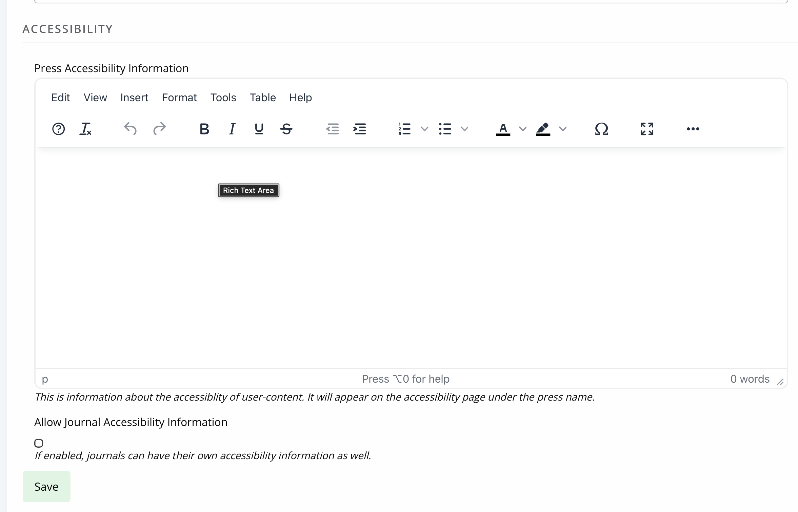
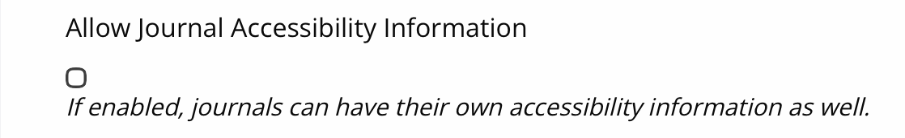
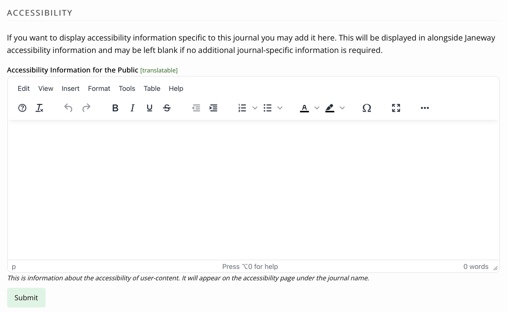

title: Displaying custom accessibility information

# Displaying custom accessibility information

## Introduction

Janeway 1.9 introduced an **Accessibility** page linked from the footer.
By default, this only shows the platform accessibility information,
however, there are settings to include custom press and/or journal specific
information. Journal information can only be displayed if the setting **Allow journal accessibility information** is switched on at press level. It is off by default.

## Enter press accessibility information

Press accessibility information may be entered in through the **Press manager** under **Edit press details**. There is a section for **Accessibility**, within which there is a rich-text area for **Press accessibility information**.

## Press setting to enable journal accessibility information

After the [press accessibility information](#enter-press-accessibility-information), there is a setting to **Allow journal accessibility information**. This allows each journal to have a unique accessibility statement.

> [!NOTE]
> This setting applies to all journals within that press. It provides the option to enter text onto the journal accessibility page, and will be hidden from readers when it is left blank.

## Enter journal accessibility text

> [!WARNING]
> The setting at press level must be switched on to make this available in the journal manager. If this section does not appear within your journal, then please contact your press manager.

Journal accessibility information may be entered through the **Journal manager**, through  the**General**/**Journal settings** page.

## Tabular summary

This table summarises the information already provided within this document.

| Custom press text | Press setting to allow journal text | Custom journal text | What is displayed                    |
| ----------------- | ----------------------------------- | ------------------- | ------------------------------------ |
| _none_            | no                                  | _not available_     | Platform                             |
| _none_            | yes                                 | _none_              | Platform                             |
| _none_            | yes                                 | Journal text        | Journal text + Platform              |
| Press text        | no                                  | _not available_     | Press text + Platform                |
| Press text        | yes                                 | _none_              | Press text + Platform                |
| Press text        | yes                                 | Journal text        | Journal text + Press text + Platform |
