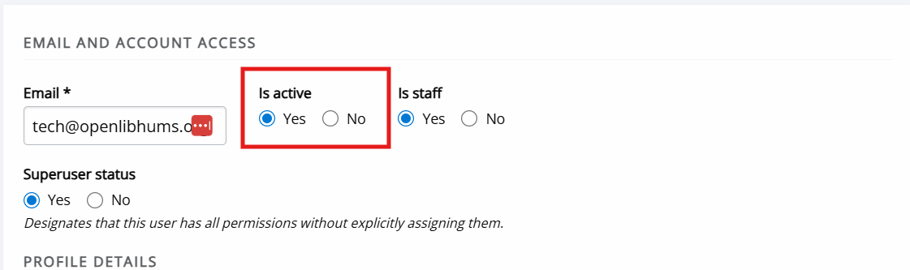

# Activating accounts

This page explains how to check whether a user account has been activated and how to activate inactive accounts. As users must activate their account before they can log in to Janeway, inactive accounts are a common cause of login issues.

## Inactive users

There are two places from which to check and manage the activation status of accounts:

- **Journal users**
- **Inactive users**

Both are found under **Users & roles** on the Manager dashboard. The **Journal users** page is available to editors and journal managers, whereas the **Inactive users** page is accessible to staff only.

To view inactive users:

1. Open **Journal users**.
2. Use the filter on the left-hand side.
3. Set **Status** to **Inactive**.
4. Click **Apply**.

This will list all inactive users on the journal. You can also search by name or email address.

The **Inactive users** page lists all inactive users across the press who have not yet activated their accounts.

## Activating accounts

Once you have identified an inactive account through either **Journal users** or **Inactive users**:

1. Click **Edit** next to the user to open the account page.
2. Under **Is active**, select **Yes**.
3. Save your changes.

The user will now be able to log in to the journal.

<!-- ### Troubleshooting

-Resending activation emails
Only from admin?

Account activation should not trigger an email (check).

Users usually activate through a link sent to them.

/Does ORCID require activation?
/Do author accounts automatically activate upon submission?
/Do reviewer accounts with one-click review? -> check Mauro's suggested solution for the issue encountered.
/Why can accounts be inactive? -> NEarly always because not activated. Rarely manually deactivated.

Activation emails cannot be easily resent, if the user cannot find the original. The solution is for the user to click the password reset link. If they receive the password reset email and click on that link, Janeway activates their account in addition to resetting their password.

Completing the account activation step does not trigger an email. The user only receives a message saying “Account activated” at the top of the login screen, which is where they are sent next.

After completing account registration via ORCID, users may or may not need to complete the activation step.

- If the user has made an email address public on orcid.org, then Janeway is able to get an email from ORCID, and it can be confident the user did not make a mistake entering their email address, so there is no need to make them find an email link to activate their account. It just logs marks their account as active.
- However, if no email is public on orcid.org, Janeway can’t be as sure of the email, so it requires the user to do account activation by emailing them a link. Email-based account activation is also triggered if the user logs in via ORCID, reaches the Janeway registration page with email from ORCID pre-populated, and then changes the email address in registration form, because again Janeway can’t be sure the email has no typos, and it is important for it to be correct, so that users do not lose access to their account if they forget their password.

Author accounts don’t get activation any differently from other accounts. It just depends whether someone has logged in to Janeway fully. You can’t log in without activating your account, and you can’t submit an article (as main author actually doing things in Janeway) without being logged in.

Historically, accounts were created for all co-authors, and they were inactive by default (except for the submitting author--theirs was active). But this is no longer the case from version 1.8. Only author records are created, not accounts. So if co-authors want to create accounts, they need to do the same registration and activation steps as everyone else.

From version 1.8, reviewers should be able to review things without logging in, so they won’t have to have active accounts unless they have another reason to. The exception is if a journal has turned one-click review off.

Or is this a question about whether inactive-account reviewers are visible in the editors’ reviewer selection screen? From version 1.8, we have made sure that they are visible.

Usually the reason accounts are not active is because activation is off by default, and the user has to activate with the email link, or through another mechanism like ORCID or OIDC, where Janeway can be confident the email address is correct.

There is one scenario in which the system changes previously active accounts to inactive: if the user starts the email change process, the system marks the account inactive and requires activation via email link, so we can be sure the email doesn’t contain typos.

-->

## Authenticated users

The **Authenticated users** page shows a list of users currently logged in to your Janeway installation.

This page is only accessible to users with staff permission.
