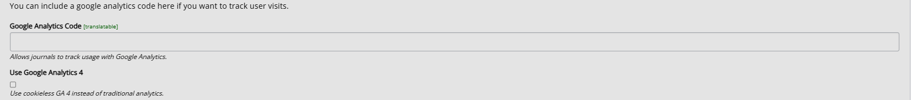
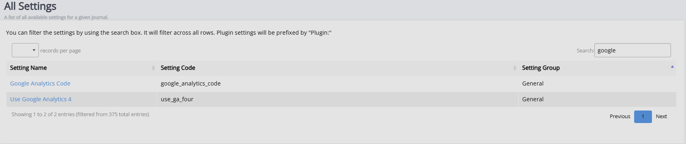

# Google analytics

You can implement Google Analytics code to measure activity on your pages, if you wish.

The settings for this can be found in **All settings** through the Manager dashoard.

Alternatively, you can search for it through **All settings**.

Google Analytics can be done by adding the Google Analytics code (provided by Google) in the **Google Analytics code** field and ticking the **Use Google Analytics 4** box, if using Google Analytics 4.

For more information, consult the [Google Analytics documentation](https://developers.google.com/analytics).

For support with issues, contact your system administrator.
