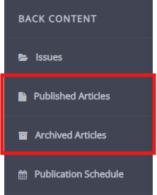
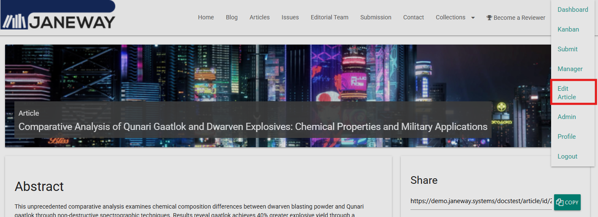
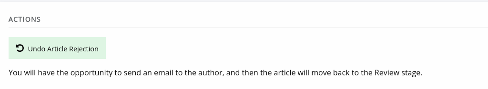
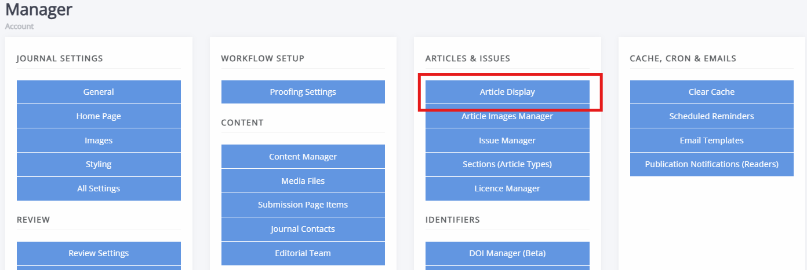

# Articles

Once an article is published, you may need to change it — for example, to upload a new galley or correct a metadata error. All published articles can be found on the **Published articles** page under **Back content** in the left-hand sidemenu.

Archived and rejected articles can be found under **Archived articles**. On either page, you can search and then select an article to edit.

> [!TIP]
> You can also edit a published article by going to its page on the journal front end and selecting **Edit article** from the account dropdown.
>
> 

## How to use the article archive page

From the **Article archive** page, you can:

- Edit metadata
- Edit publication information
- Add or remove images
- Create publisher notes
- Manage identifiers
- Manage galley files
- Manage which issues an article appears in
- Unreject a previously rejected article

## Issues

The issues that an article belongs to are listed at the bottom of the **Article archive** page. From here you can edit individual issues or go to the issue manager.

## Archiving an article

To archive an article that is in progress:

1. Select the article.
2. Click **Logs, docs and more** on the right-hand side of the blue workflow progress bar.
3. Click **Manage workflow stage**.
4. Click **Archive article**.

## Restoring archived or rejected articles

To move an article back into the workflow:

1. Select the article.
2. Click **Logs, documents and more** on the right-hand side of the blue workflow progress bar.
3. Click **Manage workflow stage**.
4. Click **Move to stage** to return the article to the stage it was at before it was archived or rejected.

Article rejections can also be undone directly from the **Article archive** page using the **Undo article rejection** button.

If the article was previously assigned to an editor, it will move to the Review stage. Otherwise, it will move to the Unassigned stage.

## Article display settings

The **Article display** page can be found on the Manager dashboard and has settings for controlling how articles look and how metrics are displayed. It is broken up in four sections as outlined below.

- Disable article thumbnails  
   If this box is checked, no article thumbnails will be shown on the article list.
- Disable article large image  
   If this box is checked, the large article image at the top of the page will not be displayed.
- Display guest editors  
   If this box is checked, guest editors will be displayed on the article page. If this article is assigned to multiple issues, only the guest editors of the primary issue assigned will be displayed.
- Suppress how to cite  
   If this box is checked, the how-to-cite block will not be shown on the article page.
- Hide author email links  
   If this box is checked, links to email correspondence authors will not be displayed on the article page.

### Download and view links

- Disable HTML downloads  
   If this box is checked, HTML copies can no longer be downloaded from the article page.
- View PDF option  
   If this box is checked, a "View PDF" button will be visible on the article page.

### Metrics display

- Disable metrics display  
   If this box is checked, metrics will not be displayed on the article page.
- Suppress citation metrics  
   If this box is checked, the citations counter will not be shown on the article page. This setting is overruled by the **Disable metrics display** setting; if that setting's box is ticked, citation metrics will not show, regardless of the status of this setting.

### Article dates

- Display date submitted  
   If this box is checked, the submission date will be displayed on the article page.
- Display date accepted  
   If this box is checked, the acceptance date will be displayed on the article page.

How to cite is an auto-generated citation based on a custom Open Library of Humanities citation style. You can suppress it for all articles using **Suppress how to cite**. You can also override it for individual articles by entering a custom citation in the **Edit metadata** pane for each article.

> [!NOTE]
> A previous version of the citation included "p" before page ranges. To restore this, enter a custom value in the **Page numbers** field in **Edit metadata** for each article.
