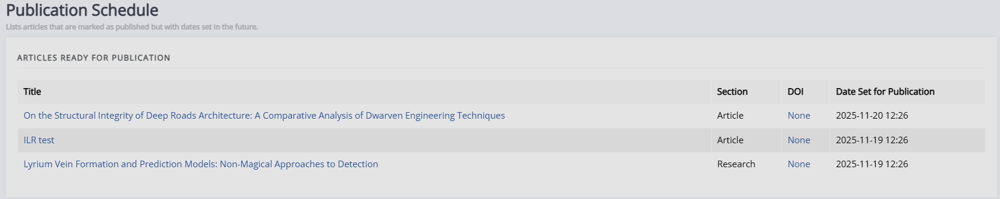

# Article management

There are various aspects to article management within Janeway and various interfaces to manage them from. This section contains documentation on the following:

- [Article galleys](../article-management/article-galleys.md)
- [Article images](../article-management/article-images.md)
- [Article metadata](../article-management/article-metadata.md)
- [Article sections](../article-management/article-sections.md)
- [Managing archived and rejected articles](../article-management/articles-management.md#archiving-an-article)

Additionally, there's a page to manage the publication schedule:

## Publication schedule

Any articles that are set to publish on a future date will appear in a list on this page. It will list the title, section, DOI, and scheduled publication date.

<--!

<!-- -->

<!-- explain scheduling around end of year and why to avoid, explain where this is found. -->-->
