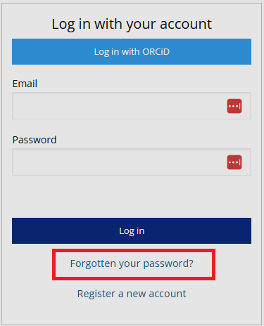

# Account troubleshooting

## Activate your account

If you are sure your password is correct and you cannot login, your account has likely not been activated yet.

This is usually resolved either by:

- Requesting a password reset link. This will send you an account activation email, if your account has not yet been activated. If your account was not created by you (or an editor) but was imported into Janeway, this will not work. You will need to use the option below.

- An editor or journal manager activating your account. (If you are an editor or journal manager, see [Activating a user account](#activating-a-user-account) for more information).

### Activating a user account

See: [Activating accounts](../accounts-and-roles/activating-accounts.md)

## New password

### Reset your password

If you have forgotten your password and need to reset it:

1. Click **Forgotten your password?**
2. Enter your email address.
3. Click the **Request token** button.
4. Open your email inbox and locate the password reset email. The email subject will be "[journal name] Password Reset". It can take a few minutes to arrive and may arrive in your spam folder.
5. Click the link in the email.
6. Fill in the password fields to set a new password.

If you have not received the password reset email, contact **Support**.

## Update your password

If you know your Janeway password and want to update it:

1. Log into the journal.
2. Click on the circle with your initials or profile picture in the top-right corner and select **Profile**.
3. Go to the **Update password** block and fill in your current and new passwords in the respective fields.
4. Click the **Update password** button.
