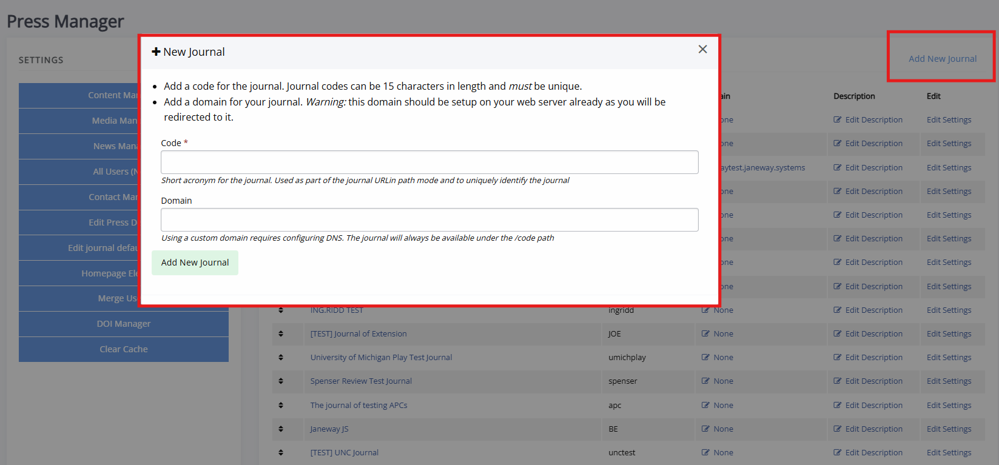
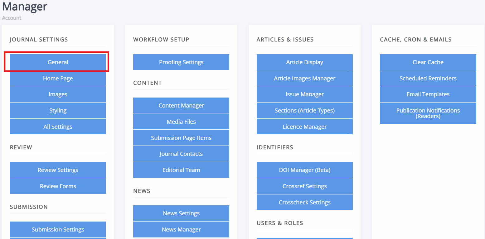

# Setting up your journal

This guide takes you through setting up a journal on Janeway, looking at creating the journal, configuring it and opening submissions. You will not necessarily need to work through them stage by stage, as many of these steps (beyond the very first one) can be done in different orders (but there will be the occasionaly dependency) and you may wish to return to various aspects of the journal configuration later. Each section contains a link to the wider documentation with more detail on how to perform tasks.
 
You do not have to do everything in one sitting. Most settings can be changed later or handled when working through submissions (webcontent, email reminders, styling etc.)

## Before you start

### Who can set up a journal

Creating a journal happens at press level and needs staff permission. If you are an editor, you cannot do this yourself - you will need to contact your press manager or systemn administrator. Once the journal exists and you have the editor or journal manager role, you can work through the rest of this guide.

Everything after [Creating a journal](#creating-a-journ) is available to editors and journal managers, with two exceptions noted in the text: press-level settings and the admin area. For a full breakdown of who can do what, see [Roles and permissions on Janeway](../accounts-and-roles/roles-and-permissions-on-janeway.md). If you have not worked in Janeway before, read [Navigating Janeway](./navigating-janeway.md) first so the interfaces mentioned below make sense.

### Information you'll need

Gathering this information before getting started and keeping it nearby will make the process easier:

- The journal title and code (an abbreviation for the journal - this may show up in the DOI and URL).
- Journal ISSN, if you have one.
- Publisher name, website and contact email address.
- Journal logo, default issue cover, default banner image.
- If using, your Crossref prefix and credentials.
- The names and email addresses of editors.

Optional information that may be helpful:
- A postal address; certain indexers require them.
- The names and email addresses of your editorial board.
- A list of the licenses used for the journal.

## Stage 1

###  Creating a journ

A press manager creates the journal from the **Press manager**, clicking **Add new journal**.
 

 
You will need to fill in the following:
 
- Journal code  
  A short abbreviation or word that identifies the journal, for example `orbit`. In path mode, this appears in the journal's web address.

- Domain  
  Only needed if the journal runs on its own domain. Additional settings will need to be configured by your system administrator.

The code is the only required field. If you are using domain mode, you can configure the domain later.
 
Janeway serves journals in one of two ways:
 
- Path mode  
  All journals share the press domain, and the journal code identifies each one, for example `www.pressdomain.com/orbit`.

- Domain mode  
  Each journal has its own domain, for example `www.myjournal.com`.

After clicking **Add new journal** you are taken to the new journal's general settings page, where you can also fill in the journal name. 

It is recommended to turn on **Hide from press** by ticking the box with this setting whilst you are setting up the journal, so the journal isn't listed on the press website.

### Set the general settings

After creating a journal and clicking  **Add new journal**, you will be taken to the journal's general settings page. You can also find this page on the manager dashboard by clicking on **Journal settings**.
 

The general settings page lists many settings, but the following may be especially relevant when setting up a journal:

- Journal information  
  Title, ISSN, description, and keywords.

- Publisher information  
  Publisher name, website, and contact details.

- Email settings
  The addresses Janeway uses for automated emails.

- Language settings  
  The languages the journal website can be displayed in.

- CRediT  
   If you wish to use CRediT on your journal and its submissions, turn on this setting by ticking the box.

Click **Submit** at the bottom of the page to save any changes.

Some settings are better configured at press level and applied to all journals, than repeated for every journal (publisher name and URL, support email, login and registration notices). See [Journal management at press level](../press-management/journal-management-press-level.md) for more information.

For mor information, see [Journal settings](../journal-management/journal-settings.md).

> [!TIP]
> If you are looking for a specific setting and cannot find it, open **All settings** from the **Journal settings** panel and search for it there.

### Designing your journal

Janeway from 1.9 onwards has four themes: Clean, Material, OLH and Clarity. Clarity is only available from 1.9 onwards. They share the same features and content, but differ in layout and how prominently they use images.
Clarity is the most accessible theme as of 1.9, Clean is the most accessible before 1.9. The theme setting is found on the **General** page under **Journal settings**.

In addition to setting a theme, you may wish to upload default images. These images act as fallbacks: if an article or issue has no image of its own, Janeway uses the journal default.

- Header image  
  Your journal logo, shown in the site header.

- Cover image  
  The default or backup issue cover, which can be seen on the issues list on the journal website.

- Large image  
  The wide banner used at the top of the article page and on an issue's page, and in the homepage carousel.

- Thumbnail image  
  The square image shown in places where articles are listed on the journal website.

- Favicon  
  The icon in the browser tab.

> [!TIP]
> Check the colour contrast in your logo and cover images. Try to aim for a contrast ratio of at least 4.5:1 between text and the background.

For more information or information on image sizing, see [Image guidelines](../journal-management/image-guidelines.md)

## Stage 2

### Configuring the workflow

By default, Janeway has the following stages:

1. Unassigned (submission)
2. Review
3. Copyediting
4. Typesetting
5. Prepublication

These can be edited, reordered and removed by someone with the staff permission through the **Workflow** page, which is accessible through the left-hand side menu.

>[!WARNING]
>Removing stages may have unintended consequences, only do this if you are comfortable doing this. Otherwise, contact your system administrator.

### Setting up article types (sections)

Article types (sections) are used to categorise articles by content type, e.g., research articles, book reviews and editorials. You can configure these by clicking **Sections (Article types)** on the manager dashboard.

If your journal only publishes one article type, you can hide the section field during submission using the submission fields configurator. See [Managing submission fields](../submission/managing-submission-fields.md) for more information. If you do, set a default section so the information still reaches the article metadata.

>[!NOTE]
>A section cannot be deleted once articles are assigned to it. To remove a section that contains articles, first move every article to a different section. It is worth getting your section list roughly right before you open submissions.

For more information on configuring sections, see the documentation on [Article sections](../article-management/article-sections.md)

### Setting up licenses

Authors can chose a licence when they submit, so the licence list needs to be right before submissions open. Janeway comes lists the CC 4.0 licences and All Rights Reserved licence by default. Edit this list from the **Licence manager** which can be found on the manager dashboard.

Similarly to sections, if journal only publishes with a single licence, you can hide the submission selection field during submission <!-- mising hyperlink-->. If you do, set a default licence so the information still reaches the article metadata.

For more information on configuring licences, see the [Licence manager](../submission/licence-manager.md)

### Setting up submissions

The submission process setup has four parts, all reached from the manager dashboard:
1. Submission settings
    This controls the process itself; whether submissions are open, who is notified upon submission, whether to limit filetypes, etc.

2. Submission page items
    This controls various blocks on the public submission page (the page with information before starting a submission) which are also visible during the submission itself. E.g., the submission checklist, focus and scope and licences will all appear before as well as during submission.

3. Submission fields configuration
    This controls which fields are shown to authors during submissions, as Janeway comes with a set of default fields, but you may not wish to use all of them.

4. Additional submission fields
  This lets you set up additional submission fields and questions.

>[!TIP]
>You may wish to leave submissions disabled until your sections, licences, review settings, and editor accounts are setup. It is easier handling submissions when all is ready, though his is not necessary.

For more information, see: [Submissions](../submission/index.md)

### Setting up review

In terms of setting it up, peer review has two aspects to it: the settings that shape the process and the review forms/questions used.

The settings you are most likely to want to review and/or edit:

- Default review visibility  
   Determines whether the default review visibility is open, single anonymous or double anonymous.

- Review guidelines  
   Set the general guidance for reviewers which appears on the review page.

- Default review days  
   The default length for how long reviewers have to complete a review.

- Default review form  
  Sets the default form used for completing reviews.

- One-click peer review  
  One-click access adds a unique token to the link in the review request email, so reviewers can complete a review without signing in.

>[!TIP]
>We recommend turning on one-click peer review, as it makes process significantly easier for reviewers.

For the review form, Janeway will come with a basic review form called 'Default form' with a single text area for the review. This can be edited or replaced with a more detailed or structured form, through the **Review forms** page, available on the manager dashboard.

> [!WARNING]
> Deleting a review form cannot be undone. Ongoing and past reviews keep the form they used, but the form can no longer be selected for new reviews.

For more information, see: [Review](../review/index.md).
   
## Stage 3 

### Adding users and assigning roles

When needing to add new people to the journal (except reviewers and authors) it is easiest to have them register through the website and then assign them their roles. This will allow them to set their passwords and edit their profiles.
Authors will have accounts created when they submit an article and reviewers can be added when you assign a review or in bulk.

If you have a large number of editors or reviewers to add, you can use the [import plugin](../plugins/imports-plugin.md).

It is, however, also possible to manually add accounts:
1. Go to **Journal users** on the manager dashboard.
2. Click **Add new user**
3. Fill in their name, email address, set their account to active and set a password.
4. Click **Save**
5. On the **Journal users** page, find this user and assign them the roles they need.
6. They can either set up a new password using a password reset link or you can email them their password and recommend they change it as soon as possible. The former is more secure.

For more information, see: [User management](../accounts-and-roles/index.md).

### Setting up the editorial team page

The editorial team page is composed of groups, each with a name, description, and list of members. Open it from Content on the manager dashboard. To set up an editorial team page, click **Editorial team** on the manager dashboard. Before someone can be added to a group on the editorial team page, they must have an account. If a large number of your board members don't have an account, there are three options:

1. Use the [editorial team import](../plugins/imports-editorial-team.md), which can create groups without needing to setup accounts (especially helpful for large groups)
2. List names directly in the group description, using the text editor.
3. Create "dummy" accounts through the **Journal users** interface, using a placeholder email address (not recommended if the board member will need to be able to log into Janeway).

For more information, see: [Editorial team page](../journal-management/editorial-team.md)

### Setting up the contacts page

The contact page contains a form which allows people vising the journal website to contact you. Email addresses are never shown publicly; visitors only see a name and role Every message is recorded and send to the address specified through the contacts page settings. A copy of every message is also saved to Janeway and can be viewed in the admin area by staff.

For more information, see: [Contacts page](../journal-management/journal-contacts.md)

## Stage 4

### Setting up DOIs

Janeway can register DOIs with either Crossref or DataCite. It will initially register the DOI for an article once it is accepted and update its metadata with a second deposit once the article is published.

You will require a DataCite or Crossref membership, a DOI prefix (e.g. 10.xxxx) and the account credentials. These will be provided by Crossref or Datacite, not Janeway. For more information see: [Identifiers](../identifiers/index.md)

If you run several journals, Crossref settings can be set once at press level and overridden per journal. See [DOI management at press level](../press-management/doi-management-at-press-level.md)
<!-- include DOI management at press level link in identifiers index in next PR-->

### Creating issues

Articles on Janeway do not require an issue, but services such as Crossref expect them. If you are publishing continuously throughout the year, create one issue per year and add articles to it as they are published.

Create issues from the **Issue manager**, available from both the manager dashboard and the sidebar.

>[!Warning]
>Do not use volume 0, issue 0. Imported articles with no volume and issue number are assigned there by default, so it is best to keep this volume clear.

For more information, see: [Issue management](../issues-volumes-and-collections/index.md)

## Stage 5

### Adding webcontent

You may wish to add additional pages with information to your website, such as journal policies, author guidelines, an about page etc. Additional, custom pages can be created through the **Content manager** page, which is found on the manager dashboard.

1. To read more about adding pages, see: [Content manager](../journal-management/janeway-content-manager.md)
2. To read more about editing the navbar, see: [Navigation](../journal-management/navigation.md)
3. To read more about configuring the journal homepage, see: [Journal homepage customisation](../journal-management/homepage-customisation.md)
4. To read more about adding news items, see: [News manager](../journal-management/news-manager.md)

>[!TIP]
>If a change is not visible on the website and you are certain you clicked **Save** where appropriate, try [clearing your cache](../journal-management/clearing-the-cache.md).

### Adding an accessibility statement

Janeway has the option to link out to an accessibility statement through the footer. As long as this setting has been turned on at press-level, you can add a statement for your journal. See [Displaying accessibility information](../accessibility/displaying-accessibility-information.md) for more information.

## Final checks

You may wish to confirm the following are all in place, before turning on submissions:

- General settings are complete; including journal title, ISSN, publisher details, and contact email.
- The journal default images have been uploaded.
- Article types are set up and, if you wish to auto-notify editors of new submission for specific article types, the right editors are notified for them.
- The correct licences are listed for the journal.
- Any hidden submission fields have defaults set.
- Submission page text is written: focus and scope, checklist, copyright notice, fees, and acceptance criteria. If fields are not used, make sure they are turned off.
- Review settings are configured; including visibility, review days, and the default review form.
- Your editorial team and contacts pages are populated.
- If using: make sure that Crossref or Datacite is setup.

You can turn submissions on by unchecking the **Disable submissions** box on the **Submission settings** page.
>[!TIP]
> You may wish to create a test submission yourself, before publicising the journal. Going through the submission process yourself is the easiest way to check if all looks correct. You can archive the submission once you are done. See [Article management - Archiving an article](../article-management/articles-management.md#archiving-an-article) for more information.

## What to read next

- [Editor workflow guide](../guides/editor-guide-overview.md) - a guide on processing articles from submission to publication.
- [Navigating Janeway](../guides/navigating-janeway.md) - a guide on finding your way around the pages and interfaces described above.
- [Creating an account](../guides/creating-an-account-on-janeway.md) - a guide on creating accounts on Janeway.
- [Journal management](../journal-management/index.md) - more information on configuring and managing your journal.
- [Press management](../press-management/index.md) - more information on press-level settings on Janeway.
