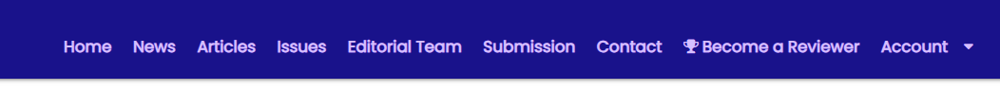
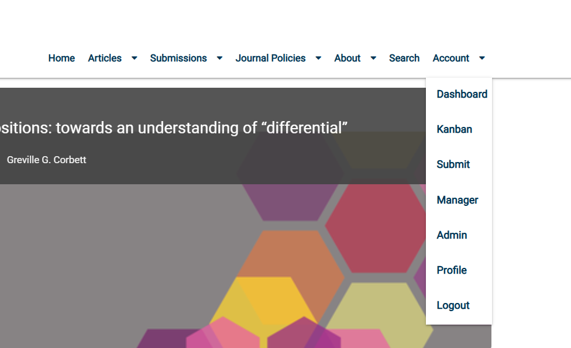
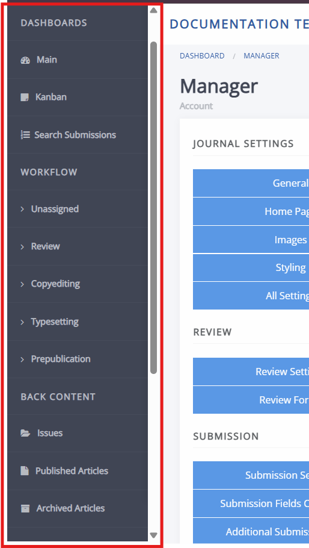
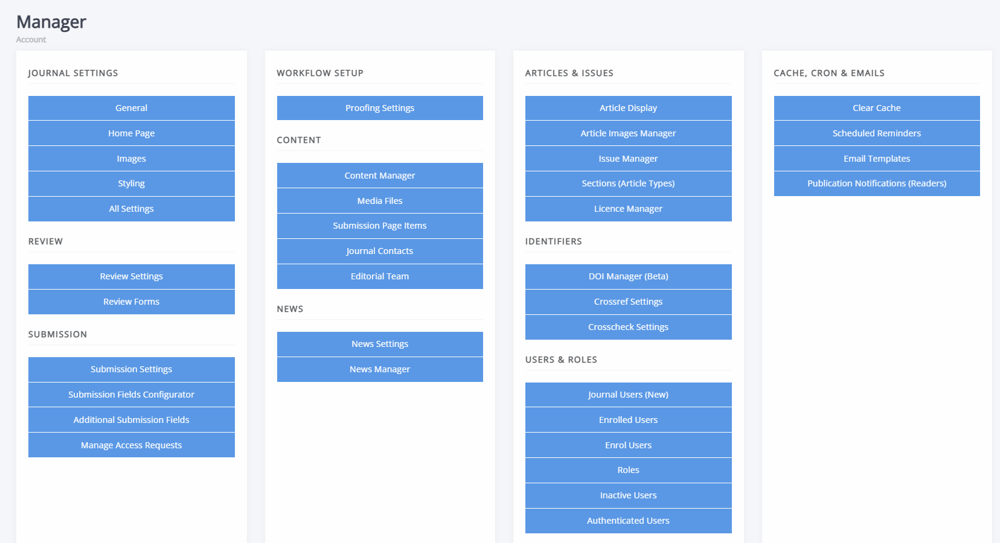
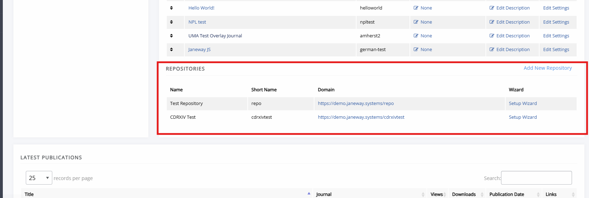
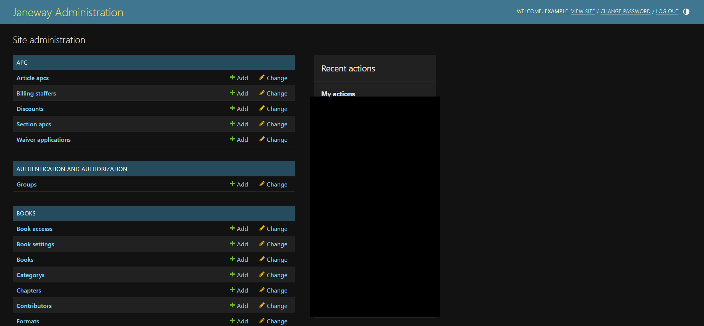

# Navigating Janeway

Janeway is made up of several distinct areas and how to navigate them depends on where you are, what you want to do, and what your role allows. This guide introduces each area, explains how to move between them, and points you to the pages that cover the interfaces listed.

This guide is written for editors and press managers who are working in Janeway for the first time. If you want to jump straight into processing articles, see the [editor guide overview](./editor-guide-overview.md).

## In this guide

- [The three areas of Janeway](#the-three-areas-of-janeway)
- [Navigating the journal and press website](#navigating-the-journal-and-press-website)
- [Navigating the back office](#navigating-the-back-office)
- [Navigating press-level pages](#navigating-press-level-pages)
- [Navigating a repository](#navigating-a-repository)
- [Navigating the admin area](#navigating-the-admin-area)
- [What to read next](#what-to-read-next)

## The three areas of Janeway

Janeway has three distinct areas, knowing which one you are in makes will make easier to find what you need.

- Web content  
  Also called the front end. This is the public-facing website that shows articles, the homepage, and any other content you want to share with visitors. It also displays information such as author guidelines, editorial policy, and submission guidance.

- The back office  
  This is the part of Janeway you see when you sign in. Here you process articles through review, copyediting, and typesetting, configure workflows, and manage the journal more broadly. Journal settings, journal styling, user information, article metadata, and email templates are all reached from here.

- The admin area  
  This area is intended for system administrators and advanced users. From here you can inspect data and settings, edit records directly, and troubleshoot problems.

> [!CAUTION]
> Changes made in the admin area bypass the checks built into the rest of Janeway. If you are not comfortable working there, contact your system administrator or support contact instead.

What you can see in each area depends on your roles and permissions. For more information, see [Roles and permissions on Janeway](../accounts-and-roles/roles-and-permissions-on-janeway.md).

## Navigating the journal and press website

### The navigation bar

Visitors move around the journal or press website using the navigation bar (navbar) at the top of every page. The navbar combines fixed elements supplied by Janeway, such as **Home**, **Articles**, and **Issues**, with custom items you can create.

To enable, disable, reorder, or add navigation custom items, see [Navigation](../journal-management/navigation.md).

### The footer

The footer carries information that belongs on every page, such as a privacy policy and accessibility statement.

Footer navigation is configured at press level and applies across all journals. To set it up, see [Journal footer](../press-management/footer.md).

### Moving from the website to the back office

When you are signed in, an account icon appears in the top-right corner of the page. It shows either your initials or your profile picture(if you have set one).

1. Select **Account**, or the circular icon showing your initials/profile picture.
2. From the dropdown, select where you want to go.
   

The dropdown can display options for the dashboard, the manager interface, your profile, the submission portal, and the admin area. Which of these are visible to you will depend on your roles and permissions.

> [!TIP]
> To return to the public website from anywhere in the back office, select the journal name or logo at the top of the page.

## Navigating the back office

The back office is visible only to signed-in users and different users see different parts of it. Editors, journal managers, and users with staff permission can access the broadest range of views and interfaces. Reviewers, copyeditors, typesetters, and proofreaders see only the tasks assigned to them.

Unlike the public website, the back office cannot be styled or rebranded.

### The dashboard

The main journal dashboard is your starting point. It shows the articles in the journal workflow that are relevant to you. The editor block groups by the stage they have reached and the other blocks will show tasks assigned.

Information about articles in the journal workflow is available in other views as well, listed under the **Dashboards** section of the sidebar:

- Main  
  The standard workflow dashboard, organised by stage.

- Kanban  
  A board view of every article in the workflow, with a column for each stage.

- Search submissions  
  A filterable list of active submissions, useful when you know what you are looking for.

### The sidebar

The sidebar runs down the left of every back office page and is the quickest way to move between stages, the management dashboard and article lists. You can reach any stage from anywhere in Janeway, without returning to the dashboard first.

The sidebar is divided into four sections. What appears in each one depends on your roles and permissions, and on how your workflow is configured.

- Dashboards  
  Contains **Main**, **Kanban**, and **Search submissions**, described above.

- Workflow  
  Links to each stage in your journal's workflow. A typical journal shows **Unassigned**, **Review**, **Copyediting**, **Typesetting**, and **Prepublication**. If your journal is configured to skip a stage, it does not appear here. For what happens at each stage, see the [Editor guide](./editor-guide-overview.md).

- Back content  
  Covers material that has left the workflow. **Issues** opens the [Issue manager](../issues-volumes-and-collections/issues-and-volumes.md), **Published articles** lists everything you have published, **Archived articles** lists rejected and archived submissions, and **Publication schedule** lists articles scheduled for publication.

- Staff  
  **Manager** opens the manager dashboard, **Plugins** lists the [plugins](../plugins/index.md) installed for the journal, **Workflow** opens the page where you configure your journal's workflow elements, and **All articles list** shows every article regardless of status. The **All articles list** page also lets you export a list of articles or upload a CSV of metadata updates. Access to these pages depends on your permissions.

### The manager dashboard

The manager dashboard lists the settings used to configure the journal. It is visible to editors, journal managers, and users with staff permission. It is reached by selecting **Manager** under **Staff** in the sidebar or from the profile dropdown in the top-right corner.

Settings are grouped into panels by what they control. See also [Journal management](../journal-management/index.md) for further documentation on this area.

- Journal settings  
  [General settings](../journal-management/journal-settings.md), [homepage layout and elements](../journal-management/homepage-customisation.md), [journal default images](../journal-management/image-guidelines.md), and **All settings**, which searches every setting available on the journal.

- Review  
  Settings related to configuring the review process. See also [Review](../review/index.md).

- Submission  
  Settings related to configuring the submission process and the submission page. See [Submissions](../submission/index.md).

- Content  
  The [content manager](../journal-management/janeway-content-manager.md), [editorial team](../journal-management/editorial-team.md) page settings, [journal contacts](../journal-management/journal-contacts.md), [media files](../journal-management/media-files.md), and [submission page](../submission/configuring-the-submission-page.md) items.

- News  
  The [news manager](../journal-management/news-manager.md) and its associated settings.

- Articles and issues  
  [Article display](../article-management/articles-management.md#article-display-settings) options, the [issue manager](../issues-volumes-and-collections/index.md), [article images](../article-management/article-images.md), [sections](../article-management/article-sections.md), and the [licence manager](../submission/licence-manager.md).

- Identifiers  
  The DOI manager, Crossref settings, and Crosscheck settings. See [Identifiers](../identifiers/index.md).

- Users and roles  
  Journal user management. See [Accounts and roles](../accounts-and-roles/index.md).

- Cache, cron, and emails  
  [Clearing the cache](../journal-management/clearing-the-cache.md), [scheduled reminders](../email-and-reminders/scheduling-reminders.md), [email templates](../email-and-reminders/email-templates.md), and [publication notifications](../email-and-reminders/publication-notifications.md).

> [!TIP]
> If you cannot find a setting in the interface, open **All settings** from the **Journal settings** panel and search for it there.

## Navigating press-level pages

If you manage more than one journal, some tools sit above journal-level in the **Press manager**. This page is available to users with staff permission and covers press-wide details, all journals' and press' users, and journal-level defaults.

From the press manager you can do the following:

- Configure the press website, including press settings; including the press homepage, content manager, news manager, and contact manager.
- Add journals, reorder how they appear in the journal list, edit the description shown for each journal, and access a journal's settings. See also [ournal management at press level](../press-management/journal-management-press-level.md)
- [Manage users across every journal](../press-management/managing-users-at-press-level.md) from the **All users** interface, filtering by activity, staff status, role, and journal.
- [Merge duplicate user accounts](../press-management/managing-users-at-press-level.md#merging-users) through the **Merge users** interface.

Some settings are worth setting once at press level rather than journal by journal, including DOI settings, review guidelines, copyright submission labels, the default theme, and publisher details. For guidance, see [Journal management at press level](../press-management/journal-management-press-level.md) and [managing users at press level](../press-management/managing-users-at-press-level.md).

## Navigating a repository

Janeway can host repositories for preprints and similar material alongside journals on the same press. Repositories have their own manager, rather than sitting inside a journal's back office.

If your press has repositories enabled, you can find the repository list underneath the journals list of the press manager. From there you can access, manage and configure your repository.

See [Repository documentation](../repository/index.md) for more information on repositories.

## Navigating the admin area

The admin area is Janeway's underlying database interface. To open it, select the account icon in the top-right corner and then select **Admin**. It is available to users with staff permission.

There are two key things to consider when using the admin area:

- It is organised into tables that mirror the database structure, grouped by the part of Janeway they belong to. This ordering comes from the software architecture itself and cannot be rearranged. For more information on the technical aspects of the admin interface and how it works, see the [Django admin site documentation](https://docs.djangoproject.com/en/6.0/ref/contrib/admin/).
- It edits records directly. The validation, permission checks, and email prompts built into the back office do not apply here. It also does NOT have an option to undo work and deletions from the admin are are permanent. Most editorial work never requires the admin area, but there examples of tasks done through admin include:

- Core \> Settings  
  Adjust which roles can view and edit an individual setting, using the `editable_by` field. See [Granular settings permissions](../accounts-and-roles/roles-and-permissions-on-janeway.md#granular-settings-permissions-advanced).
- Core \> Accounts  
  Inspect an account record when troubleshooting a sign-in problem. See [Account troubleshooting](./account-troubleshooting.md).
- Journal \> Journals  
  Check a journal's code and domain configuration when links resolve unexpectedly. This is also where you can change a journal code, if needed -- this will break existing links to a journal in path-mode.

> [!CAUTION]
> Edits made in the admin area take effect immediately and are not reversible. If you are unsure about a change, contact your system administrator before you make it.

## What to read next
