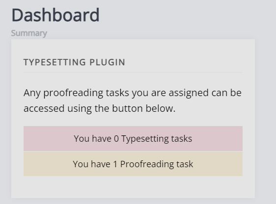
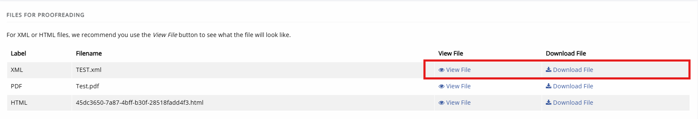

# Proofreader guide

As a proofreader you may be assigned proofing tasks for a paper. These will be assigned after a paper has gone through a round of typesetting. When a new assignment is made you will receive and email and be able to see the requests from the journal dashboard, they will be displayed as part of the typesetting block.

The following users can be assigned as proofreaders:

- Authors of the paper
- Editors
- Users with the Proofreader role

## Proofreading assignments

On the proofreading overview page, you will see tasks in progress and completed tasks. Click **View assignment** to open a proofreading assignment.

The proofreading page is broken down into three sections:

### Task definition

This is a note written by an editor when the proofing task is created. This often includes instructions / guidance.

### Files for proofreading

This section lists the files for proofreading (galleys) that have been assigned to you.
Common galley types are: PDF, HTML and XML.

Janeway has a **Preview** button that opens a preview on a separate browser window. You can leave comments in the textbox in the notes section., you do not need to annotate the galleys directly. Make sure to click **Save notes** after filling in this section.

> [!NOTE]
> It is unusual to see both XML and HTML files for proofing, as XML itself is a source from which HTML is generated (thus not requiring a seperate HTML file). What filetypes are available will depend on your publisher.

### Annotated files upload

If you do wish to annotate a file or share a document with notes, you can upload it using this section. It is generally recommended not to directly annotate XML/HTML as this may complicate the process, but your publisher will likely have provided instructions in the task definition.

## Completing proofreading

When you are done with your proofreading task, you can mark the task as complete by clicking **Mark task as complete**. You will not be able to return to this page after it has been marked as complete. If you have not opened one or multiple of the proofreading files, Janeway will give you a warning.
