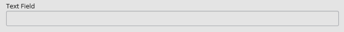
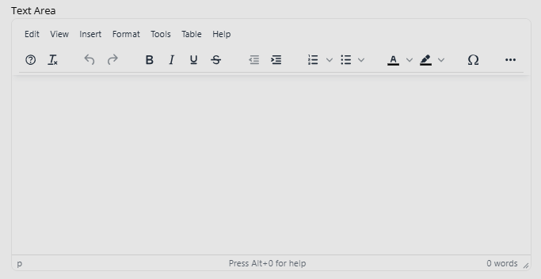
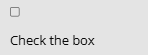
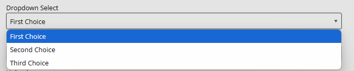
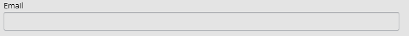
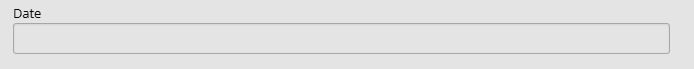

# Form elements

Custom forms in Janeway have the following aspects to them:

<!-- edit to work for review, submission and hunt for any other custom forms. -->

- Name  
   This field provides the name of the element.
  In case of a short question, you could put a question in this field. If using a longer question, you may wish to use a more generic description and provide further guidance in the help text.

- Kind  
  This determines the type of element, e.g., text field, checkbox, dropdown etc. For an overview of element types available, see [Element types](#element-types-kind).

- Choices  
   The **Choices** field is used in the 'Select(dropdown)' element. It will, however, always appear. If you are not using the 'Select(dropdown)' element, you should ignore it.

- Required  
   Checking this box will make it obligatory for users to complete that specific field. This means that they cannot submit the form without doing so. Unchecking it means that it will become optional.

- Order  
   This determines the order of the elements on the form. This is expressed numerically, so “1” means that the element will be displayed first, “2” means that it will be displayed second, etc.

  You also have the option to click and drag elements from the full form view to reorder them.

- Help text  
   This text will display under the form element and can provide further guidance or information for authors.

- Default visibility (review forms only)  
   If this box is ticked, the answer to this form element will be visible to the author by default once the editor has shared the review with them. If disabled, the author will not see this element unless the editor overrides it.

## Element types (kind)

A form element can be one of the following kinds:

- **Text field**  
   This is a single-line input area for short text answers such as names, keywords or subjects. It does not allow for formatting.

  

- **Text area**  
   This is a larger, multi-line input area for longer texts such as comments and descriptions. It allows for formatting and line breaks.

  

- **Checkbox**
  This allows you to ask users to tick a box. These can be used to declare no competing interests or agree to terms and conditions.

  

- **Select (dropdown)**  
   This lets you provide a set of options to be displayed in a dropdown list, allowing users to select one.

  To add these options, use the **Choices** field. The options must be separated by the bar (" | ") character. This will look like this: "choice 1|choice 2|choice 2".

  

- **Email**  
   This is a specific text field for emails. It checks if an email address is correctly formatted before a user submits the form and prompts them to edit it, if it is not.

  

- **Upload**  
   This lets a user upload a file from their device.

  

- **Date**  
   This asks the user to provide a date.

  
