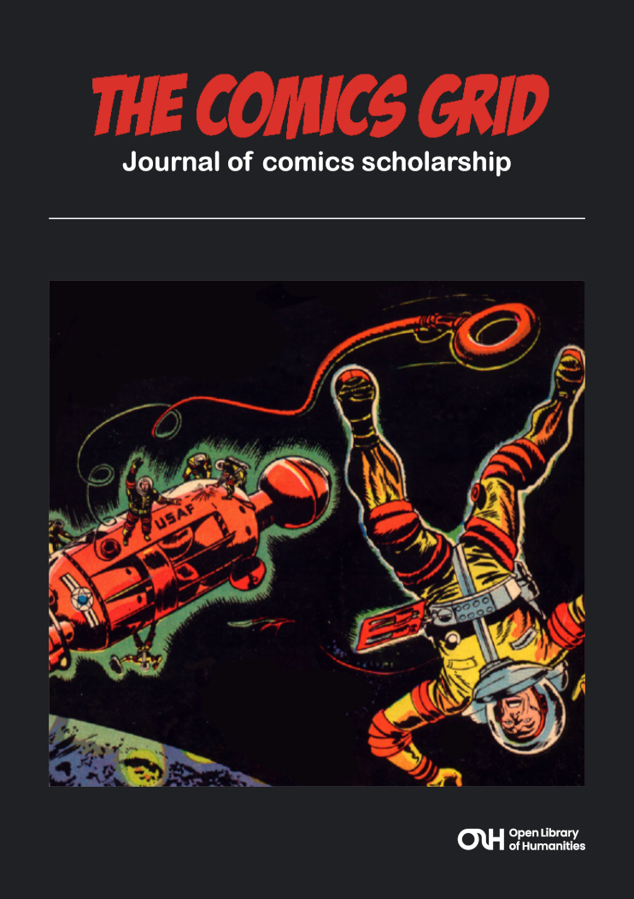
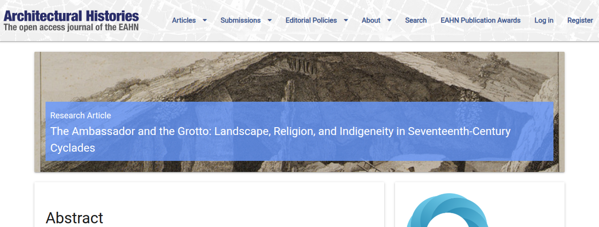
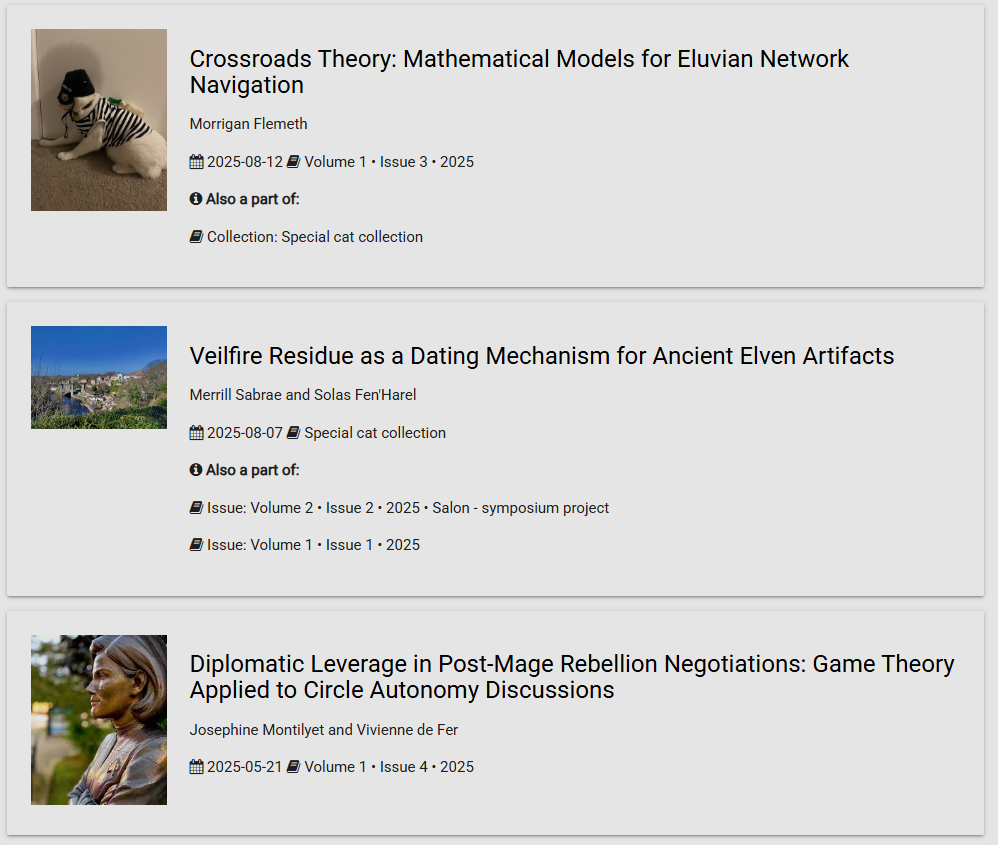
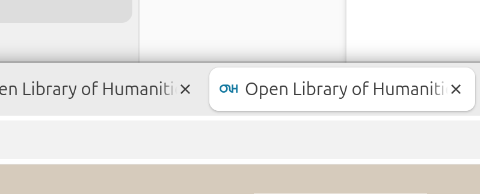

# Image guidelines

This section describes the different images that can be uploaded in Janeway to customise the look and feel of your journal, as well as the recommended sizes and aspect ratios.

## Recommended sizes at a glance

| Name | Width (px) | Height (px) |
|------|-------|--------|
| Header image     | 90-360 | 90 |
| Press override image     | 90-360 | 90 |
| Cover image     | 742 | 1050 |
| Large image     | 1500 | 648 |
| Thumbnail image     | 432 | 432 |
| Favicon     | 100 | 100 |

## Header image

This image is displayed on the site header and is normally used for the journal logo. It can be changed in [**Journal settings**](journal-settings.md).

Here is one example from the OLH journal _Energy Humanities_:

The maximum height of the image is 90px, but the width is not limited, making it suitable for either square or landscape logos. We recommend maximum dimensions of 90px by 360px.

SVG format is ideal so that the logo stays sharp at any size. PNG is the next best format.

> [!TIP]
> Ensure accessible color contrast in your logo between the color used for text and the color behind them. The contrast ratio should be at least 4.5:1.

> [!TIP]
> Avoid small text or detail in your logo, as it may be difficult to read when the logo is displayed at 90px high.

> [!WARNING]
> In the Material theme, the navigation buttons and the header image are rendered within the same line, competing for space. If a very wide image is combined with a large number of navigation items, the two may overlap on narrow screens. If your journal has a large number of navigation links (5 or more), it is recommended to use a dropdown menu grouping similar items.

## Press override image

This can be set to replace the press logo that appears in the footer of some journal sites. (The Material theme does not have it.)

Recommended dimensions are the same as for the header image: 90px tall and between 90px and 360px wide.

## Cover image

Cover images are used for issue covers, as displayed on the **Issues** page. They can be set for each issue, and a fallback can be set for the journal in [**Journal settings**](journal-settings.md).

We recommend an A5 size and aspect ratio for cover images. This translates to pixel dimensions of 742px by 1050px.

> [!TIP]
> Ensure accessible color contrast between text and backgrounds within cover images. The contrast ratio should be at least 4.5:1.

## Large image

Large images are used as wide banners on article pages, issue pages, and in any carousel on the journal homepage that draws in these elements.

They are also used on the [**Collections**](../issues-volumes-and-collections/collections.md) page.

You can set the large image for each article, and you can set fallbacks at the issue and journal level.

We recommend a size of 1500px by 648px for large images. If you upload a wider or taller image, just the  middle top part of the image will be kept.

> [!TIP]
> You may notice large images are sometimes pixelated or skewed if you are using Janeway 1.8 or older, because Janeway downsized the image to 750px by 324px, even if it displayed larger on the screen.
> 
> Once you are on Janeway 1.9, you can re-upload full resolution images to get them to display more clearly.

> [!TIP]
> The large image can be disabled entirely under [**Articles display settings**](../article-management/articles-management.md#article-display-settings).

## Thumbnail image

When articles are listed in search results or as a part of their issue, they are displayed with a square thumbnail image. These can be set individually in the **Article images manager**, and a fallback can be set for the journal in [**Journal settings**](journal-settings.md).

These images should be roughly square. Dimensions of 432px by 432px are recommended.

> [!TIP]
> The thumbnail image can be disabled entirely under [**Articles display settings**](../article-management/articles-management.md).

## Favicon

This favorite icon or favicon appears in the browser tab alongside the name of the journal website, as well as in search results, browser bookmarks, and other places.

We recommend using an icon of up to 100px by 100px, as this should fit most use cases.

