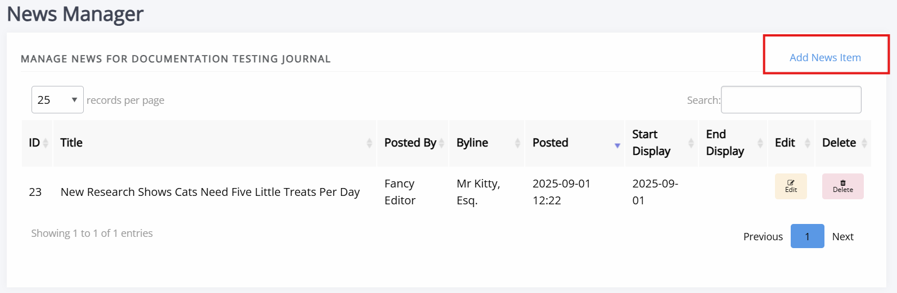
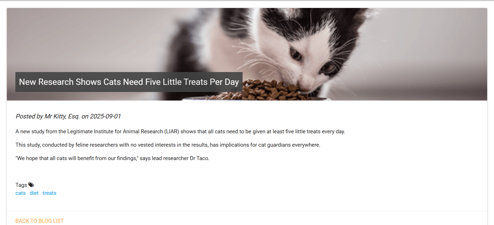

title: News manager

# News manager

The news manager allows you to create news items, assign them start- and end dates, and upload images to display alongside them.

News items can also displayed in [the carousel](./carousel.md).

To add a new news item, click **Add news item**.

The form fields include:

- Title  
  The title of the news item.

- Body  
  The HTML body of the news item.

- Start display  
  The date to start displaying this news item.

- End display  
  The date to stop displaying this news item (can be left blank to display indefinitely).

- Sequence  
  Use for sorting when news items are posted on the same day.

- Image file  
  An image file to fit the news piece; this will display at the top as a banner image.

- Custom byline  
  Lets you overwrite the name displayed as the author of the news item.

- Tags  
  A series of tags/keywords for the piece, you can filter news items by tags. These tags are case-sensitive.

