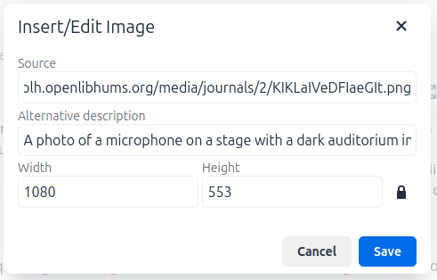

# Managing rich text fields

Many fields in Janeway allow you to enter rich text. Rich text can be formatted with links, italics, bolding, numbered lists, block quotes, and other elements. It also makes structural markup like heading levels and list structure possible, so that your content can be more accessible to users of text-to-speech or other assistive technologies.

Most of the time, it is straightforward to use the toolbar of formatting options to format content. But there are a few tricks to using Janeway’s rich text editor.

## Copy-pasting from Word or another app

If you copy-paste from another rich-text environment like a DOCX document, Janeway tries to help you manage how much formatting comes over. 

> “Formatted paste detected. Click ‘OK’ to paste as text or ‘Cancel’ to keep the formatting.”

Selecting OK will remove all the formatting (markup) in the source text. You will have to reformat bold, italic, and lists, re-enter links, and make sure any headings are marked up with the right level.

Selecting Cancel will attempt to keep all the source formatting. Note that this may not have intended results, since the journal website applies its own styling, so there may be visual inconsistencies, or only a fraction of the kept formatting may be strictly necessary.

### Technical details of clearing or keeping formatting

This section explains the technical details of the copy-paste process, requiring some knowledge of HTML and CSS.

Clearing the formatting effectively removes all the HTML markup from the text. Line breaks are preserved only with newline characters (`\n`). Semantic markup like heading levels and list structures are removed, and link references are lost.

Keeping the formatting not only keeps the HTML markup but creates in-line CSS style rules in the HTML markup. An example of how this might look is `
test
`.

> [!TIP]
> If you can edit HTML, consider preparing your page in a code editor and then copy-pasting into the code view of the Janeway rich-text field. This will allow you to keep exactly the markup you want. By pasting into the code view, you bypass the question about clearing or keeping formatting.

## Inserting images

You can insert images into rich-text content by using the [media manager](./media-files.md).

1. Upload your image to the media manager and copy the URL.
2. In the rich-text field toolbar, select **Insert** and then **Image**.
3. Paste the media manager URL into the **Source** field.
4. Enter alternative text for your image in the **Alternative description** field.
5. Edit the width and height if desired, to change how large the image displays.
6. Select **Save**.

## What cannot be put in rich-text fields

The rich-text field does not support some types of media, as these could lead to that could lead to [Cross Site Scripting](https://owasp.org/www-community/attacks/xss/) attacks.

These elements are always removed from the content when you click **Save**.

- Audio or video players, including copy-paste embeds from other platforms like YouTube, are removed.
- JavaScript code is removed. 
- Some CSS rules are removed.

> [!NOTE]
> These elements are removed by applying a bleach algorithm to the page markup. Server administrators can change what elements are removed by changing the Django settings beginning `BLEACH_`.
