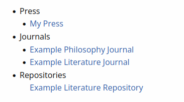

# Custom styling

Status: Active
[GitHub repository](https://github.com/openlibhums/customstyling)

This is a Janeway plugin that allows a staff member to add custom CSS directives to a journal or press site, giving the user control over the styling of each site.

> [!NOTE]
> This page assumes basic knowledge of Cascading Style Sheets (CSS).

> [!TIP]
> It is recommended to access the plugin from the press manager, not the journal manager, because this makes it easier to navigate between journal style sheets.

## Organizing custom stylesheets

By default, the plugin provides one stylesheet for each website in the installation: the press, each journal, and each repository.



You can also create more stylesheets that apply to a custom set of journals. Select **Add new stylesheet** and add the journals to which you want the sheet to apply.

## Creating resets by theme

If you want to make changes for more than one journal, we recommend making cross-site stylesheets for each Janeway [theme](../journal-management/themes.md).

Organizing custom stylesheets by theme makes sense because Janeway’s themes use different underlying HTML and CSS frameworks (see [**Theme resources**](#theme-resources)).

It is a good idea to use CSS custom properties (variables) to set up options which individual journal stylesheets can modify, like colours and fonts.

> [!TIP]
> If you are modifying CSS for accessibility purposes, note that some themes are more accessible than others. Move your journals onto the Clean theme if possible, or the Clarity theme if available (requires Janeway 1.9+).

## Customizing one journal’s colours and fonts

Individual journal stylesheets can be used to change colours and fonts that apply to one journal.

First, identify what CSS custom properties (variables) are available, depending on the theme (see [**Theme resources**](#theme-resources) and whatever variables have been defined in a cross-site stylesheet for that theme (see [**Creating resets by theme**](#creating-resets-by-theme).

Then, write rulesets that modify the values of those variables for the journal in question.

> [!WARNING]
> Avoid creating highly specific selectors that depend on element names if possible, since updates to Janeway’s templates could break your styles.

## Theme resources

Custom CSS will be easier to write if you work with the underlying theme used by the journal.

### Clarity

Clarity is an emerging theme that is intended to be a more accessible and current alternative to the other three themes. It requires Janeway 1.9+ and the source code is stored in a separate Git repository.

The Clarity theme uses [Bootstrap](https://github.com/twbs/bootstrap) v4.4.1 as a basis, and modifies them with [Clarity theme styles](https://github.com/openlibhums/clarity/tree/main/assets/css).

Clarity has basic colour customization built in through four pre-set [colour palettes](https://github.com/openlibhums/clarity/tree/main#colour-palettes).

However, should you need finer grained control, you can use these three variables to modify the main colours:

```css
[data-clarity-palette]:root {
  --brand-primary: #your-colour;
  --brand-secondary: #your-colour;
  --header-bg: #your-colour;
}
```

### Clean

The Clean uses [Bootstrap](https://github.com/twbs/bootstrap) v4.4.1 as a basis and adds a number of [Clean theme styles](https://github.com/openlibhums/janeway/blob/master/src/themes/clean/assets/css/clean.css).

Clean is recommended for Janeway 1.8 and earlier. However, if you have Janeway 1.9 or newer, consider using the Clarity theme.

We have prepared a [recommended reset for the Clean theme](https://github.com/openlibhums/stylesheets/blob/main/clean-base-janeway-v-1-8.css) that you can use on 1.8 as a cross-site stylesheet before customizing each journal futher.

With this reset in place, you can then use the following block to override the brand colour for individual journals:

```css
:root {
  --journal-brand-color: #000000;
}
```

Replace the above hex code with your desired code.

You can also override the font with this block (again depending on the above reset):

```css
@import url("https://fonts.googleapis.com/css2?family=SomethingElse&display=swap");
:root {
  --font-face: SomethingElse, sans-serif;
}
```

Change the URL to point to your chosen font, and change `SomethingElse` to the font’s name.

### OLH

The underlying framework for the OLH theme is [Foundation for Sites](https://github.com/foundation/foundation-sites) v6.3.0.

There are also [OLH theme styles](https://github.com/openlibhums/janeway/blob/master/src/themes/OLH/assets/scss/) to be aware of. Most current maintenance is done by modifying [OLH/assets/scss/app.scss](https://github.com/openlibhums/janeway/blob/master/src/themes/OLH/assets/scss/app.scss).

The following block can be used to change OLH-theme colours for one journal. Copy-paste this block into an individual journal style sheet, and then edit the hex codes.

```css
:root {
  --primary-dark-color: #22175b; /* Primary colour used by elements such as buttons */
  --very-dark-primary-color: #22175b; /* Darker primary colour used for contrast or hover effects */
  --primary-light-color: #fff; /* lighter colour or secondary colour */
  --topbar-background-color: #fff; /* background colour for the top bar of the navigation */
  --menu-background-color: #ffffff; /* background colour for the menu bar of the navigation */
  --menu-alternative-background-color: #ffffff; /* Alternative background colour for the menu bar, used by some buttons */
  --menu-foreground-color: #000000; /* font colour used in the menu bar */
  --link-color: #2199e8;
  --toc-link-color: #22175b; /* Colour used by text on TOC sidebar elements */
  --figure-caption-background-color: #003dac;
  --figure-caption-color: #ffffff;
}
```

### Material

Material uses [Materialize CSS](https://github.com/materializecss/materialize) v1.2.2 and there are also [Material theme styles](https://github.com/openlibhums/janeway/blob/master/src/themes/material/assets/mat.css).

> [!WARNING]
> Material is difficult to customize effectively because it uses older CSS conventions. It is recommended not to use Material as the basis of extensive customization.
