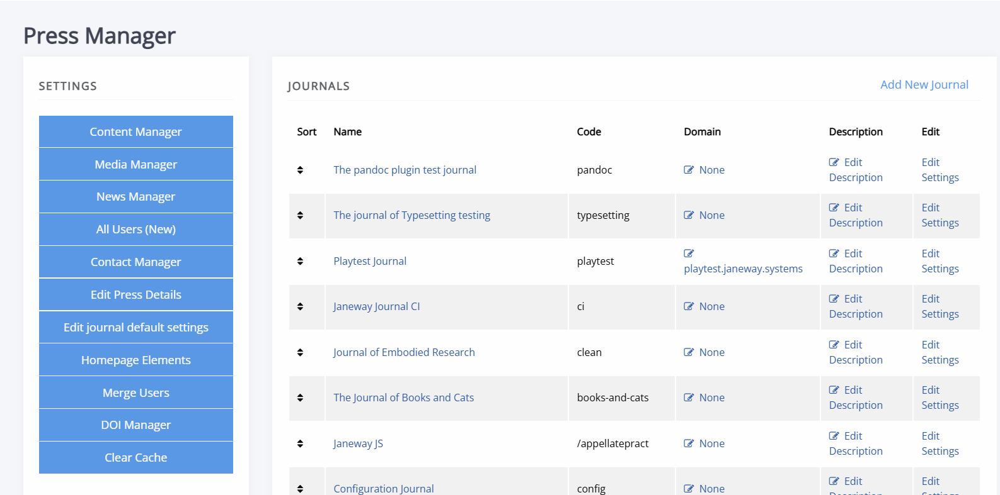

# Press management

_Coming soon_

The **Press manager** page brings together settings and tools that apply across every journal on your press. It's accessible to users with the **staff** role, and is where you configure press-wide details, users, and journal-level overrides.

- [Journal management at press level](./journal-management-press-level.md)  
  An overview of the Press manager dashboard, including press-wide journal settings and overrides.
- [Managing users at press level](./managing-users-at-press-level.md)  
  How to view, filter and manage user roles and permissions across all journals from the **All users** interface, as well as merging duplicate accounts through the **Merge users** interface.
- [Journal footer](./footer.md)  
  Configuring the postal address, contact details and navigation links shown in every journal's footer.
- [DOI management – press level](./doi-management-at-press-level.md)  
  Managing Crossref DOI settings and the DOI Manager across journals from the press level.
