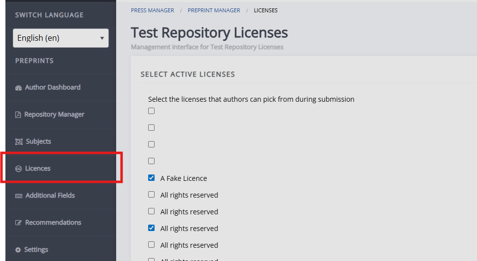
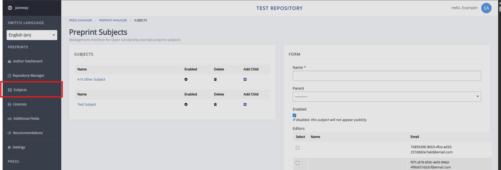
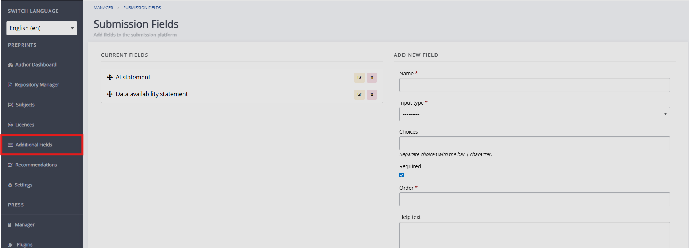
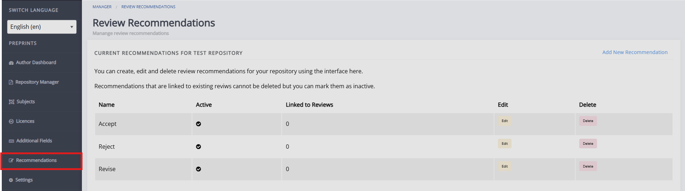

# Repository settings

Clicking**Repository settings** opens the repository setup wizard, which is used for both configuring a new repository and editing the settings of an existing one.

The wizard has five steps:

1. **Repository details 1**
   Key repository details, such as the name, custom domain, and the name of the objects in the repository (for example, "article" or "preprint"). Help text is available on the page.

2. **Repository details 2**
   Provides more detailed repository information, including the repository description and images, and review guidance for users.

3. **Submission details**
   Text shown to users on the submission page, and settings related to review.

4. **Email templates**
   Displays the email templates available on the repository. For more
   information on editing email templates and email template variables,
   see [Email templates](../email-and-reminders/email-templates.md). <!-- do we have a full list of repo email template vars? -->

5. **Live**
   Sets the repository as live.

The section below will briefly outline the the other pages which lets you configure youre repository. For information on additional settings, including licences, submission fields, and subjects, see [Additional repository settings](). <!-- missing hyperlink--> <!--need to write this still-->

## Licences

This page lets you choose which licences are made available for preprints in this repository. The available licences are all of those made available on the Janeway press, which is why you may see duplicates.

## Subjects

This page lets you set the subjects that preprints can fall into.

## Additional submission fields

You can set up additional, custom submission fields for your repository on this page.

## Recommendations

You can create, edit, and delete review recommendations for your repository using the interface here.
