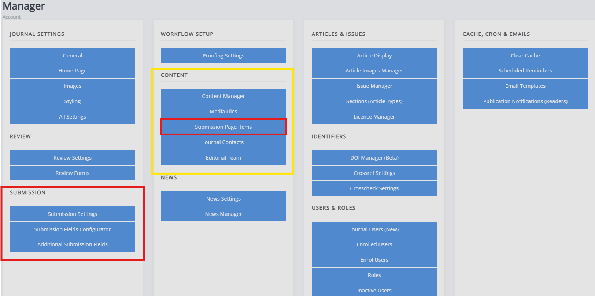

# Managing submissions on Janeway

There are multiple aspects to managing submissions on Janeway. The two key parts are the submission information page and the submission process. The submission page displays information for potential authors on the journal website. The submission process is where authors submit their manuscript and provide information about the submission. Certain fields, such as the copyright notice, publication fees and submission checklist, appear by default on both. The textboxes for these fields are crosslinked; this ensures the information provided to authors regarding submission remains consistent regardless of where it is presented.

- [The submission page items](./submission-webpage.md)  
  This configures the text on the submission page, visible at `[yourjournalwebsite]/submissions`.

- [Submission settings](./submission-settings.md)  
  This configures the submission process itself and how it functions. From here, you can also disable submissions.

- [Submission fields configurator](./submission-fields.md)  
  This configures the submission fields used during the submission process. Any unchecked fields will not be presented during the submission process. If you do not enable the licence, language and section (article type) fields, you must set a default value for these. This will set these fields to the default provided in the article metadata. If no default is provided and the field is disabled, the information will not be present in the article metadata.

- [Additional submission fields](./submission-fields.md#custom-submission-fields)  
  If you require any additional submission fields as part of the submission process, you can set them up through this page.

Other relevant settings you may configure related to submissions are the [**Licence manager**](./article-licence-manager.md), which configures the licences available for your journal, and [**Sections**](../article-management/article-sections.md), which sets the article types available for the journal and submissions.
