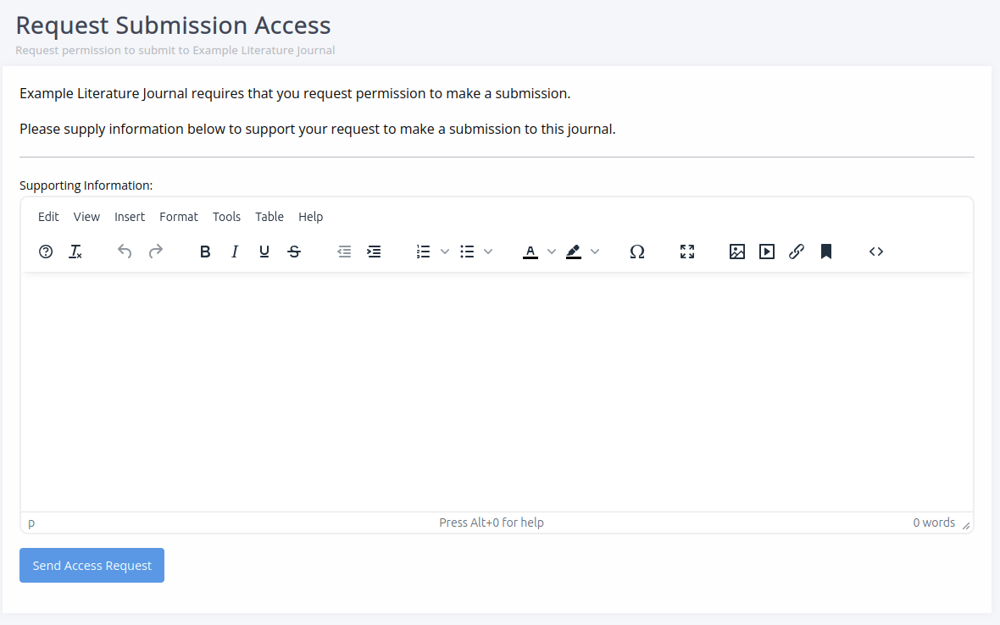
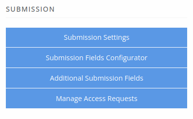
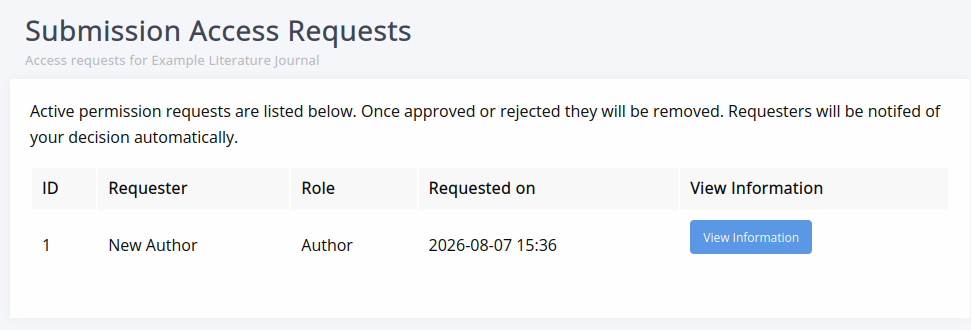

# Managing submission access

Journals may wish to limit submissions to approved authors or turn submissions off entirely.

The settings to control access can be found under [**Submission settings**](submission-settings.md#submission-control).

## Submitting access requests

If a journal has turned on **Limit access to submission**, authors have to request access before submitting a manuscript.

When they click **Start submission**, they are brought to an access request page, where they can provide supporting information via a text field and request submission access.

## Processing access requests

Access requests are sent by email to the contact specified in the submission settings, who then need to follow the link to process them by approving or denying them.

Requests can be viewed within Janeway by users with staff access. For staff, a new option will be available on the journal manager page under **Submission** called **Manage access requests**.

On this page, you can view the detail of each request and approve or deny it.

