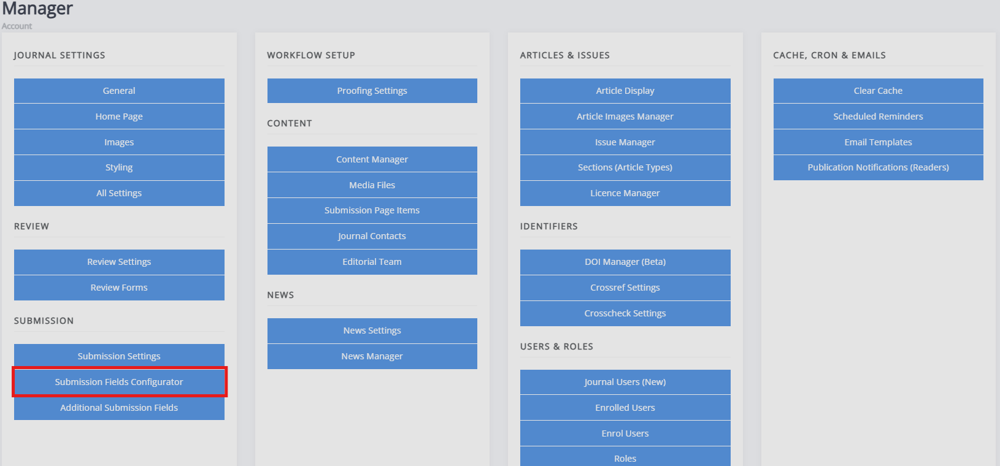
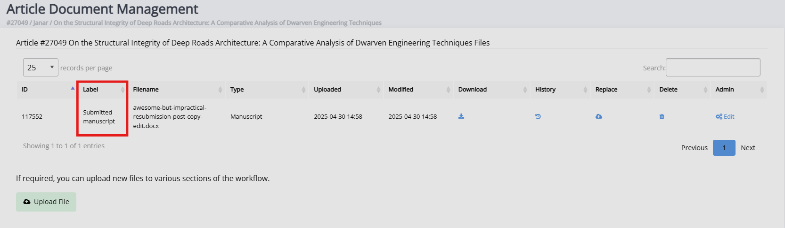

# Managing submission fields

There are two parts to managing submission fields on Janeway: standard fields and custom fields. The standard fields are the preexisting submission fields on Janeway, whereas the custom ones are any you create.

## Standard submission items

There are a set of default submission fields within Janeway, the **Submission fields configurator** allows you to configure which one of these will appear during the submission process. The fields you have checked will display, while any of those which are unchecked will not. The default submission fields include:

- Publication fees
- Submission checklist
- Copyright notice
- Competing interests
- Comments to editor
- Abstract
- Language
- Licence
- Keywords
- Section
- Funding
- Figures and data files

If you choose not to use the licence, language and section fields as a part of the submission process, it is recommended to set a default value for those. E.g. if you only accept submissions in English, you could remove the language selection from the submission process. If you do so, it is recommended you set English as the default language. If nothing is set, the language will be absent from the article metadata (or licence or article type, respectively).

If you are using Janeway in languages other than English, you can also set the label for the submission file. This is what the 'main text' the author uploads will be labelled within the system.

## Custom submission fields

Under the same header, you will also find **Additional submission fields**. This lets you add custom fields to the submission process.
See [form elements](../journal-management/form-elements.md) for more information about the types of fields you can create.