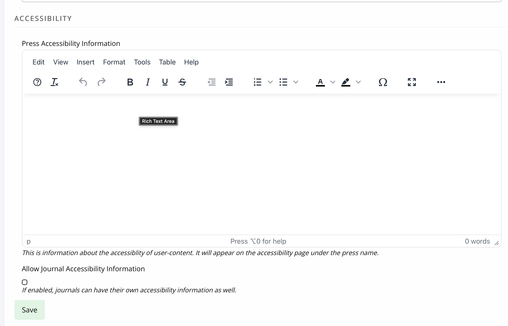
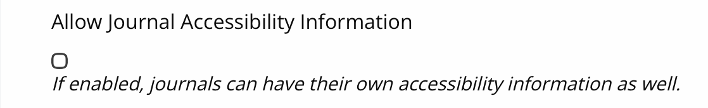
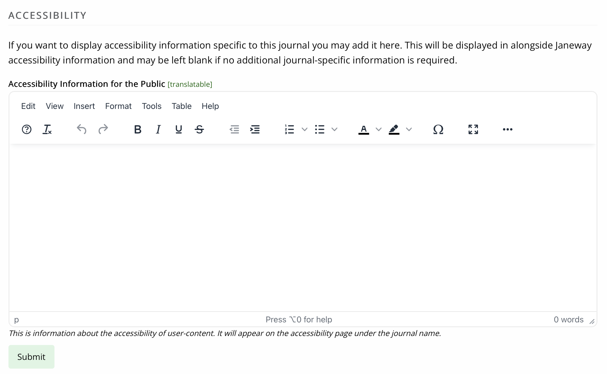

title: Displaying Custom Accessibility Information
# Displaying Custom Accessibility Information
## Introduction
Janeway 1.9 introduced an Accessibility page linked from the footer. 
By default, this only shows the platform accessibility information, 
however there are settings to include custom press and/or journal specific 
information. Journal information can only be displayed if a setting to allow that is switched on at Press level. 

## Enter press accessibility information
Press accessibility information may be entered in through the Press Manager under "Edit Press Details". There is a section for Accessibility. 

## Press setting to enable journal accessibility information
After the accessibility information (above) there is a setting for enabling custom accessibility information on each journal.  This allows each journal to have a unique accessibility statement. 

> [!NOTE] 
> This setting applies to all journals within that press. It provides the **option** to enter text onto the journal accessibility page, and will be hidden from readers when it is left blank.

## Enter journal accessibility text
> [!WARNING] 
> The setting at press level must be switched on to make this available in the journal manager. If this section is not available, then please contact your press manager.

Journal accessibility information may entered through the Journal Manager "General" page. 

### Quick reference

| Custom Press Text | Press setting to Allow Journal Text | Custom Journal Text | What is displayed |
|---|---|---|---|
| *none*          | no    | *not available*   | Platform |
| *none*          | yes   | *none*              | Platform |
| *none*          | yes   | Journal Text      | Journal Text + Platform |
| Press Text    | no    | *not available*   | Press Text + Platform  |
| Press Text    | yes   | *none*              | Press Text + Platform  |
| Press Text    | yes   | Journal Text      | Journal Text + Press Text + Platform  |

