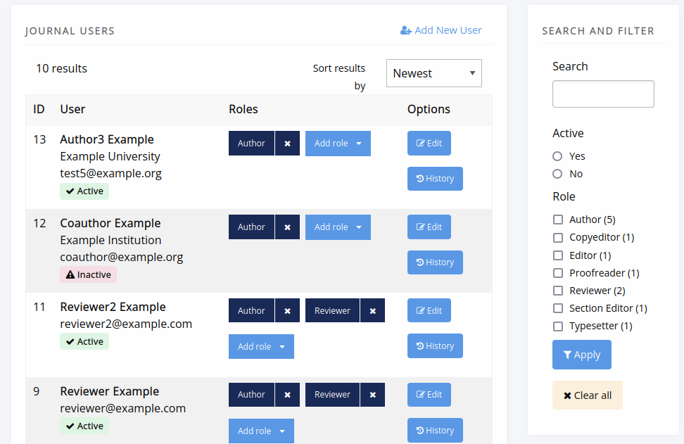
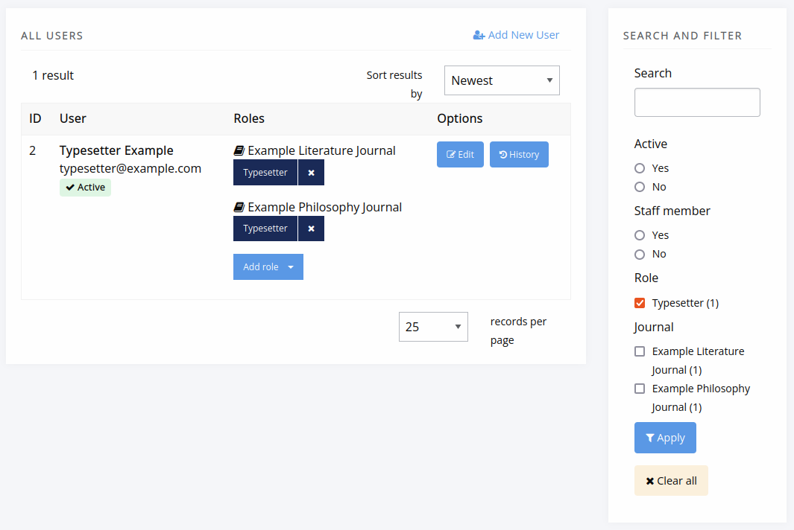
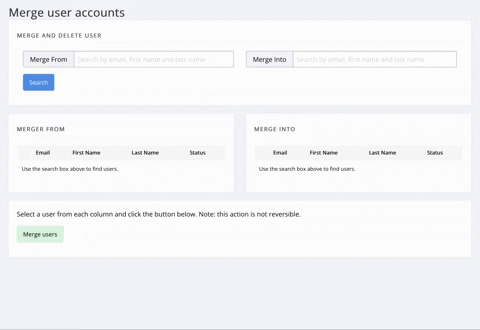

title: Managing user accounts
# Managing user accounts

The **Users and roles** section of the Manager dashboard has various controls for managing users and permissions. Who can manage what will depand on their role and permissions associated with it.

**Editors** and **Journal managers** can:
- Manage user accounts at the journal level.
- Assign and remove roles for users on the journal.
- View and update account activation status.

**Staff** have additional controls for:
- Viewing all accounts for the press (Janeway installation), including their journal roles and activation status.
- Merging duplicate user accounts.

These additional controls are only available at the press level.

## Journal users
If you are an editor, journal manager or staff member, you can manage user accounts for a
journal via the **Journal users** page.

From this page you can:
- Search by name, email address, ORCID, institution, or biography.
- Filter users by role and account activation status.
- Add or remove journal roles.
- Edit user account details.
- Create new user accounts where required.

Each user's assignment history (for example, editorial or review activity) is also available from this view. 

This page cannot be used to delete accounts, only deactivate them. Accounts can only be deleting using through the **Admin area** <!-- missing hyperlink>.

## All press users

Staff users can access a press-wide view of all accounts across press / the Janeway installation. This view is available from the **Press manager** interface only.

At press level you can:
- Filter users by journal role and staff status.
- Manage roles across multiple journals.
- Perform all actions available to editors at journal level.

## Editing user accounts

Click **Edit** next to a user to open the **Edit user** interface, where you can update a user’s account details.

Some changes are restricted by permission level. For more information, see the **Permissions** page. <!--missing hyperlink-->

>[!IMPORTANT]
> Editing a user account does **not** change author metadata on articles that have already been accepted.  
> To update author details on an accepted article, you must edit the *frozen author record* on the article’s metadata page.

## Merge users (staff only)
When users have multiple accounts (often due to different email addresses having been used), it may be helpful to merge accounts. Users with staff permission can merge two user accounts to remove duplicates, using the **Press manager interface**. When searching for users to merge, note that the user account in the left column (source account) will be merged into the user account in the right column (destination account). 

>[!WARNING]
>An account merge **cannot** be undone. Only merge account when you are certain they can be merged.

When accounts are merged:
- All associated items (including articles, tasks, roles and files) are transferred from the source account to the destination account.
- The destination account profile is retained.
- Any profile information from the source account is permanently lost. <!--check how much of this is the case -->

