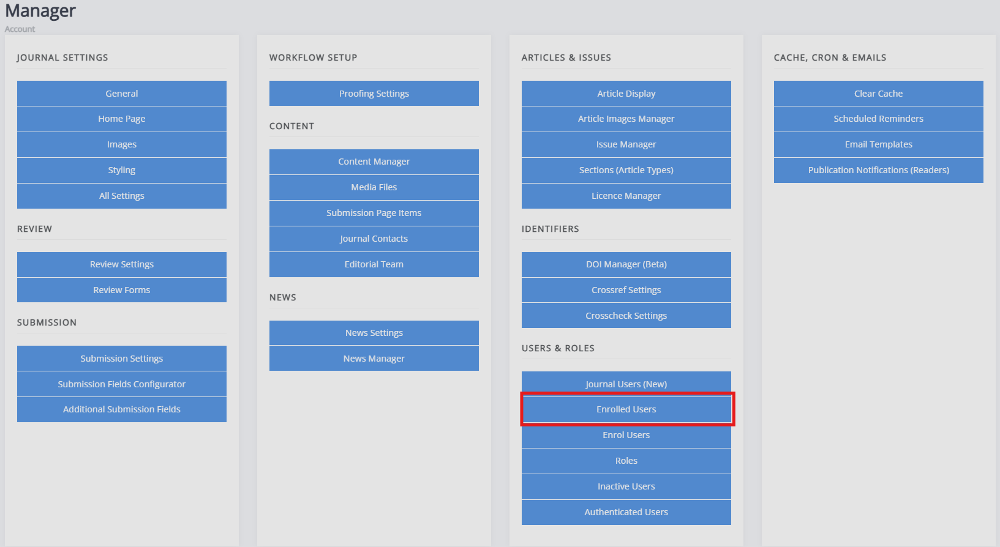

title: Managing user accounts
# Managing user accounts

The **Users and Roles** section of the manager has various controls for
different permission levels.

Editors have control of:
-   User accounts at the journal level.
-   Account roles in the journal.
-   Account activation.

Staff have additional controls for:
-   Viewing all accounts for the Janeway installation, including their journal roles and activation status.
-   Merging user accounts.
Both of these are only available at the press level.

## Journal users
If you are an editor or staff member, you can manage user accounts for a
journal via the **Journal Users** page.

You can search by various fields, including name, email, ORCID,
institution, and biography. You can filter by role and whether an account
is active.

You can also add and remove roles, edit accounts, and, if needed create
accounts.

Each user's assignment history is also available from this view.

## All users

If you are staff, you can see all users across a press (a.k.a. Janeway
installation) - this view is only available from the Press Manager interface.

At this level, you can filter by journal and staff-member status and
manage roles across journals, in addition to the actions an editor can
take.

## Editing user accounts

When clicking **Edit** next to a user, you will be taken to the Edit User interface, where you make changes to a user's details. There are a few things to note regarding permissions, see the Permissions page for more information <!-- missing hyperlink -->.

TBC 
- information about how editing an account won't affect metadata on articles that have already been accepted: to do that you'll need to edit the frozen author record on the article metadata page. 

## Merge users (Press Manager only)

The press manager interface enables staff members to merge two accounts to eliminate duplicates. All associated objects, such as tasks, articles, roles, and files, will be moved from the source account to the destination account. The account profile remains unchanged, meaning any profile information in the source account will be lost.

> [!WARNING]
> When searching for users to merge, note that the user account in the left column will be merged into the user account in the right column.

 -->

<!-- The below may be deprecated with the introduction of Users and roles

## Enrolled users

The journal user interface lists all users with one or more roles for your journal. From this page, you can:

- Edit a user

- Add new users

- Add multiple users to roles

- View a user's assignment history  
  - Editorial assignments
  - Review assignments
  - Copyediting assignments
  - Production assignments

<!-- Check if image still good here -->
<!-- 

## Enrol users

The enrol users page allows editors to search for existing user accounts and assign them a role in their journal.

You can search for existing user accounts by:
- First name
- Last name
- Email address

> [!TIP]
> You don't need to search by all three fields. You can search by first name or email address, for example.

Once you have found an account, you can see which roles they have and which are available to be assigned to them.

<!-- Check if image still good here [This user has two roles (Author and Editor) and can be assigned any of the other roles.](../../support/images/enrol-user.gif) -->

