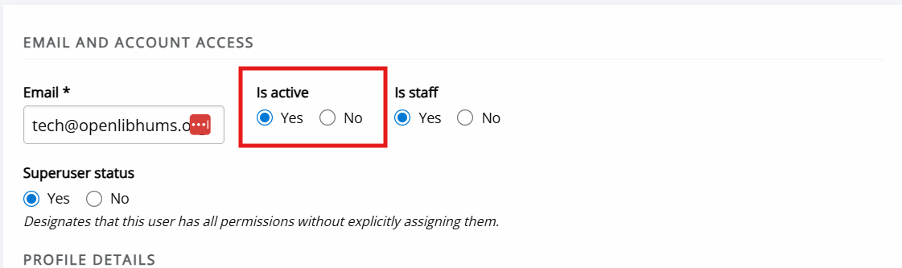

title: Activating accounts
# Activating accounts

This page explains how to check whether a user account has been activated and how to activate inactive accounts.

As users must activate their account before they can log in to Janeway, inactive accounts are a common cause of login issues.

## Inactive users
There are two places from which to check and manage the activation status of accounts: 
- **Journal users**
- **Inactive users**.

Both are found under **Users & roles** on the Manager dashboard. The **Journal users** page is available to editors and journal managers, where as the **Inactive users** page is accessible to staff only.

To view inactive users:
1. Open **Journal users**.
2. Use the filter on the left-hand side.
3. Set **Status** to **Inactive**.
4. Click **Apply**.

This will list all inactive users on the journal. You can also search by name or email address.

The **Inactive users** page lists all inactive users across the press who have not yet activated their accounts.

## Activating accounts
After finding an inactive account, 

Once you have identified an inactive account through either **Journal users** or **Inactive users**:
1. Click **Edit** next to the user to open the account page.
2. Under **Is active**, select **Yes**.
3. Save your changes.

The user will now be able to login into the journal.

### Troubleshooting

-Resending activation emails
  Only from admin?

Account activation should not trigger an email (check).

Users usually activate through a link sent to them.

/Does ORCID require activation?
/Do author accounts automatically activate upon submission?
/Do reviewer accounts with one-click review? -> check Mauro's suggested solution for the issue encountered.
/Why can accounts be inactive? -> NEarly always because not activated. Rarely manually deactivated.

## Authenticated users
The **Authenticated users** page shows a list of users currently logged in to your Janeway installation.

This page is only accessible to users with staff permission.