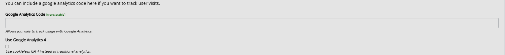

title: Google analytics
# Google analytics

Allows you to measure activity on your web pages.

- About Google analytics
- Link to GA page
- If issues, send email to support.

Found through either general settings -> scroll down

Or through all settings:

