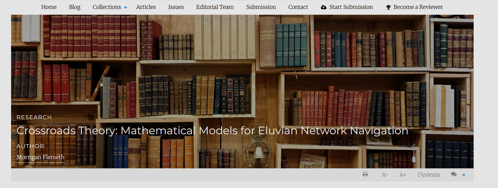

title: Article images
# Article images

Articles have three images that are used for display:

## Large landscape image 

This image is used in the heading of the article page (also called a 'hero image'). This image will also be used in the carousel, popular articles and featured articles sections on the homepage, if those are enabled and an article is added to it. It is also used as the meta image if none is supplied.

The exact recommended size of the large image will depend on the theme your journal uses. The height of the display will also ways be 648px, but the width will vary per theme: 1100px on the Clean theme, 1200px on the OLH theme, 1477px on the Material theme. For information on image display, cropping and sizing, see Image guidelines <!-- missing hyperlink -->). The image will be resized smaller for display on the homepage.

Generally, we recommend large, landscape images to be used for the large image and avoiding images with people or bodies due to potential unexpected cropping.

If no landscape image is uploaded, the **Default large image** will be used where the landscape image is set to display.

## Thumbnail image  

The thumbnail is a small square image displayed on pages listing articles such as the **All articles** or the **Issue articles** list. A width-to-height ratio of about 3 to 4 is recommended. If no thumbnail is set, this defaults to the Janeway logo.

<!-- -->

## Meta image  

The meta image allows you to override the image displayed on social media when the article is shared. If no meta image is supplied, the large image is used, but it may not display correctly due to its size.

<!--  -->

## Article images manager
The article images manager is an interface for editing all of the images for a given article.

See also: image guidelines <!-- missing hyperlink -->