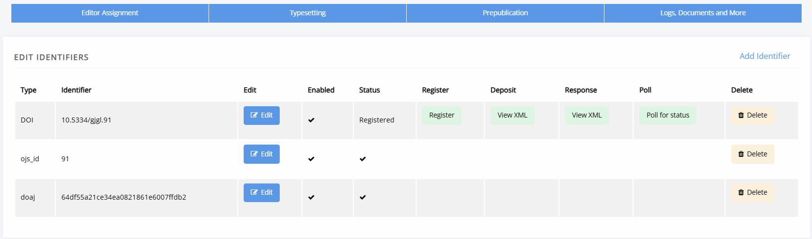

title: Article metadata
# Article metadata

*Coming soon*
<!-- -How to find article metadata.
Published VS in-progress -->

Article metadata can be edited through either the **Archive** page or through **Edit metadata**. Both can be found under **Logs, documents and more** in the blue workflow bar.

The first block of the **Article archive** page lists most of the article's metadata. To change it you can click **Edit** button.

This will take you to the following page, where you can edit the article's metadata:

Make sure you scroll down and click **Update metadata** to save any changes.

On this page, after the block for the article metadata, you can also edit the author metadata and funder information.

## Metadata fields

*Coming soon*

## Identifiers

Janeway can mint CrossRef and DataCite DOIs <!-- missing hyperlinks --> and if working with data imported from other platforms can also maintain existing publisher IDs, such as an OJS ID.

Identifiers associated with an article can be found through **Identifiers** under **Logs, documents and more**. Though DataCite DOIs will not show up here and need to be managed through the DataCite plugin. <!--missing hyperlink-->

> [!TIP]
> You can also manage CrossRef DOIs at the journal level as an editor (and at the press level as a staff user) using the DOI Manager.

## Google Scholar

Google Scholar indexing is automatic; they use a webcrawler that looks for relevant materials (articles, monographs, preprints, reports, etc). It takes some time for new journals to appear on Google Scholar and for changes to existing content to show. [Google Scholar advises](https://scholar.google.com/intl/en/scholar/inclusion.html#troubleshooting) it may take 6-9 months for changes to appear.

If your journal is not properly indexed, contact support, we work with Google Scholar to make sure all journals are captured
 <!-- - Metadata issues
    - Gotta compare galleys against meta-tags in the HTML.
   
[Google Scholar documentation.](https://scholar.google.com/intl/en/scholar/inclusion.html#overview)

## OAI-PMH

## KBART

## Credit

## ORCID

## Funder ref
-->