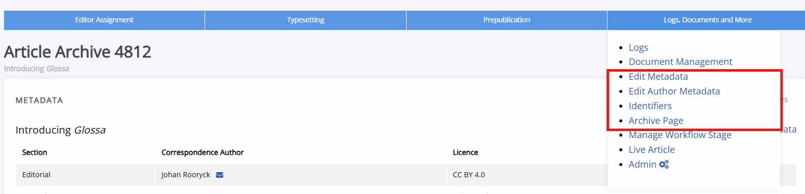
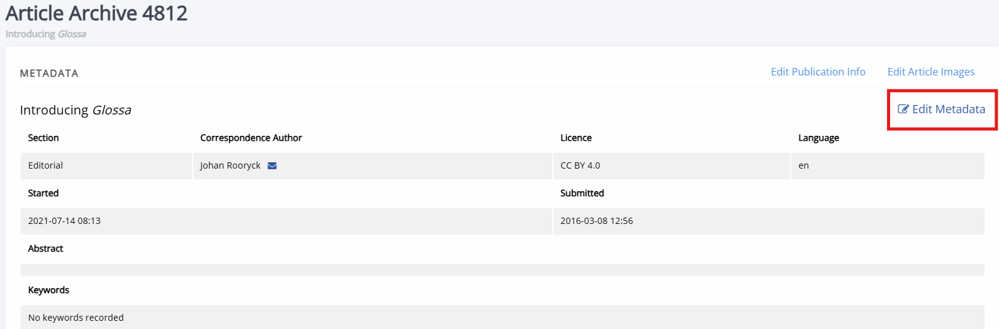
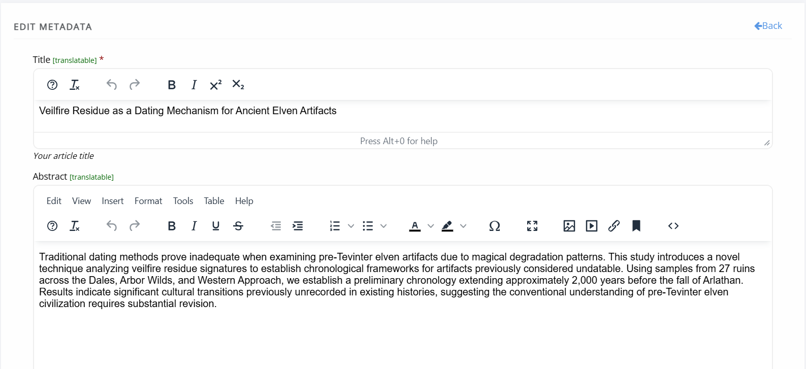
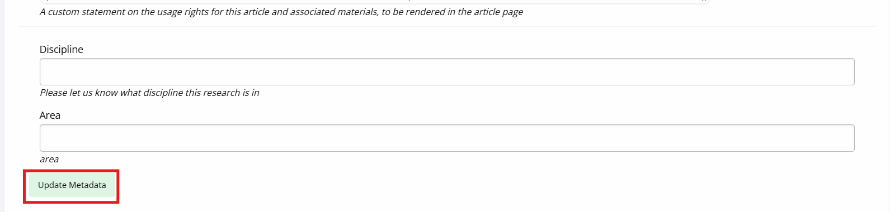

title: Article metadata

# Article metadata

<!-- Siobhan: this is the only doc that I could not figure out how to merge when I was doing the big merge in the second week of June. -->

<!-- start version 1 -->

There are various ways to access an article's metadata depending on the status of an article. This page will provide an overview, for more general information on metadata, see: metadata on Janeway<!-- missing hyperlink-->.

For unpublished articles, you can either scroll to the bottom-right corner with the decisions and select **View metadata** (granted an article is no longer in the unassigned stage), or you can:

1. Go to the article page within the workflow.
2. Click on **Logs, docs and more** on the right-hand side of the blue workflow progress bar.
3. Select
   a) **Article archive** if you wish to only see the metadata,
   b) **Edit metadata** if you wish to edit it or,
   c) **Edit author metadata** if you wish to edit the author metadata.

For published articles:

1. Find the published article.
2. Click on the Account dropdown in the top-right corner.
3. Click **Edit article** this will lead to the **Article archive** page, where you can view the article's metadata.
   
4. You can now click on:
   a) **Edit publication information**
   b) **Edit metadata**
   c) Or scroll down to the author section and click **Edit author metadata**
   Alternatively, you can also click on **Logs, docs and more** and find these options in the dropdown menu.

_Coming soon_

## Identifiers

Identifiers can be managed on an indivual basis or, if using CrossRef DOIs, in bulk.

Any identifiers such as DOIs are listed here and a link to manage them is in the top right of the block.

> [!TIP]
> You can also manage DOIs at the journal level as an editor (and at the press level as a staff user) using the DOI Manager.

<!--  -->

See also: Identifiers <!-- missing hyperlink -->

## ROR

Affiliation metadata in Janeway is managed using the [Research Organization Registry](https://ror.org/).They assign persistent identifiers to organizations, like DOIs for articles, ORCIDs for people, and ISBNs for books. This allows multiple names to be associated with a single organization, for easier discovery and display, and it adds to the possibilities for linked open data. To read more about RoR (and CRediT) on Janeway, see Metadata on Janeway<!-- missing hyperlink -->.

## Publisher notes

Publisher notes appear on the article page below the abstract and how to cite block. These can be used to notify readers of small changes to the paper like a post-publication update to fix spelling etc. The publisher notes can be edited from the **Article archive** page.

<!-- Publisher note on the OLH theme](../nstatic/publisher-note.png) -->

<!-- end version 1 -->

<!-- start version 2 -->

_Coming soon_

<!-- -How to find article metadata.
Published VS in-progress -->

Article metadata can be edited through either the **Archive** page or through **Edit metadata**. Both can be found under **Logs, documents and more** in the blue workflow bar.

The first block of the **Article archive** page lists most of the article's metadata. To change it you can click **Edit** button.

This will take you to the following page, where you can edit the article's metadata:

Make sure you scroll down and click **Update metadata** to save any changes.

On this page, after the block for the article metadata, you can also edit the author metadata and funder information.

## Metadata fields

_Coming soon_

## Identifiers

Janeway can mint CrossRef and DataCite DOIs <!-- missing hyperlinks --> and if working with data imported from other platforms can also maintain existing publisher IDs, such as an OJS ID.

Identifiers associated with an article can be found through **Identifiers** under **Logs, documents and more**. Though DataCite DOIs will not show up here and need to be managed through the DataCite plugin. <!--missing hyperlink-->

> [!TIP]
> You can also manage CrossRef DOIs at the journal level as an editor (and at the press level as a staff user) using the DOI Manager.

## Google Scholar

Google Scholar indexing is automatic; they use a webcrawler that looks for relevant materials (articles, monographs, preprints, reports, etc). It takes some time for new journals to appear on Google Scholar and for changes to existing content to show. [Google Scholar advises](https://scholar.google.com/intl/en/scholar/inclusion.html#troubleshooting) it may take 6-9 months for changes to appear.

If your journal is not properly indexed, contact support, we work with Google Scholar to make sure all journals are captured

 <!-- - Metadata issues
    - Gotta compare galleys against meta-tags in the HTML.
   
[Google Scholar documentation.](https://scholar.google.com/intl/en/scholar/inclusion.html#overview)

## Publisher notes

Publisher notes appear on the article page below the abstract and how to cite block. These can be used to notify readers of small changes to the paper like a post-publication update to fix spelling etc. The publisher notes can be edited from the **Article archive** page.

## Credit

## ORCID

## Funder ref

-->

<!-- end version 2 -->
