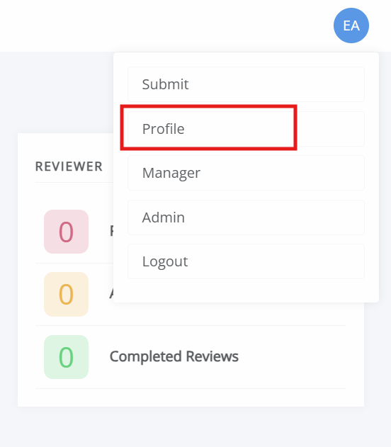

title: Creating an account on Janeway

# Creating an account on Janeway

From the front page of a journal, select **Register** to set up an account. Complete the form and activate your account using the link sent to you by email. Once your account is set up and activated, you can sign in to Janeway.

If you are an author making a submission, you don't need to create an account. One will be created as part of the submission process.

If you have been invited to review, you may be able to complete your review without creating an account if the journal has enabled one-click peer review. <!-- missing hyperlink-->

If the journal is part of a press and you have access to another journal in that press, you may already have an account. Sign in using your existing credentials. If you make a submission, you automatically receive the author role. If you need other roles on the journal, ask an editor or press manager to assign the relevant roles.

## Setting up as an editor

To create an editor account, first register using the steps above. An editor, press manager, or someone with **Staff** permission then needs to assign you the editor role.

## Editing your account

You can edit your account by clicking on the account icon in the top-right corner. This displays either your initials or a profile picture, if one has been set. Click **Profile** to open the profile page, where you can edit your profile.

On this page, you can do the following:
- Update your email address.
- Change your password.
- Update your affiliation.
- Update personal details, such as name, ORCID, social media links, biography, and signature.
- Set a profile picture.
- Set review interests.
- Set your timezone.
- Set your profile visibility.