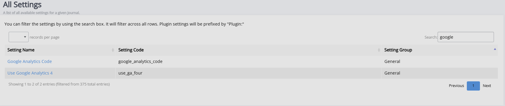

title: Janeway guides
# Janeway guides

# h1
## h2
### h3
#### h4??

**This is bold text**

_This text is italicized_	

This is an <ins>underlined</ins> text	

`???`

This site was built using [GitHub Pages](https://pages.github.com/).

[Contribution guidelines for this project](../contributing-guide.md)

* List
  * Listy list
 
1. number
2. two

[ ] Probably
[ ] Not

> [!NOTE]
> Useful information that users should know, even when skimming content.

> [!TIP]
> Helpful advice for doing things better or more easily.

> [!IMPORTANT]
> Key information users need to know to achieve their goal.

> [!WARNING]
> Urgent info that needs immediate user attention to avoid problems.

> [!CAUTION]
> Advises about risks or negative outcomes of certain actions.

<!-- safety check -->

| First Header  | Second Header |
| ------------- | ------------- |
| Content Cell  | Content Cell  |
| Content Cell  | Content Cell  |

<table><thead>
  <tr>
    <th>Note</th>
  </tr></thead>
<tbody>
  <tr>
    <td>Sweet sweet HTML</td>
  </tr>
</tbody>
</table>
