title: Author guide 

# Author guide
This guide will walk you through the Janeway journal submission system. 

## Navigating the submission process
Generally, all Janeway journals' submission systems will look the same. Along the top of the page, you will see a progress bar with five stages. Once a stage has been completed, the corresponding segment of the bar will turn into a link. You can use this bar to return to an earlier screen if you need to make changes. 

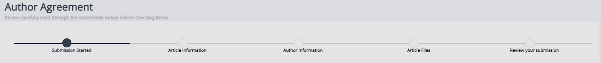

## New submissions
There are multiple ways to submit a journal article on Janeway.

If you do not have an account yet:

- First, begin from the **Submission** page on the main site. If this is not visible on a journal website, they may not be accepting submissions at this time. 

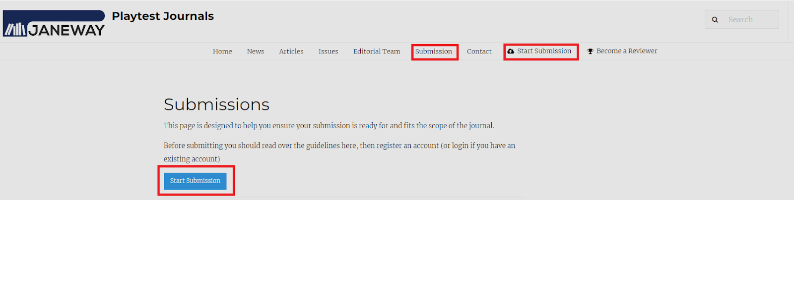

If you already have an account:

- First, begin from the drop-down menu in the top right-hand corner of the page. This will be visible both on the journal webpage when you click **Account** and within Janeway when you click on your profile in the top right-hand corner.

This is an example of how this will appear on the journal website:

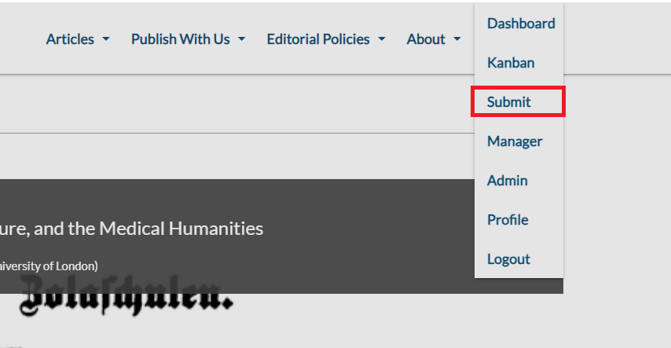

This is an example of how this will appear on the Janeway journal platform:

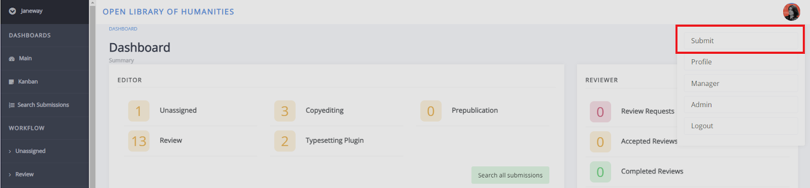

This is an example of how this will appear from the author dashboard within Janeway.

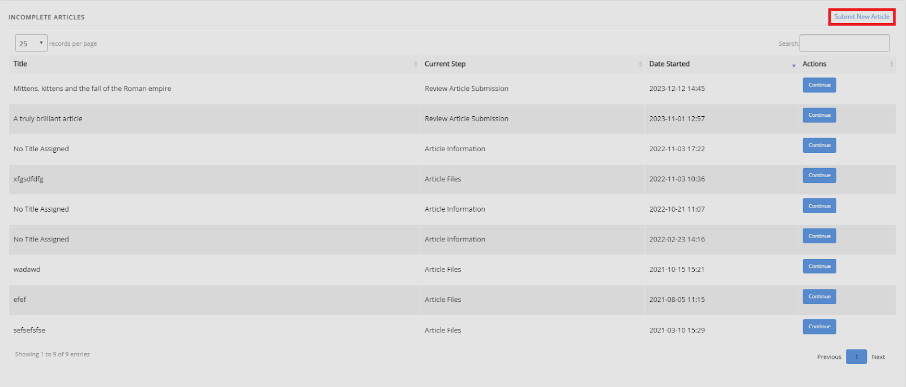

If you already have an account, you will usually automatically be given the author role in Janeway when you submit an article. However, some journals will ask you to provide the details of the manuscript’s author or select yourself as the author manually. For more information on this, see the **Author information** <!-- Missing hyperlink --> section of this guide.

### The author agreement
The first page of the submission process is the author agreement. Depending on how a journal is set up, this may appear slightly different, and not all of these fields may be displayed.

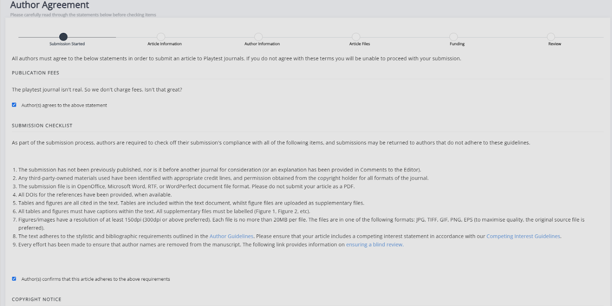

- Publication fees  
  This is where you will see any publication fees, including Voluntary Author Contributions (VACs) or Article Processing Charges (APCs) that apply to the submission.
- Submission checklist  
     The submission checklist will display any steps you need to take before submitting the manuscript (e.g. formatting).
- Copyright notice  
    The copyright notice specifies the license under which the paper will be published and any rights you may need to sign over to the publisher.
- Competing interests  
    If you have any competing interests that the editors should take into account when examining your paper, this is where you will need to disclose them.

> [!NOTE]
> Please note that a "Voluntary Author Contribution" and "Article Processing Charge" are different. The former is entirely optional and not required for publication in a journal. For more information about publication fees, visit the relevant journal’s policy page(s) or contact its editorial team.
 
If they have been enabled, the publication fees, submission checklist and copyright notice fields will be required. This means that you _must_ select the checkboxes in order to complete a submission. If you have any issues with any of the clauses, it is best to contact the editor(s) before you submit your work.

### Article information
The **article information** page is where you will provide the metadata for your submission. Required fields will be marked with an asterisk, but we recommend that you fill out optional fields as well.

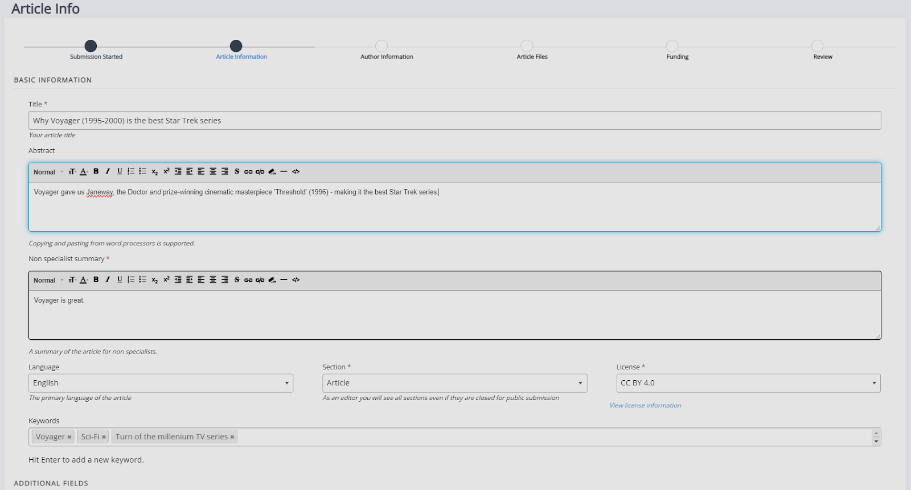

Metadata that may be requested on this page:
- Title  
    This field is always required.
- Subtitle
- Abstract  
    Whether or not an abstract is required will depend on the individual journal.
- Language  
    This is usually only required if the journal publishes in multiple languages.
- Section  
    This refers to the type of article the paper is (e.g., research article, book review, editorial, etc.).
- Licence  
    This is usually disabled if the journal only accepts one license type.
- Keywords  
    You can add keywords to your article to help people discover it. To add keywords, type the word or phrase into the textbox and press 'Enter' to add it. If you wish to delete a keyword, click the **X** icon next to it within the textbox. Keywords can include spaces and special characters.

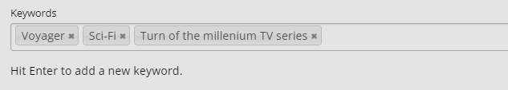

Individual journals can add more fields to this page. These will be displayed under **Additional fields**.
    
### Author information
The **Author information** page is where you fill in the relevant information about a submission’s author(s). The person submitting will be automatically added as an author.

To add more authors to a submission, you can either search the journal's author list for existing authors, search by ORCID or add another author manually.

- Adding authors through **Add author from search**
    - This lets you search the journal's database of authors by using their email address or ORCID. You cannot search using a name or institution.
    - If a matching record is found, they will be added as a co-author. If not, you will be notified that no account has been found.

    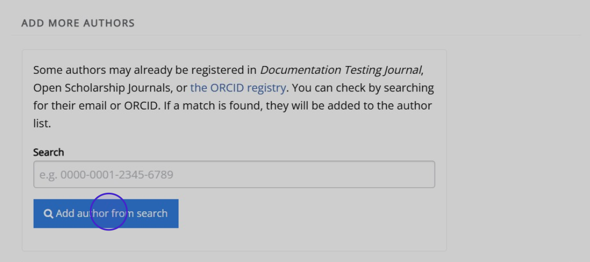

If the search of the journal's author list or ORCID search are successful, author details will be added automatically. You can still make edits, by clicking on **Edit author details**. When an author already has an account with the journal or another journal under the press, this submission will be linked to their existing record.

- Adding authors through **Add author manually**
    - The **Add author manually** button lets you create a new author record for authors if they do not already have one. The following fields are mandatory in Janeway:
        - First name
        - Last name
        - Email address

        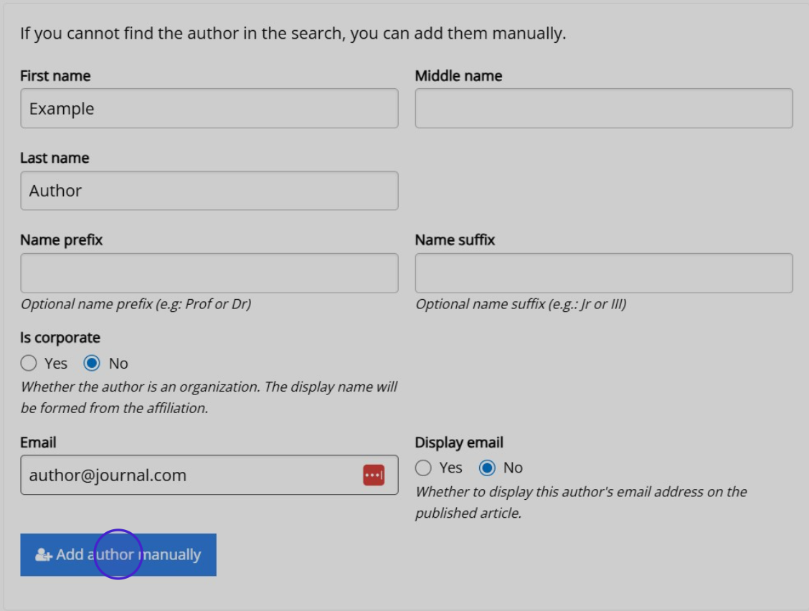

This will not create a new account for the  additionaly author(s), it will only create an author record with no account attached. If they wish to login and check the article's progress, they can create an account with the same email address that was used on the author record (submission). Either the submitting author or an editor can then link the account to the author record.

To change the correspondence author, another author with a pre-existing (confirmed) account needs to be added. If no other co-authors have an account, the submitting author is required to remain the correspondence author.

>[!NOTE]
>The correspondence author does not necessarily have to be the primary author. The correspondence author can also be changed after submission.

Janeway uses [Research Organization Registry (ROR)](https://ror.org/) to manage affiliation data. You can add author affiliation by clicking **Edit author details** and scrolling down to **Affiliations**. From here, you can add, remove and edit affiliations. If an author ORCID has been provided, their affiliation will be added automatically from their ORCID. You can still edit this, if it is incorrect.

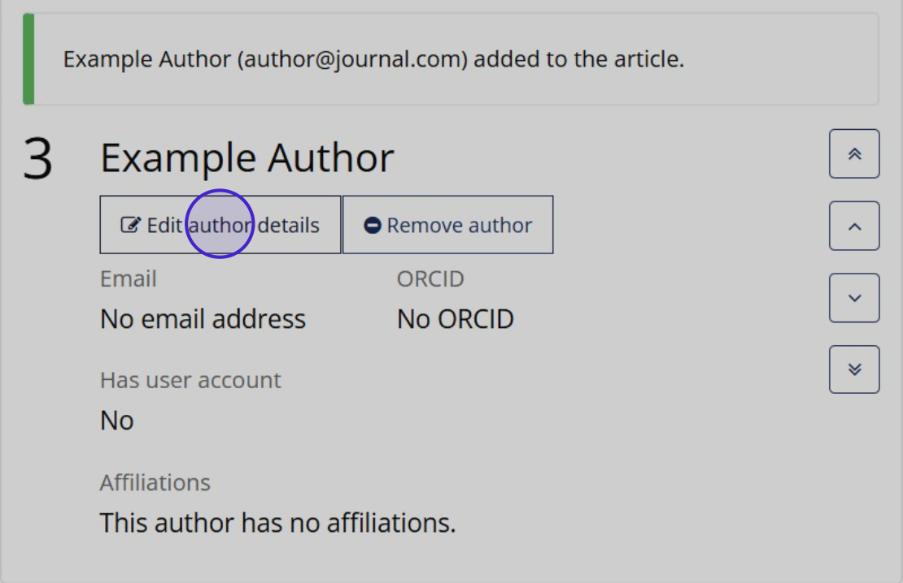

After the submission is completed, co-authors will be notified and will be able to access the submission and update or edit their details.

### Article files
On the **Article files** page, you can upload your manuscript and any supplementary files, figures or images that go along with it.

Even if they have already been inserted into the manuscript file, you need to add any figures, diagrams, images, or other additional data separately under **Figures and data files**. 

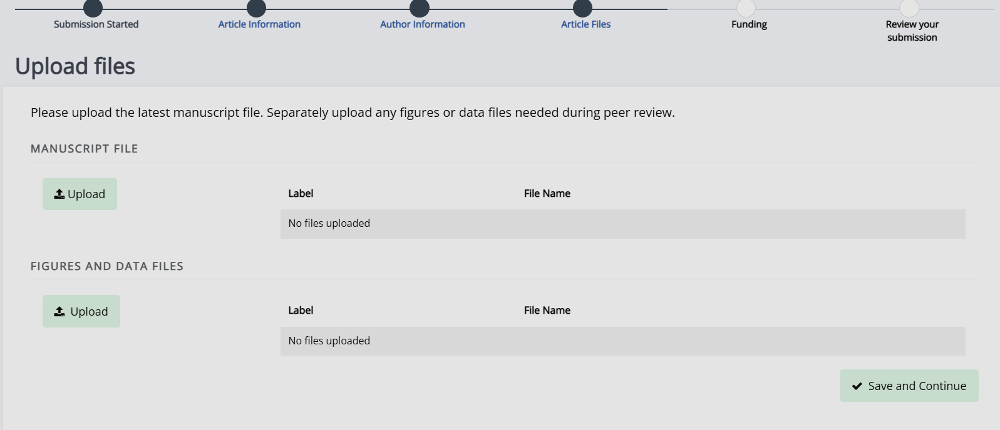

To add a file, click the **Upload** button under either **Manuscript file** or **Figures and data files**, and a popup will appear. You can select the file from here using the **Choose file** button. 

You are required to add a label to any file uploaded, but the description field is optional. For manuscript files, we recommend something along the lines of "submitted manuscript". For figure files, this label should correspond with the information in the manuscript (e.g. the "Figure 1" in your manuscript should be labelled as "Figure 1" when you upload it here).
   
While you can add only one manuscript file, multiple figures and/or data files can be added.

### Funding
You will then be asked to supply information about any relevant funding. You can search for your funding source using our **Search for funder** function or add them manually. When adding a funder, you will be given the option to provide an optional Funder DOI and Grant ID.

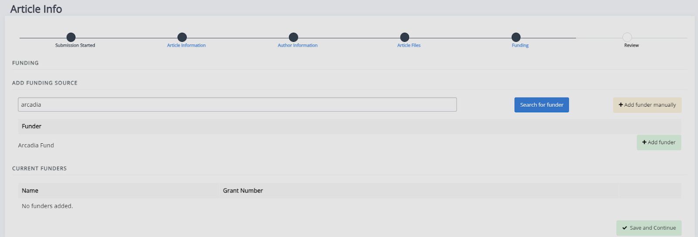
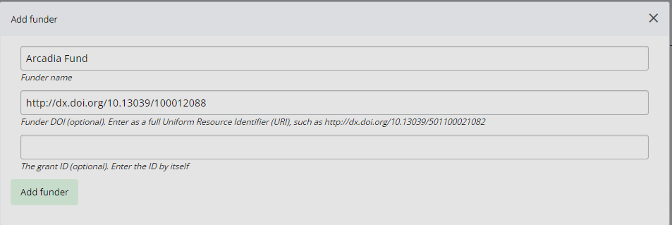

If you do not have any funders to add, you can skip this page by clicking **Save and continue** without adding any funders.

### Review
The **Review** page displays a run-down of the article you've submitted, metadata, files and authors. From here, you can click **Complete** to submit or jump back to other stages to make changes. Once you have finalised your submission, you cannot make any changes until editors request revisions (if applicable). 

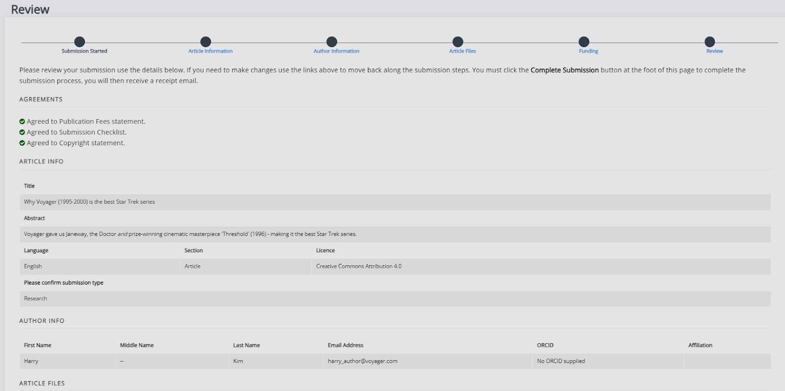

## Revisions
If an article is accepted, it may enter the peer review process. Once a submission has been reviewed, editors may request that authors revise their files based on recommendations from reviewers. There are three types of revision requests:

1. Minor revisions.
2. Major revisions.
3. Conditional acceptance.

With major revisions, the editor may send the paper for a second round of review once you have completed your revisions.

When an editor requests revisions, there are two ways to start this process:

1. Through the link in the email sent to you.
2. Via the journal dashboard:
    1. Login to the journal.
    2. Go to the journal dashboard.
    3. Scroll down to **Submitted articles**.
    4. Click the **Revision request** button next to the article.

Once you have accessed the revision request, you can view the available peer reviews. You can also download, revise, and upload new files. 

Once you've uploaded the revised manuscript and any additional image files, you can complete the covering letter and save the revision.

## Copyediting
Editors and authors are encouraged to undertake as many rounds of copyediting as is necessary to ensure that the text is ready to go into typesetting. 

When an editor requests an author revision following a copyedit, this can be accessed in the same way as revisions following peer review:

1. Through the link in the email sent to you to access the file.
2. Via the journal dashboard:
    1. Login to the journal. 
    2. Go to the journal dashboard. 
    3. Scroll down to **Submitted articles**. 
    4. Click the **Copyediting review** button.

From here, you can view requested copyedits and download the copyedited file. Copyedits are made as tracked changes.

Accept tracked changes you agree with and address any queries that the copyeditor has made in the comments. Check your manuscript carefully to ensure that you have not introduced any new errors before uploading your revised file back into the system. 

It is important that all stylistic changes are made at this stage. As many errors as possible should be corrected at this point, and by the end of copyediting, there should be a final manuscript which requires no further changes. 

The typesetters will then use this final manuscript to create the finished article, which will be sent back for checking in the form of typeset proofs. 

Typeset proofs are not an opportunity to make changes to the content or style of a manuscript: the file that goes into production is final. It is expected that only a handful (less than 10) of very minor changes should be requested at the proofing stage, if any.

### To complete a copyediting author revision: 
1. Upload your revised manuscript by replacing the copyeditor's version of the file with your own updated version.

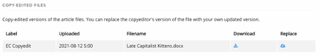

2. Fill in the **Note to the editor** field with any additional information.
3. Select a Decision (either **Accept** or **Corrections required**).
4. Click **Complete copyedit task**.

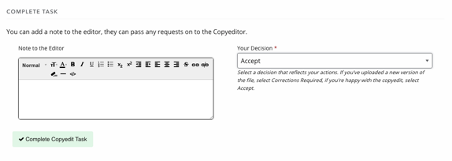

## Proofing
After your paper has been accepted and copyedited, the editors might send you a request to proof the typeset manuscript. This is the final version that will be made publicly available once the article gets published in the journal.

You can access your proofing tasks either through the link sent to you by email or through the proofing task button on your dashboard.

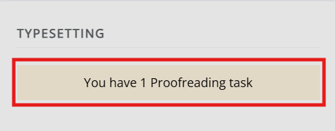

For journals that publish content in multiple media formats (HTML, PDF, XML, etc.), it is important that you check all these files before publication. This will not require any technical knowledge; authors are not expected to be able to open and read XML/HTML code. Instead, Janeway provides a **View file** button, which allows you to preview how the article will look once it is published.

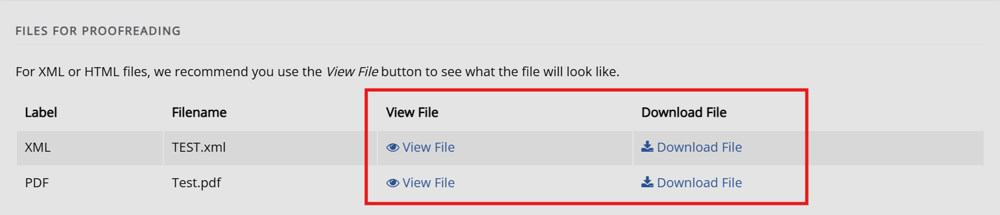

Once you've previewed the files, you can provide feedback in two ways:

- Fill in the **Notes** field.  
    You can use this to add not just text, but also to paste in screenshots or other relevant images.

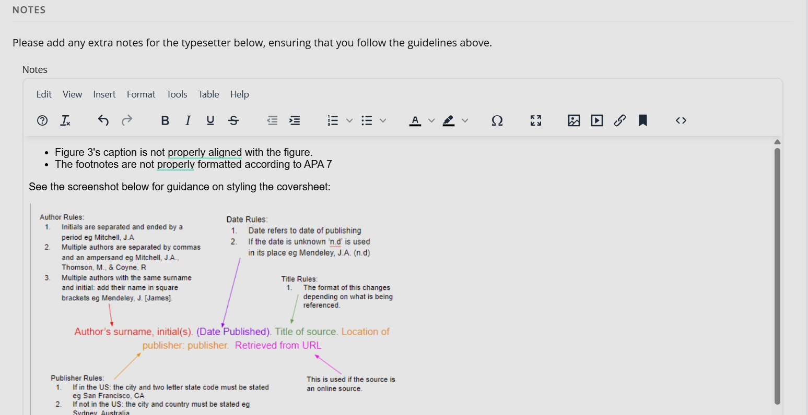

- Upload an annotated file.  
    In the case of PDF files, you can download the file and make annotations offline using PDF readers. When this is done, you can upload the annotated file for the editor to review.

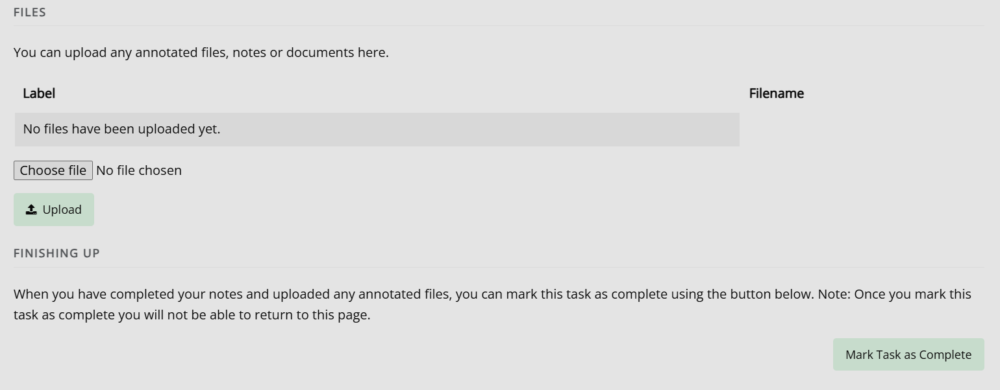

It is important to proof all the files thoroughly in order to avoid unnecessary follow-up rounds. This saves everyone time, work, and money and makes the publishing process run much more smoothly.

Click **Mark task as complete** to finish proofreading. Once you have provided your feedback, the editorial team might send you another proofing task once the requested corrections have been made. If this happens, the process will be exactly the same as in the first round of proofing. If there are no (or only very minor) corrections, you will likely not be asked to review again.

Once the article is published, all authors will receive a notification through the email addresses used when the article was submitted (except if this has been updated before publication).
