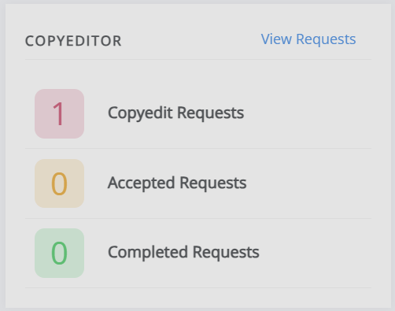
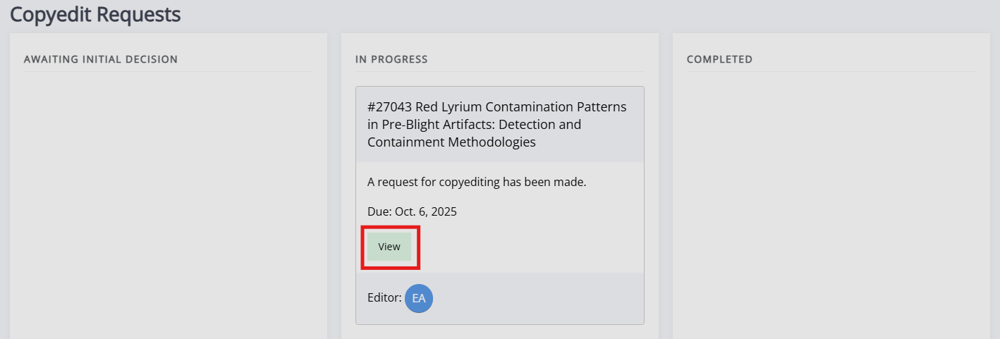
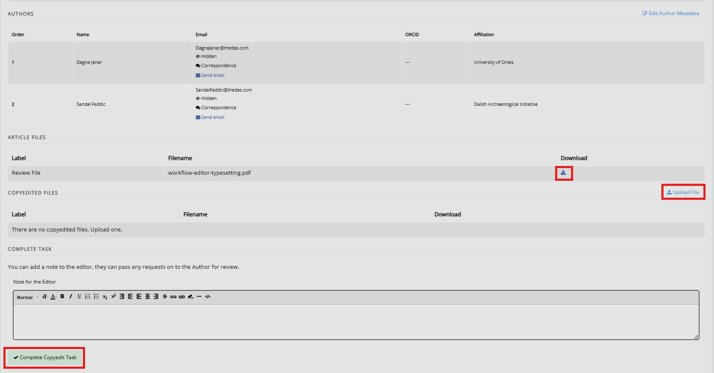
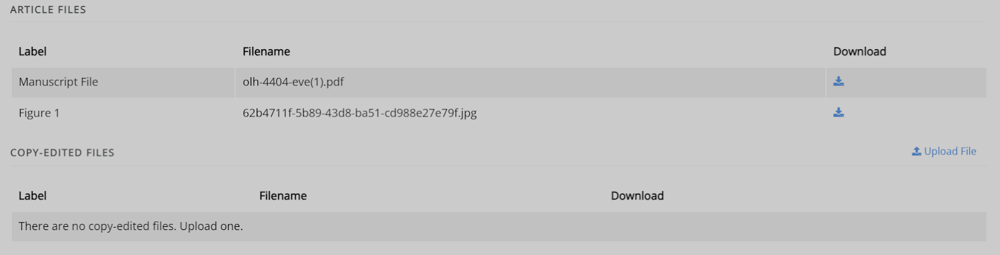
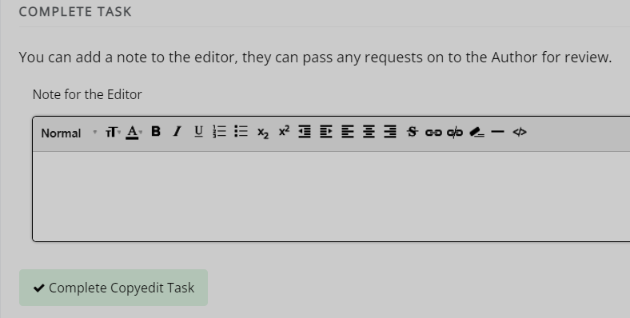
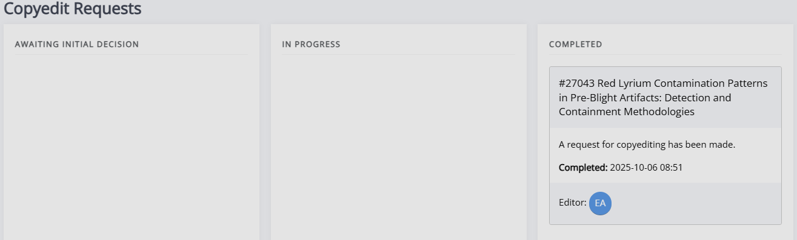
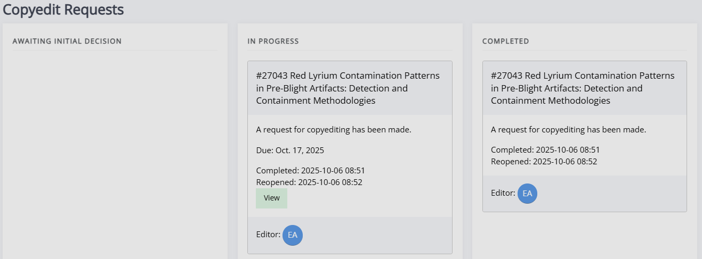

title: Copyeditor guide

# Copyeditor guide
When a new copyediting assignment is created, you will receive an email containing a link. Click on this link to be taken to the **Copyediting Requests** page, where you can see all of your copyediting tasks. You can also access this page through the copyediting block on the journal dashboard by clicking on **View Requests**.

On this page, you will see three columns of copyediting tasks.

- **Awaiting initial decision**  
    New tasks you have not accepted or declined.
- **In progress**  
  Tasks you have accepted but not completed.
- **Completed**  
  Tasks you have completed.

To start a new task, press the **Accept** button. The task will then be displayed as **In progress**. To begin copyediting, click **View** on the task's card.

## Copyediting a paper

Once you have clicked into a paper, the next page you see will be broken into four sections:

- **Guidelines**  
     Here you will find the journal's copyediting guidelines. These will help you complete your task, so you may wish to have them open in another tab as you copyedit in case you need to refer back to them.
<!-- there does not appear to be a corresponding section below for this section-->
<!--There currently isn't one, as it does not explicitly require the copyedited to 'do' anything except 'look at the guidelines'. E.g. I didn't have more to say about it than I already did here, do you feel something needs adding about it? If so, I can have a think-->
- **Article files**  
    A list of the files supplied by the editor for copyediting. From here, you can download the necessary files to work on and any supplemental files (e.g., additional figures) by clicking the  **Download** icon.

- **Copyedited files**  
    A list of files you have uploaded. Use the  **Upload file** button to add a new file when you have completed copyediting it. 

- **Complete task**  
    Here you can enter a note for the editor and mark the task as complete. 

### Article files & copyedited files

This is where you can find the necessary files to complete the copyediting task. This will include the manuscript and other files, such as figures. You can upload the copyedited manuscript using the **Upload file** button.

### Complete task

In this section, you can leave any notes for the editor. They may pass these to the author if so required.

> [!NOTE]
> Make sure to press **Complete copyedit task** after uploading the files and leaving your comments so that these will be sent to the editor correctly.

Once you complete the request, the card will move to the **Completed** column.

The editor can then either accept your copyedited manuscript and move onto the next stage of the publishing workflow or send it to the author for review. The author can provide feedback and the editor can decide whether to accept or send it back to you for more copyediting.

## Reopened task

If the editor has reopened the task, you will receive an email containing a link to the **Copyediting requests** page. There, you will be able to see the request on your Dashboard.

It may appear as though the task has been duplicated, but the one in the **Completed** column is the original task, and the one shown under **In Progress** will be the reopened version.

From here, this works the same way as any other copyediting task. The updated paper will be found under and can be downloaded from **Article files** for you to work on. Once you have completed your copyedit, it can be uploaded under **Copyedited files**. When you have done this, press **Complete copyedit task** to submit your work. The reopened task will be moved to **Complete** and the editor will be notified.
