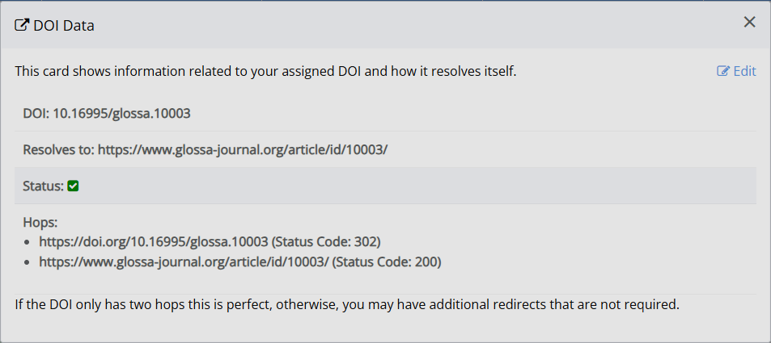

title: Editor guide to pre-publication
# Editor guide to pre-publication

Pre-publication takes you through the last checks before publication, going through each of these final elements step-by-step:

1. Confirm the metadata
2. Set the issue
3. Verify the DOI
4. Select a galley
5. Set a publication date
6. Select the article image
7. Send the publication notifications

## Confirm the metadata
Confirming the metadata is the first step in prepublication. This is where you can make final checks and alterations to information such as the author details, abstracts, titles, licenses, funders, etc.

If you publish using XML, it is essential to ensure that the abstract and title in the metadata exactly match those of the PDF file. Authors often change their abstracts during revision and copyediting, so the original abstract may require updating before publication. If you copy and paste an abstract into the metadata field, ensure it is pasted without formatting (Janeway will offer to remove formatting).

> [!TIP]
> If you are using XML files, the metadata abstract is displayed when previewing the XML file during typesetting. You can use this to check that it has updated correctly.

It is also important to ensure that the licence provided in the metadata matches any licensing information visible in the PDF (e.g. the footer). This will affect indexing and compliance with certain Open Access regulations.

> [!NOTE]
> If an author requests a non-standard licence, this should be flagged in advance to the typesetters.
 
Once you have checked the metadata, check the **Mark as complete** box to move on to the next step. 

## Set the issue
Setting the issue is where you can assign the article to its appropriate issue(s), or check it is correct if it was already assigned. Click **Add to issue** to assign the article to an existing issue; you can select more than one issue if needed. You can create a new issue under **Create new issue** if the issue does not yet exist; if you do this, click **Add issue** before closing the window.

Check the **Mark as complete** once you are done.

## Verify DOIs
Articles usually have a DOI (Digital Object Identifier) automatically assigned and created (‘minted’) for them by Janeway. The DOI serves as both a unique identifier and a permalink. The **Verify DOI** step lets you check if the DOI is working successfully as a permalink.

DOI links should redirect to the article, without intermediate steps. To ensure the redirect is working properly, you can check the number of "hops" shown in the bulleted list. There should be no more than two. See the image below for example.

If the DOI has more than two hops, or you see something else, you need to look more closely at the DOI's details. Select **Edit** and check the **Status** column for an indication of what to do next. See Interpreting DOI status for more information. <!-- missing hyperlink-->

Check the **Mark as complete** box to move on to the next step.

## Select a galley for rendering
You can now select the file (galley) that will be used to show (render) the article on the journal website. This file is either XML or HTML. If you have XML as an option, always select that. Otherwise, HTML is the best option.

If you have not done so already, double-check that any typesetting queries at the end of the PDF have been addressed and removed.

> [!CAUTION]
> Check to ensure no additional files other than publishable galleys are visible here. If they are, they will also be published alongside the galleys. If any other files appear, return to the typesetting stage to delete files that have accidentally been added as galleys before proceeding.

Check the **Mark as complete** box to move to the next step. 

## Set a publication date 
You can set a publication date in the future or click **Now** to publish the article immediately. You must set a date for the article to publish. If you wish to set a date in the future, you can either select any of the preset timeframes or add a specific date. Click **Set publication date** to save the date.

Check the **Mark as complete** box to move on to the next step.

## Select the article image 
Upload an image (JPG, PNG or GIF formats are accepted; do not use PDFs) in the pop-up window. Rectangular or landscape images work best, as this image will usually sit at the top of an article.

You can also set an article thumbnail through the **Article image manager**, which is accessible through the Manager dashboard or the Article archive page. More information on managing article images and their recommended dimensions is available here. <!-- missing hyperlink -->

> [!TIP]
> You can source many free-to-use images from [Unsplash.com](https://unsplash.com/). If you are sourcing images from elsewhere, be aware of any copyright restrictions and only use images that you are permitted to reproduce.

Check the **Mark as Complete** box to move on to the next step.

## Send the publication notifications
The last step before publishing the article is setting the publication notifications. This is an optional step that allows you to notify authors, co-authors, section editors or others of publication. You can add people in either the CC or BCC fields.
You can also amend the subject line, email body, and add attachments. 

The dates/times you see in the email correspond to the timezone set in your user profile or the default timezone (UTC) if none has been set. 

Check the **Mark as Complete** box to move on to the next step. 

## Publishing the article
Once you have completed all the steps, you are ready to publish the article. The **Publish this article** button is located at the top of the page, on the right-hand side. Any remaining warnings, including options to address them, will accompany it.

> [!NOTE]
> The warning regarding whether an article is marked as peer reviewed will always remain. This allows editors to double-check this and easily adjust, if needed.

Once the **Publish this article** has been clicked, the article is now scheduled to publish at the specified time. Once an article is live, you can see it on the Articles page and you may wish to check if all files display correctly. For information on managing articles after publication, see: Content management. <!-- missing hyperlink -->

The publishing workflow is now complete – congratulations on your finished article!
