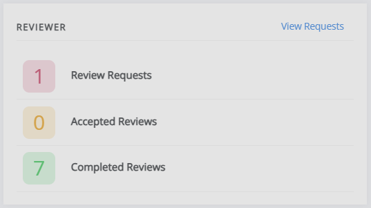

title: Reviewer guide

# Reviewer guide

As a reviewer, you can access your review task in two ways:
1. Using the direct link in the review request email.
2. Through the ‘Review’ section on the Janeway Dashboard.

## Direct link
If the journal has enabled one-click access, you can go straight to the review page (bypassing the login screen) by using the link in the review invitation. Otherwise, you will have to log in as usual to access it.

> [!NOTE]
> Do **not** share your link! This link is generated specifically for you and your review task, and functions like a password. If you share it, someone else can access your review task under your name and credentials.

## Dashboard
If you log into Janeway as a reviewer, you will see the **Reviewer** section on your Dashboard. Here, you can see active requests, accepted ones, and reviews you have completed. 

If you have any other roles within a journal (e.g. author, editor), you will also see sections for these on your dashboard. 

Click **View Requests** to be taken to the Review Requests page. On this page, you can see more information about the review (title, abstract, keywords, etc.) and either accept or decline the task.

## Review request
If you accept the task, you will be taken to the page for the review. It is split into three sections:

1. General Review Guidelines
2. Review Files
3. Review Form

## General review guidelines
This section displays information on how the editor would like you to undertake the review, an introduction to the review form, and metadata.

> [!NOTE]
> This section may include both general review guidelines and guidelines specific to this review. These can differ depending on the journal and the type of submission. Please read through these even if you’ve reviewed a paper for this journal before, as they may not be the same as for a previous review task.

At the bottom of this block, you will find another option to accept or decline this review task. If you initially accepted the task but are no longer available, please decline it here so that it can be offered to someone else. If you opt to decline to review, you will be asked if you can suggest other suitable reviewers. This is optional, but highly encouraged.

## Review files
The files the editor has selected for you to review are listed here. There might be multiple files (e.g. supplementary files), so this block includes the option to download them all as a zip file.

## Review form
This is where you will complete your review. What this looks like will differ from journal to journal, but the main sections will be the same. Each element in the form will be accompanied by a title or description to assist you in completing it.

The sections of this form are:

- File upload
    - You can upload your review here if you prefer to complete it offline (e.g. by writing down your feedback in a Word document). This section may be disabled, in which case, it will not appear.
- Review form
    - This is where you will complete your review. The form may consist of a single text box or be composed of multiple boxes, which can include checkboxes and dropdowns. This will depend on the individual journal, but each part will be accompanied by text that explains what they are looking for.
- Your recommendation
    - This will be divided into two subsections: **Decision** and **Comments for the Editor**.
- Decision
    - You may select one of the following options for your recommendations:
        - Accept without revisions
        - Minor revisions required
        - Major revisions required
        - Reject
- Comments for the Editor
    - If you have additional comments, they can be added here. These will be visible only to the editor(s), although they may choose to share them with the author.

## Review complete
Once you have submitted your review, you will be presented with an overview of what you have written. Please note you will not be able to return to the review page or edit what you have written once you have clicked **Submit**.
