title: Typesetter Workflow Guide

# Typesetter Workflow Guide

When you have been assigned a typesetting task, you will receive an email notification containing a link. This link will lead to the Janeway Dashboard.

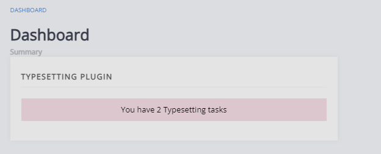

You can see the number of open typesetting assignments from here. If you click on this block, it will take you to the typesetting assignments page, and you will be able to see both your currently open typesetting assignments (the top block) and your completed assignments (the bottom block).

For open assignments, it will display:
- Title
- Current typesetting round
- Date it was assigned
- Due date
- Time to due date

For completed assignments, it will display:
- Title
- Typesetting round
- Date it was assigned
- Completion date

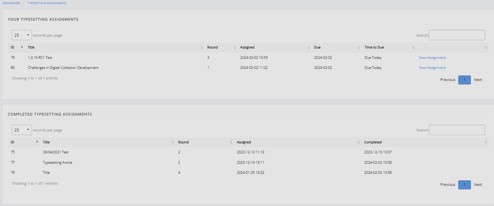

You can then click **View Assignment** to display the assignment page.

## Typesetting assignments page
On this page, you will find relevant information about the typesetting task. This will include the instructions, manuscript files, metadata, options to accept or decline the task, and space to upload completed files.

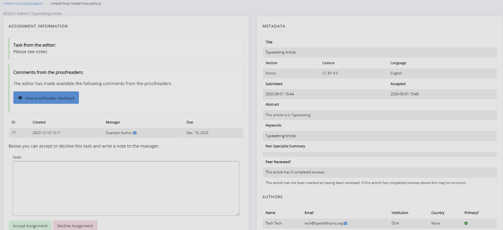

This page is divided into three sections.
- Assignment information
  - This section shows the typesetting guide, which the journal may use to provide a standard set of instructions for typesetting.
  - You can view any comments from the editor or proofreaders. 
  - You can access the files to typeset (manuscript files) and any supplementary files. 
  - Under this, you will find space to upload your completed work and (if required) any source files.

- Metadata
  - This is where you will find the metadata for the typesetting task.

- Complete typesetting
  - Under this section, you can leave any notes to the editors. 
  - This is also where you will mark the assignment as complete to submit the uploaded files.

## Uploading a typeset file
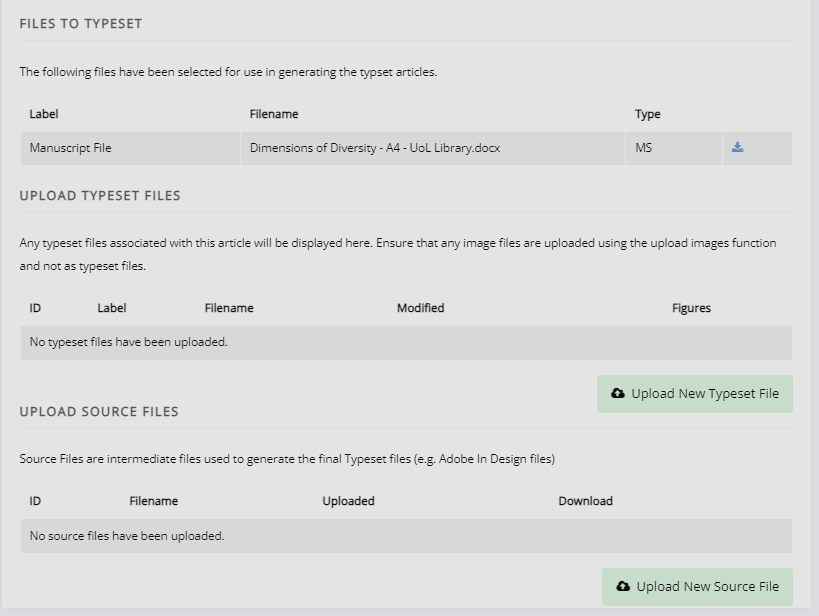

Click **Upload a New Typeset File** to upload your completed work. 

Source files (such as Adobe In Design files) can be uploaded using the ‘Upload New Source File’ button (if required).

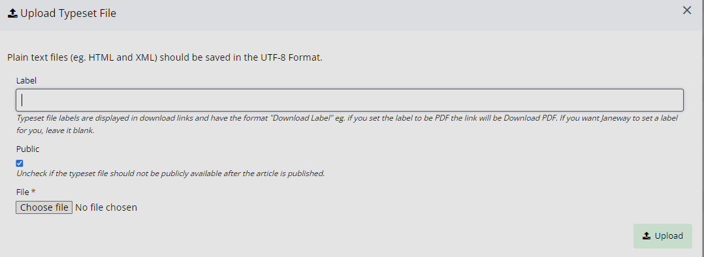

In this box, you will find the option to label your file with its file type. For instance, if this is an HTML file, you should label it as ‘HTML’. If it is a PDF, you should label it as ‘PDF’, etc. 
Janeway will attempt to provide an appropriate label if this is left blank. However, if you wish to ensure the label is correct, you can manually enter the file type. For instructions on how to edit a label, see the section below.

> [!WARNING]
>  Janeway operates with the UTF-8 encoding. Please ensure that you upload any HTML and XML files (plain text galleys) using this encoding.

## Editing typeset files and uploading additional files
If you need to make changes to the typeset files, reupload them or upload additional files; this can be done through the ‘Edit Typeset File’ page. This page can be accessed by clicking **Edit**.
 
 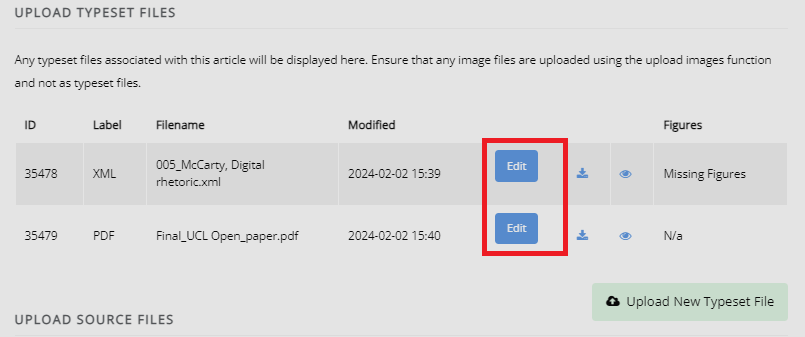

 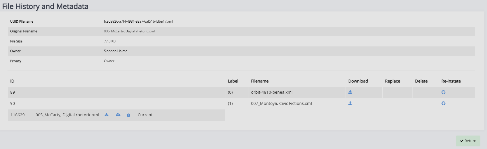

This page is divided into three sections:
- The typeset file
	- You can replace the typeset file and see the file history here.

- Typeset file details
	- This is where you can edit the file label, which denotes the file type.

- Additional file uploads
  - If authors or editors have already provided images, you can find and select them here. 
  - You can upload images as individual image files or using a ZIP file.
  - There is space to upload a CSS file to accompany the galley. 
  - You can change the XSLT file used to render the galley. 

## Managing typeset files
In the first section of the page, you can view the file currently uploaded and replace or download it. You can also view the file's history by clicking on the button under 'History'. 

This will open a page where you can download and reinstate previous versions or delete the current file entirely (in case you have uploaded an incorrect file).


## Managing images and figure files
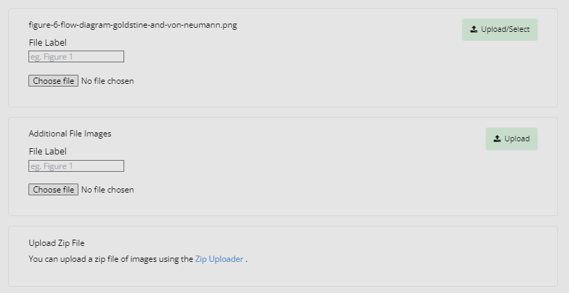

When a file typeset in HTML or XML contains image links, Janeway will detect these and prompt you to upload the image files. The file names should match the src or href used in the XML/HTML and be relative (e.g. src="fig1.jpg").

If the image files have already been uploaded onto Janeway, you can select them instead.

If you need to upload a large number of images, it might be faster to use the zip uploader (see ‘Upload Zip File’ in the image below). To do so, create a ZIP archive file with all the image files. The image filenames must match the links in the typeset file; otherwise, they will not be imported.

## Styling
On this page, you can also upload a CSS file associated with the article for an individual style, if required. We recommend avoiding style changes to the header and footer type elements, as this will affect the page's layout.

You can also select the XSL file used to render the HTML from the file. Unless explicitly instructed otherwise, this will be the Janeway default (1.4.3). In that case, the editors will communicate this as part of the typesetting task or agreement.

### Finishing up
Once you finish the typesetting (or correction) task, you can leave a note for the editor, click the button to complete the task and send it to the editor for review. Please note that you cannot return to this page once you complete the task.

> [!NOTE]
> If you attempt to complete the typesetting task with potential issues remaining (e.g. missing image files, typeset files that have not been corrected), Janeway will warn you about this.

## Typesetting recipes

### Right-to-left text direction
Arabic and many other languages are written right to left, requiring
special markup in an XHTML environment that operates left-to-right by
default.

Here is an example in JATS XML of an isolated bit of Arabic text in a
document that is otherwise left-to-right:
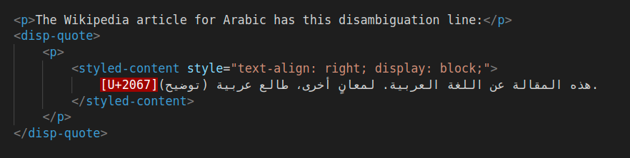

Make sure you use a text editor that shows zero-width unicode
characters, like U-2067. The above screenshot is an XML file opened in
VS Code.

Here is the rendered output:
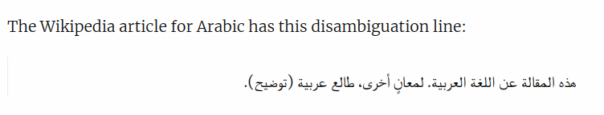

Notice the following about the code sample:

1.  On each line, begin with the [RLI unicode character
    (U+2067)](https://www.unicode.org/reports/tr9/#Explicit_Directional_Isolates)
    at the beginning of the line to explicitly trigger right-to-left
    rendering for the remainder of the line, including symbols like
    periods that the browser would otherwise render left-to-right. This
    is roughly equivalent to the HTML attribute
    _dir="rtl"_. If working with periods or
    other punctuation, note that they may appear on the right in your
    code editor, but render on the left in the browser.
2.  Wrap each line in the [styled-content JATS
    element](https://jats.nlm.nih.gov/publishing/tag-library/1.3/element/styled-content.html)
    and apply a [style
    attribute](https://jats.nlm.nih.gov/publishing/tag-library/1.3/attribute/style.html)
    specifying CSS for right text alignment and block display.
3.  When working with long lines of text, make sure not to introduce
    arbitrary line breaks.

### Center alignment
In some cases you might need to center-align text:

``` xml
<p>Then came the apotheosis of modernism:</p>
<disp-quote>
    <styled-content style="text-align: center; display: block;">
        Leaves are falling
    </styled-content>
</disp-quote>
```

The output is:
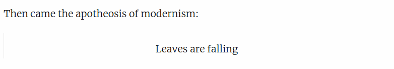


This is accomplished with the the [styled-content JATS
element](https://jats.nlm.nih.gov/publishing/tag-library/1.3/element/styled-content.html)
and a [style
attribute](https://jats.nlm.nih.gov/publishing/tag-library/1.3/attribute/style.html)
specifying CSS for center text alignment and block display.
