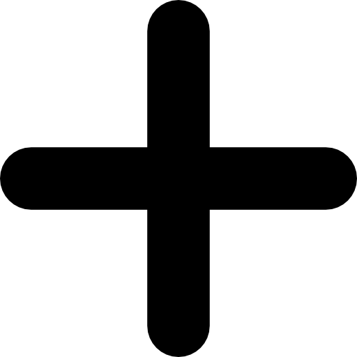

title: Issues

# Issues

On Janeway, issues organise articles for publication. While articles do not have to be part of an issue, some external services (such as Crossref) require that articles be assigned to an issue. As such, it is recommended to use issues where possible.
If your journal uses continuous publication, it is recommended to create yearly issues to add articles to.

Articles are typically assigned to issues during the **Pre-publication** stage, but can be assigned a projected issue at any point in the publication workflow. Issues can also be managed independently through the **Issue manager**, available from both the **Manager** page and the main sidebar.

## Issue types

Janeway provides two built-in issue types : 
- **Issue**  
  The standard publication issue.
- **Collection**  
  Can be used to group related articles across volumes or years.

## Volumes

Issues will automatically be assigned to a volume. They can either have their own volume or share a volume with other issues (e.g., volume 1 - issue 1, volume 1 - issue 2, etc.).

You can use volume 0 for (ongoing) thematic collections - especially those that are not tied to a specific year or publication sequence. Using volume 0 will also ensure they do not interrupt the listings of regular issues on the issue page.

>[!NOTE]
>If no volume and issue numbers are specified when importing articles, they will be assigned to volume 0 issue 0. For this reason, it is recommended to avoid using volume 0 issue 0, as this may create duplicates when importing. This in turn can cause problems.

## Issue manager

Articles are typically assigned to issues during the pre-publication stage. However, issues can also be managed independently through the **Issue manager**, accessible from both the manager page and the main sidebar. This page lists all existing issues and provides options for creating, editing, reordering, and managing them.

Using this page, you can perform the following general actions:
- **Sort by date descending / ascending**  
  Reorder issues by publication date. Sorting changes the display order of issues on the public site, and changes take effect immediately.

- **Edit display settings**  
    Opens configuration options for how issue titles and metadata are displayed. For more information, see [Display settings](#display-settings).

- **Create issue**  
  Lets you create a new issue. For more information, see [Creating and editing issues](#creating-and-editing-issues).

In addition, the issue list is presented in a table format. For each issue, the following actions are available:
- **View**   
  Opens the [Manage issue](#managing-existing-issues) page, where you can edit metadata, manage the table of contents, assign guest editors, and upload galleys.
- **Delete**   
  Permanently deletes the issue. This cannot be undone. 
- **Make current**   
  Sets the selected issue as the journal’s current issue. The current issue does not display this button.

You can also drag and drop issues to manually change their order; the new order updates the public display immediately. You can also view publication data such as volume, issue number, publication date, and number of articles directly from the table.

## Creating and editing issue details

You can create new issues from this page using the  **Create issue** button and you view and edit the detail of individual issues by selecting them.

You can set the standard issue metadata and images for the issue on this page. Information on the sizes of the cover image and large image can be found in the Styling section<!-- missing hyperlink-->. In addition, you can also provide identifiers for the issue (DOI or ISBN), set an issue type or provide an issue code.

- **Issue code**  
  This optional alphanumeric [slug](https://en.wikipedia.org/wiki/Slug_(web_publishing)) is used to generate a human-readable URL for an issue. It should consist of lowercase letters, numbers, and hyphens (no spaces or special characters).
For example, if you enter winter-special-issue, the issue URL will be:
`yourjournal.com/collection/code/winter-special-issue/`

- **Issue type**  
  You can select the issue type here; you can either select 'issue' or 'collection', or any custom issue types you have created for the journal. <!-- missing hyperlink-->

- **Issue DOI**  
  You can enter the issue DOI here. It will be registered when articles belonging to it are registered. The value entered should be the DOI only (not a full URL). If the 'issue autoregistration' setting <!-- nmissing hyperlink--> is enabled, this field should remain empty, as the DOI will be created automatically during the article registration process.

- **Issue ISBN**  
  If this issue has an ISBN, it can be entered here. This will only be relevant for specific (non-serial) types of content such as conference proceedings.

## Managing existing issues

Clicking on  **View** in the table listing all issues takes you through to the issue page where you can alter an individual issue. The page is split into four sections.

- **Issue management**  
   This block displays the issue metadata and allows you to edit it, delete it, mark it as the current issue, and if the issue is published there is a link to view it on the journal website.

- **Galleys**  
   You can upload a galley file for the whole issue, usually a PDF , so that users can download the full issue in one go.

- [**Table of contents**](#table-of-contents)

- [**Guest editors**](#guest-editors)

### Table of contents

In this section, you can add articles to or remove articles from the issue, sort the sections and sort the articles within their sections.

For each section, there are arrow icons that allow you to move the section up and down; each of the articles can be dragged and dropped into order from inside their section.

You can drop an article from an issue by clicking **Remove** and add new ones by clicking **Add article**.
[" "](/content/support/images/issue-add-articles.png)

A list of all articles in the journal not already in the issue is displayed, and you can click the  **Add** button to place it in the issue.

### Guest editors

An issue can list guest editors if the articles aren't being handled by the normal editorial team. Click **Manage** to add or edit guest editors for the issue/collection. When adding a new guest editor you can also enter a role other than 'Guest editor', which is set as the default. All users with activated accounts are listed here, click the  **Add** button next to their name to add them as a guest editor.

## Display settings

To configure how issue titles and details are displayed, click **Edit display settings** in the top-right corner of the **Issue management** page.

You can turn these elements on or off:

- Volume number
- Issue number
- Issue year
- Issue title
- Article number
- Article page numbers
- Issue DOI - see [Issue DOI management]() <!-- missing hyperlink -->
- Group issues by decade
 If your journal has a lot of issues you can use this feature to allow readers to jump to a specific decade on the issues interface.

Example display formats:

- Volume 6 • Issue 3 • Fall 2015 • 5–17
- Winter 2009 • 19 pages
- Volume 35 • 2021 • Number 49

> [!TIP]
> If you want to display a custom issue title, disable everything except issue title, and use that field to form the issue display for each issue.

> [!TIP]
> You can use the article number field to set an arbitrary number for each article, whether to distinguish articles within each volume or issue or to number articles across volumes and issues. Article number is an optional field separate from article ID and can be set in **Edit metadata**. <!-- add this to section on article metadata-->

## Projected issues

Janeway allows editors to mark articles as projected to be published within a given issue. This can be done in the **Unassigned** stage by using the **Assign projected issue** button. On the projected issue screen, you can select, from a drop-down, the issue you expect the article to be published in. Assigning an article to a projected issue is not the same as assigning an article directly to an issue. Projected issues are used mainly for internal tracking. 
