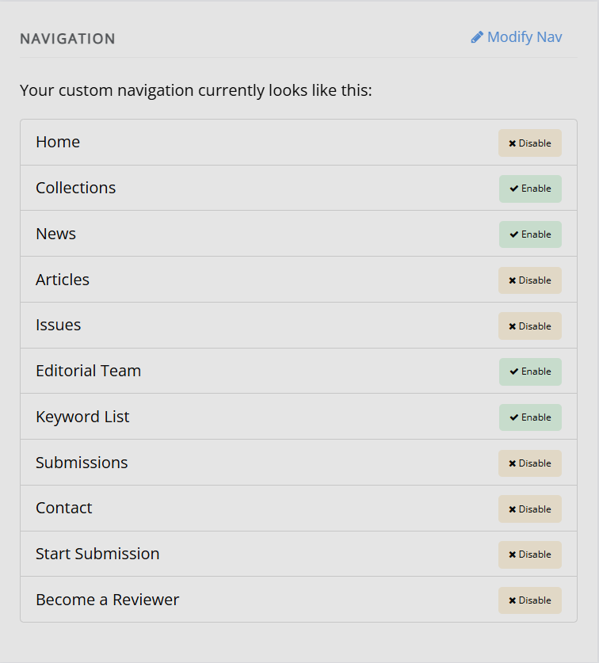

title: Navigation
# Navigation

A journal's navigation bar (navbar) is customised through the **Content manager**.

The navbar is made up of two types of items:
- Fixed navigation elements that you can turn enable/disable.
- Custom navigation items that you create yourself.

Fixed navigation elements include:

- Home
- News
- Articles
- Issues
- Collections
- Editorial team
- Submissions
- Contact
- Start submission
- Become a reviewer

The default nav consists of a selection of enabled fixed navigation elements.

To turn a fixed item on or off, click the **Enable** or **Disable** button next to it. The order of the fixed navigation elements cannot be edited directly. To see how to change the order of fixed navigation elements, see the section on **Modifying the navbar** following this section.

## Modifying the navbar

To add new, custom nav items or change the order of fixed nav items, click **Modify nav**.

This interface has multiple fields:

- Display name  
  The page title as it will display in the navigation bar.
  
- Link  
  For internal pages hosted on Janeway, compare the URL of your home page with the URL of the page you wish to link to. Copy anything that comes after the main home page URL here. For page options which are provided by Janeway, this will likely be "/page-name" or "journalcode/page-name" (e.g. "/articles" or "journalcode/articles"). For custom pages you have created, this will likely be "/site/page-name" or "journalcode/site/page-name".
  
  For external pages, this will be the full URL of the site or page you want to link to.
  If you want to create a header for a dropdown on your navigation bar that doesn't also appear as a link in that dropdown, leave this field blank.

- Is external  
  Tick this box if you want to link to an external web page.
  
- Sequence  
  This controls the order in which custom items on your navigation bar appear in relation to one another.
  
- Has subnavigation  
  Tick this box if you want to create a drop-down in your navigation bar from this item.
  
- Top-level nav item  
  If you want this link to fall under an existing drop-down in your navigation bar, select which one it should fall under.

<!--  -->

The built-in page options provided by Janeway cannot be reordered directly. To reorder these pages, use 'Create a new nav item' to create a more customisable link to that page, following the same steps as you would for adding other pages to your nav bar, and disable the Janeway default version."
  <!-- add the general navbar styling shenanigans --> 

For footer navigation, see footer navigation <!--missing hyperlink-->. This is only available at press level/
