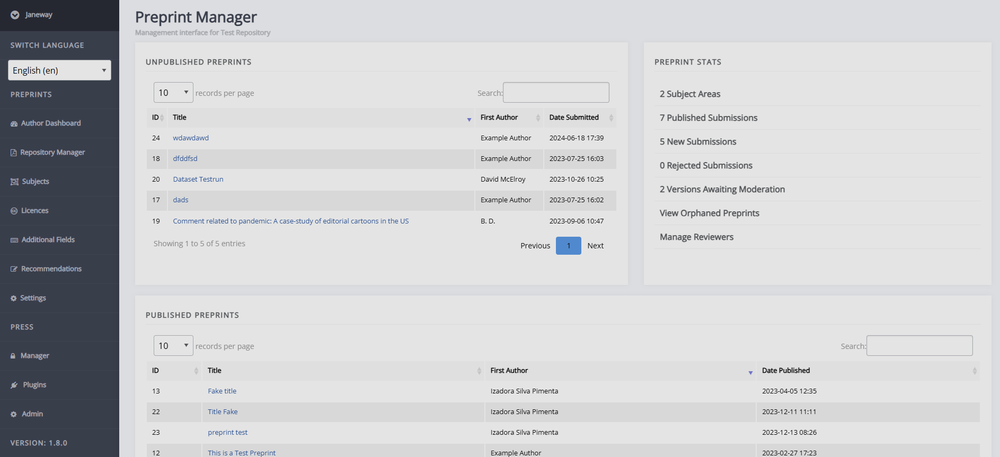
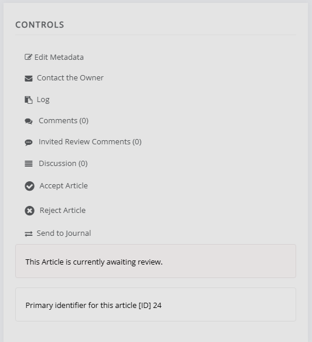

title: Moderator guide

# Moderator guide

As a moderator you can find (un)published preprints and preprint stats on the Repository manager. This can be access through the left-hand sidemenu.

## Published preprints

Clicking on the title of a preprint will take you to the preprint dashboard. Here you can view the preprint's metadata, (supplementary) files, versions and the control panel.

### Controls

* Edit metadata
* Contact the owner
    This lets you contact the primary author of the preprint by email. You will be able to include attachments and BCC others.
* Log
    This opens a log of all emails sent from the system regarding this preprint.
* Comments
    Comments made on the published preprint. From here you can review, publish and delete them.
    <!--What does "review" do, practically? It moves it to old, but how would it impact users? -->
* Invited review comments
    From here, you can invite reviews, see active reviews, and see declined and withdrawn reviews. To send someone a review invitation, they need to have been added as a reviewer first. Either through **Manage reviewers** on the Repository manager page or by clicking **Manage reviewers** on the review invitation screen.
* Discussion
    Lets you view, open new, and comment on internal discussion threads. <!--Can the author(s) see these?-->
* Edit published date
* Un-published this article
* Send to journal
    This lets you send the preprint to a journal on the press. You will select the license, section (article type) and the stage to which it will be send.
    <!--I'll need to look into why 'Force' is used.-->

## Unpublished preprints

Similar to published preprints, you can click on the title of an unpublished preprint in the Repository manager to be taken to the preprint page. On this page, you can review the (supplementary) files and metadata.

If upon initial review, the preprint is suitable, you can click **Create a version with this file**. After this, you can invite reviewers and take other actions to process the preprint. To reject the preprint, you can select **Reject article** in the control section, an email prompt will open up where you can explain your reasoning to the author(s). When the preprint is ready for publication, you can click **Accept preprint** in the Control block, and set a publication date.

### Controls

Similar to published preprints, the controls block will display the preprint's status and primary identifier, and present various options. These are the same as those for published preprints, except that 'Edit published date' and 'Un-publish this article' have been replaced with 'Accept article' and 'Reject article'.

## Moderating new versions

## Handling review commens