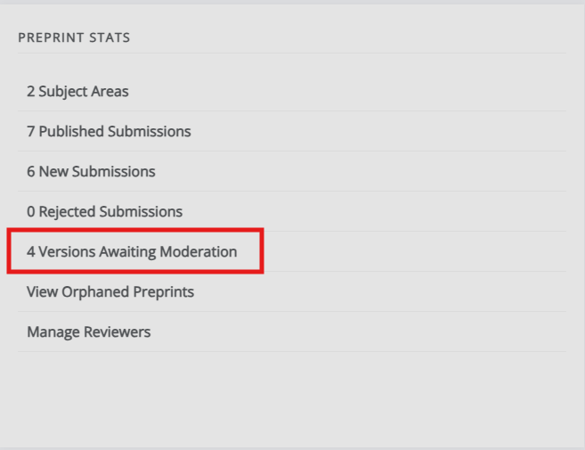
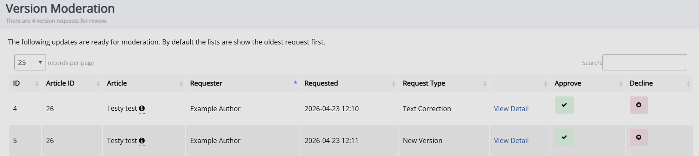

title: Moderator guide

# Moderator guide

As a moderator you can find (un)published preprints and preprint stats in the Repository manager, accessible from the left navigation menu.

## Published preprints

Click the title of a preprint to go to the preprint dashboard. Here, you can view the preprint's metadata, (supplementary) files, versions, and the control panel.

### Controls

- Edit metadata
- Contact the owner  
   Lets you contact the primary author of the preprint by email. You can include attachments and BCC other recipients.
- Log  
   Opens a log of all emails sent from the system about this preprint.
- Comments  
   Displays comments made on the published preprint. From here, you can review, publish, and delete them.
    <!--What does "review" do, practically? It moves it to old, but how would it impact users? -->
- Invited review comments  
   From here, you can invite reviews, see active reviews, and see declined and withdrawn reviews. To send a review invitation, the recipient must first be added as a reviewer — either through **Manage reviewers** on the Repository Manager page, or by clicking **Manage reviewers** on the review invitation screen.
- Discussion  
   Lets you view and comment on internal discussion threads, and open new ones. <!--Can the author(s) see these?-->
- Edit published date
- Un-published this article
- Send to journal  
   Lets you send the preprint to a journal on the Janeway press. Select the license, section (article type), and the stage to send it to. <!--I'll need to look into why 'Force' is used.-->

## Unpublished preprints

Similar to published preprints, click the title of an unpublished preprint in the Repository Manager to go to the preprint page. On this page, you can review the (supplementary) files and metadata.

If the preprint is suitable after initial review, click **Create a version with this file**. After this, you can invite reviewers and take other actions to process the preprint. To reject the preprint, select **Reject article** in the control panel. An email prompt opens, where you can explain your decision to the authors. When the preprint is ready for publication, click **Accept article** in the control panel and set a publication date.

### Controls

Similar to published preprints, the control panel displays the preprint's status and primary identifier, and presents various options. These are the same as those for published preprints, except that **Edit published date** and **Unpublish this article** are replaced with **Accept article** and **Reject article**.

## Moderating new versions

On the Repository manager, in the Stats block, click **Versions awaiting moderation**.

This displays a list of all versions awaiting moderation and their request type.
Click **View detail** to review the version. Then click **Accept** or **Decline** to record your decision.

## Handling review comments
