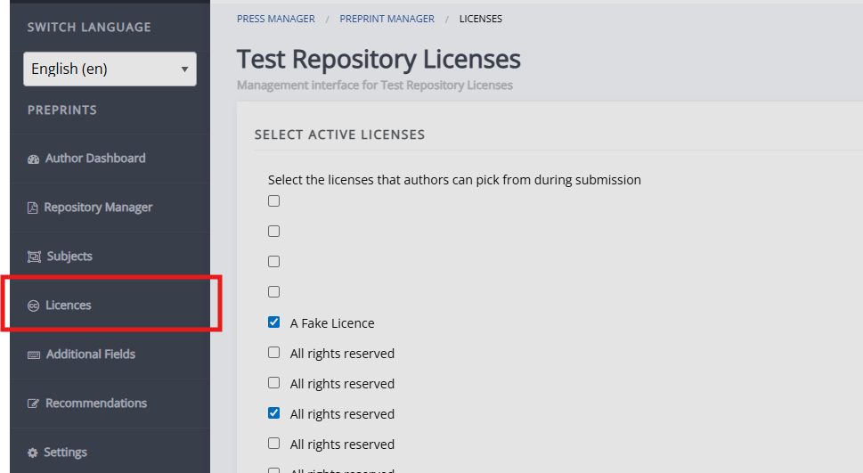
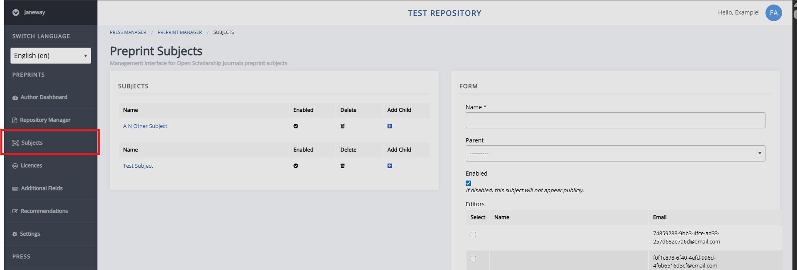
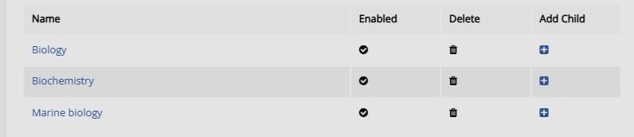
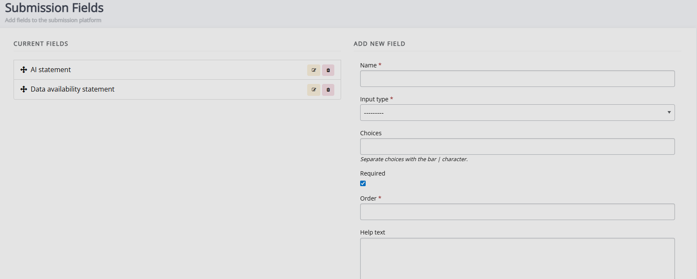
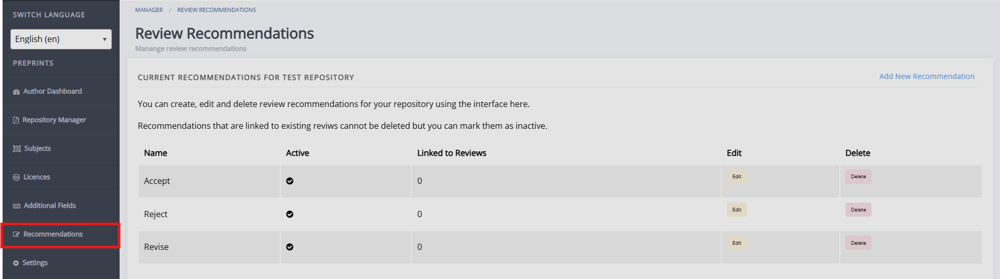

title: Repository settings

# Repository settings

This opens up the repo wizard, which is used for both configurring a new repository or editing the settings of an existing repository.

5 steps:
1. Repository details 1
    Key repo details such as the name, custom domain, name of the objects in the repo (e.g. "article" or "preprint) etc. Helptext available on page.

2. Repository details 2
    More detailed information. Repo description and images, review guidance text information for users.

3. Submission details
    Text shown to users on the submission page and settings related to review; 

4. Email templates
    Displays the email templates available on the repository. For more information on editing email templates and email template variables. <!-- do we have a full list of repo email template vars? --> see, Email templates <!-- missing hyperlink>.

5. Live
    Sets the repository as live.

Additional settings for licenses, additional submission fields, subjects. <!-- missing hyperlink-->

## Licenses

This page lets you pick which licenses are made available for preprints in this repository. The available licenses are all licenses made available on the press (each journal), which is why you may see duplicates.

## Subjects

This page lets you set the subjects which preprints can fall into. These can be organised hierachically, with sub-subjects ('children') - e.g., 'Biology' and 'Marine biology'. These will be grouped together, with the parent subject being listed first in the group.

You can also select editors who should be notified of submissions made to this subject.

## Additional submission fields

## Recommendations

This page lets you configure the recommendations available
