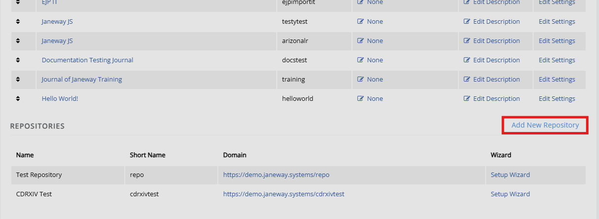

title: Setting up a repository with Janeway

# Setting up a repository with Janeway

## About Janeway repositories
Janeway supports hosting repositories for preprints, postprints, field reports, and other publication types within the same press environment as journals.
<!-- provide some additional information about JW repos-->

## Navigating the Janeway repositories

### Repository manager

You can view unpublished preprints, preprint stats and published preprints.

### Preprint stats

- High-level stats overview
- From here you can navigate to rejected, versions awaiting moderation, orphaned preprints, manage reviewers.

## Getting started
The first step is to enable the repository system in the press-level
settings:

1.  Go to the **Press manager**.
2.  Open **Edit press details**.
3.  Tick the **Enable repository system** box and click **Save**.
4. Return to the **Press manager**.
5. The option to **Add a new repository** will have appeared below the list of journals on the press, click this.

6. This will open the repository set-up wizard. See Repository settings for more information <!-- missing hyperlink>.

## Other settings

Licenses, additional fields, subjects.

## Linking a repository and journal