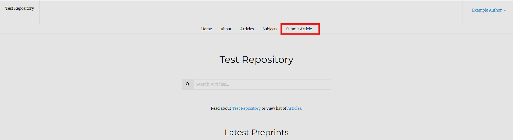
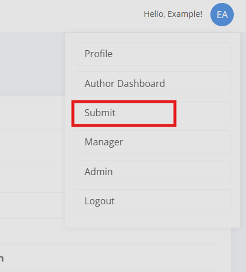
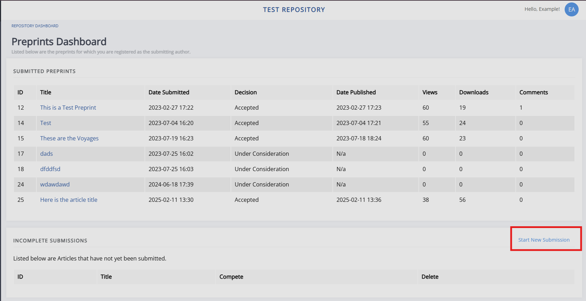
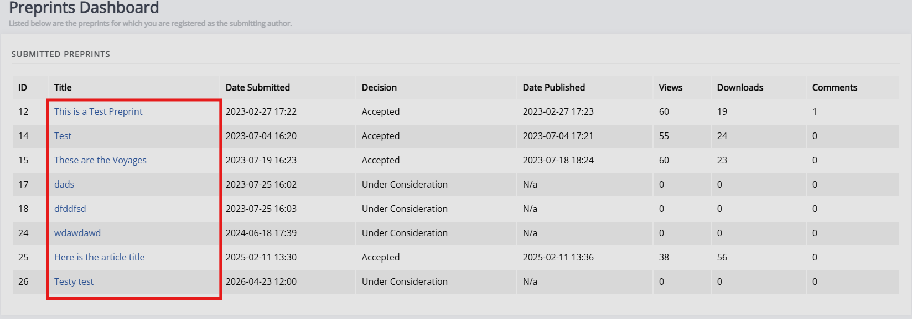
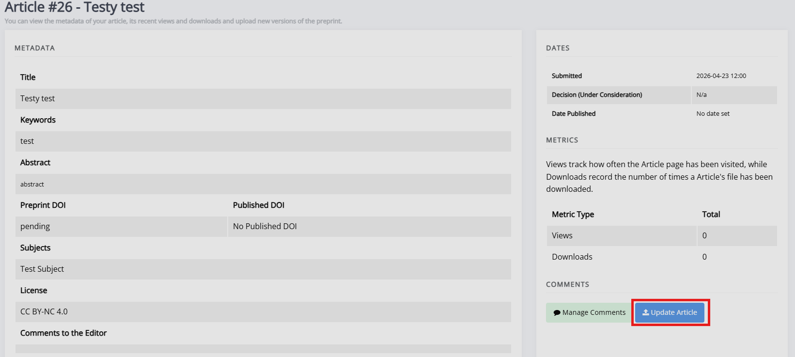

title: Submitting to a Janeway repository

# Submitting to a Janeway repository

To submit to a repository, you must either already have an account or create one.

Once you have an account and are logged in, there are three places you can submit from:

1. Through the front-page navbar (if enabled by press):
    

2. From anywhere within the system (not the public facing pages) by clicking on your profile in the top-right corner and selecting **Submit**:
    

3. From the Author dashboard, by clicking **Start new submission** in the Incomplete submissions block:
    

Once you have clicked **Submit** you will be guided through a submission process where you will be asked to supply information about the submission, this will include things such as:

1. The submission agreement and article information.
    This page usually provides information about any submission or file requirements as well. Fields marked with an asterisk are required to complete the submission.
2. Author information.
3. Article files and supplemantary files.

After which, you will have the chance to look over and confirm all details are correct, before completing the submission. If there are any issues, you can click **Edit metadata** or **Edit authors** to make changes.

## Updating a submission

If you wish to make changes to an existing submission on the repository, select it on the Author dashboard to open up the preprint's dashboard.

Click **Update article** to make changes to the preprint. 

You will be presented with three options:

1. Correction
    This option lets you upload a small update and will label it "text correction" to indicate the change. You can also update the metadata.

2. New version
    This option lets you upload a new file and will label it "New version". You can also update the metadata.

3. Metadata correction
    This allows you to make changes to the metadata, without changing the preprint itself; e.g. adding a missing keyword or correcting a typo.

All three of these will need to be approved by one of the repository managers, changes will only become visible after approval.

You will be able to read the submission requirements by clicking **Review submission requirements** at the bottom of the page after selecting any of these options.

>[!NOTE]
>Clicking **Upload new version** in the Pending updates section will open the same pop-up with these three options.

You can also download any previously (approved and unapproved) manuscript files in the Files section, by clicking the  **Download** icon.

### Supplementary files

You can manage supplementary files through the Supplementary files section. Clicking **Manage supplementary files** will open up a page listing the current supplementary files, providing the option to reorder and delete them, as well as provide a new file by providing a link and label for it.