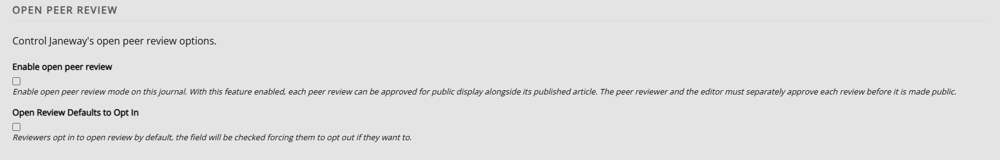
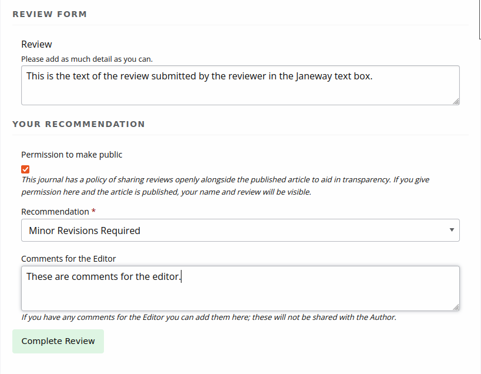
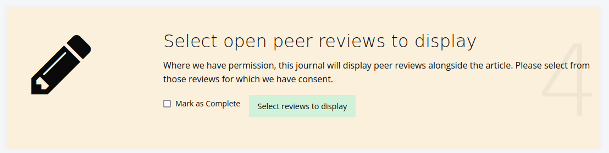
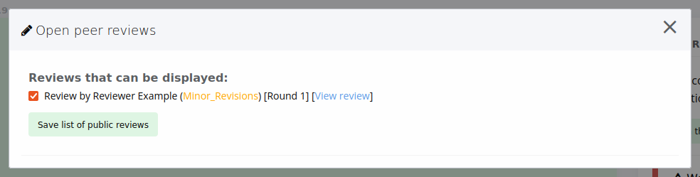
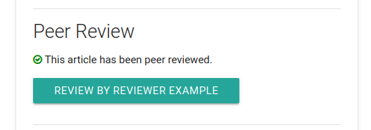
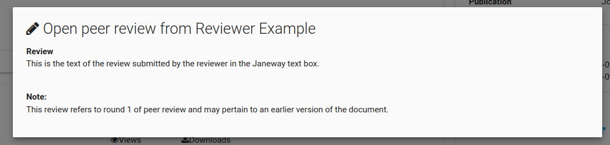

title: Open peer review
# Open peer review

This feature allows peer reviews to be made public. This requires both the consent of the reviewer and public display to be enabled by the editor. This feature is off by default, and peer reviews will remain confidential until you turn this on.

Open peer reviews that have been made public only show text that is typed into the peer review assignment box, not any comments made through uploaded files. This is for accessibility and display purposes. Accordingly, if you enable open peer review, we recommend encouraging reviewers to use the text box rather than commenting directly on a copy of the manuscript or uploading a file with their comments.

To enable open peer review, configure the settings found in **Review settings**.

If open peer review is enabled, reviewers will be asked for their permission to make their review public. Whether the permissions box is ticked or unticked by default is controlled by the **Open review defaults to opt in** setting. If it is ticked, the box will be ticked for reviewers by default. If it is unticked, reviewers will need to tick it themselves to enable the public sharing of their reviews.

During prepublication, editors can choose which of the consented reviews (if there are any) to make open. Janeway can also assign DOIs to reviews.

When **Select reviews to display** is clicked, the following dialogue box will show:

If a peer review has been approved for public display by both the author and the editor, readers can open a pane on the article page to read the review.

