Title: Review Forms

# Review Forms
Review forms can be found in the manager dashboard, under ‘Review’:

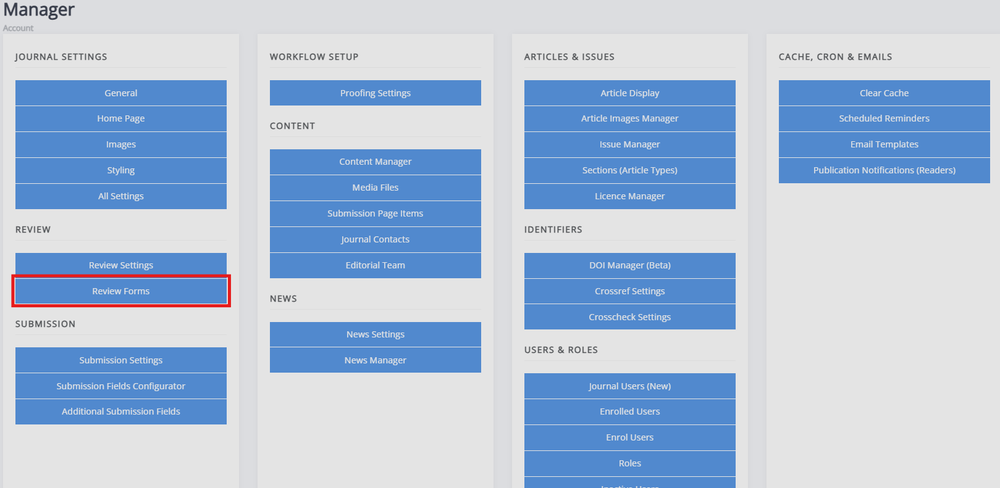

When a new journal is set up, Janeway automatically generates a default review form called ‘Default Form’. This form has a single text area called ‘Review’, which can be deleted or edited.

## Deleting review forms
Existing forms can be deleted using the icons to the right of the form name. If a form is set as the default review form, it cannot be deleted. Deleting forms will not affect current or past reviews using the form, but it will prevent users from selecting it for future reviews. Deleted review forms cannot be retrieved.
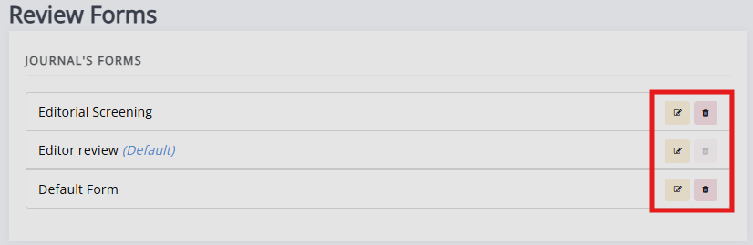

## New review forms
To create a new review form, start by filling in the form on the right-hand side of the review forms page. 

Janeway does not limit the number of review forms that can be created, but for practical reasons, we recommend regularly reviewing forms not in use.

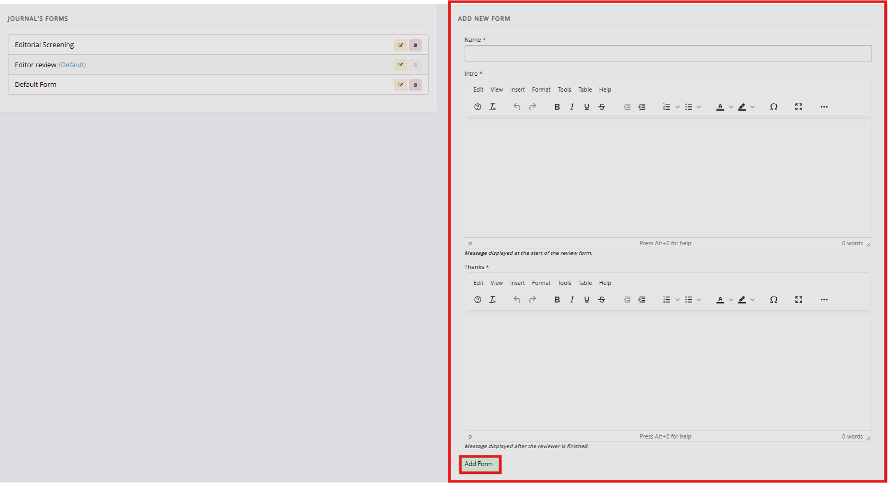

## Editing review forms
Once you have created a new form or started editing an existing form, you can add various form elements. In addition to this, you can edit the form name, form introduction and thank you message.

### Form elements
- Name
	- This field provides the name of the review element. In case of a short question, you could put a review question here. If using a longer question, you may wish to use a more generic description (e.g. “Methods” or “Clarity”) and provide further guidance in the help text section.

A review form can have the following types of review form elements:
- Text field
	- This is a single-line input area for short text answers such as names, keywords or subjects. It does not allow for formatting.

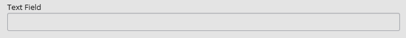

- Text area
	- This is a larger, multi-line input area for longer texts such as comments and descriptions. It allows for formatting and line breaks.

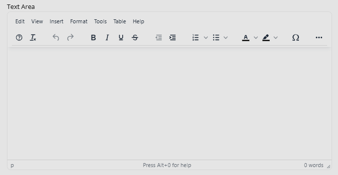

- Checkbox
	- [Asks users to check a box, which can be used to declare no competing interests / agreeing to terms.]

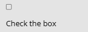

- Select (dropdown)
	- Shows a predefined list of options allowing users to select one.

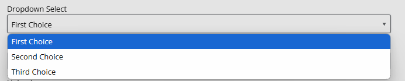

- Email
	- Specific text field for emails. It checks if the input looks like an email address. / follows the format of an email address.

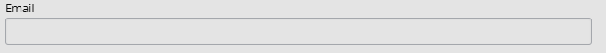

- Upload
	- Asks the users to upload a file from their device.

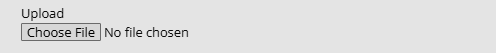

- Date
	-Asks the user to provide a date.

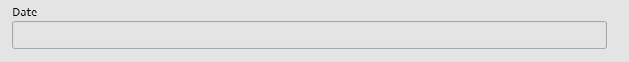

If you choose the ‘Select’ (dropdown) element, you will need to create the options. This is done through the ‘Choices’ field. The options should be separated by the bar " | " character e.g. " choice 1|choice 2|choice 2 ". When using any of the other form elements, you can ignore the ‘Choices’ field.

In addition to selecting the element type, you will be asked to [configure] the following settings for the review elements:

- Required  
  - Check this setting’s box to make this part of the form obligatory to complete.

- Order  
  - This determines the order of review elements on the review form.

<!--  To be redundant soon
- Width  
  - This setting configures the width of the review element; a third half or full width. If you put two half-width elements next to each other in order they will both display on the same line.

 -->
- Help text  
  - This text will display under the review element and can provide further guidance or information for reviewers.

- Default visibility  
  - If enabled, this element will be visible to the author by default once the editor has shared the review with them. If disabled, the author will not see this element unless the editor overrides it.

The review form can be previewed using the **Preview** button, this can be done at any point when working on a review form.

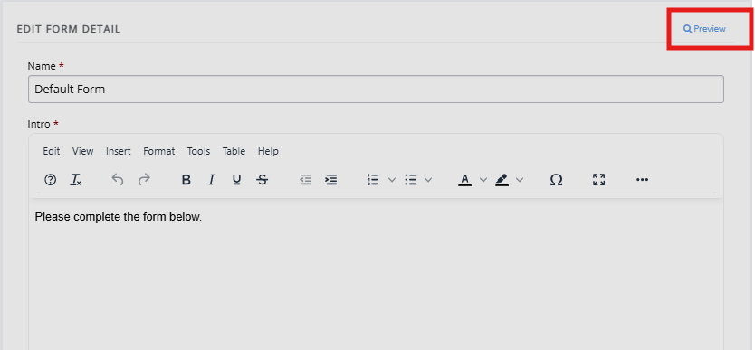
