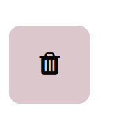
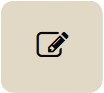

title: Review forms

# Review forms
Review forms can be found in the manager dashboard, under **Review**:

When a new journal is set up, Janeway automatically generates a default review form called 'Default Form'. This form has a single text area called 'Review', which can be deleted or edited.

## Deleting review forms
Existing forms can be deleted using the  **Delete** . If a form is set as the default review form, it cannot be deleted. Deleting forms will not affect current or past reviews using the form, but it will prevent users from selecting it for future reviews. 

>[!Warning]
>Deleting a review form can't be undone. Only delete forms if you are certain you will not need them again.

## New review forms
To create a new review form, fill in the form on the right-hand side of the review forms page and click **Add form**.

There is no limit on the number of review forms that can be created, but for practical reasons, we recommend regularly reviewing forms not in use.

## Editing review forms
You can add review questions to review forms by clicking  **Edit**. You can then add various review form elements by clicking **Add element**. 
In addition to this, you can edit the form name, form introduction and thank you message.

Read more about creating custom forms and form elements here. <!-- Missing hyperlink -->

## Preview review forms

The review form can be previewed using the **Preview** button, this can be done at any point when working on a review form.

