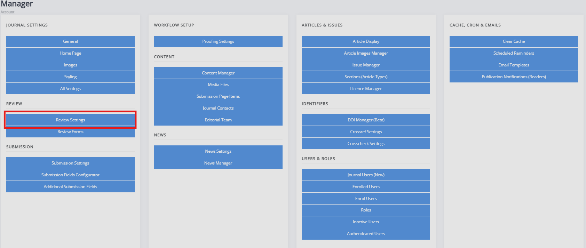

title: Review settings

# Review settings
Review settings can be found under **Review** on the manager dashboard.

Review settings control how the peer review process operates. The settings found in this section are the following:

- Review guidelines  
 	 - A set of generic review guidelines that a reviewer should follow.

- Default review visibility  
  - Janeway provides three options for the default review visibility: open, single or double anonymous review. If open, authors can see reviewers and vice versa; if single anonymous reviewers can see authors, if double anonymous, neither can see information on the other. The editor must ensure the manuscript files are sufficiently anonymised when using double anonymous review.  To configure triple anonymous review, consult the following page. <!-- missing hyperlink -->

- Default review days  
  	- This setting configures the default number of days a reviewer is given to complete a review. This number is then used to control reminders. This field is set to 56 days (8 weeks) initially. The due date can be changed when assigning a review.

- One-click access
	- When enabled, a unique access token is added to the reviewer link in the assignment email, allowing the reviewer to view the review without needing to log into the system. After the review is completed, the token is removed to prevent reuse. These tokens are Universally Unique Identifiers (UUID4s), which ensures the link sent to reviewers is unique.

- Draft decisions  
  - If enabled, section editors cannot accept papers after review. Instead, they can make recommendations to editors.

- Enable open peer review  
  - Turns on the open peer review feature. <!-- missing hyperlink -->

- Default review form  
  - This setting controls the default review form displayed when assigning a reviewer.

- Reviewer form download  
  - If enabled, reviewers can download a copy of the review form to complete offline.

- Enable save review progress  
  - If enabled, reviewers can save the progress in a peer-review assignment and return to complete it later. We recommend only using this when working with particularly long review forms.

- Accept article warning  
  	- This is a block of text displayed to the editor before they accept an article, prompting initial DOI and metadata registration with Crossref if the journal or press is set to use Crossref. You can use the setting to provide a readout of current metadata so the editor can check what will be sent to Crossref. 

- Enable expanded review details 
	- When this setting is enabled, the editor's review dashboard will show all active reviews. Otherwise, it will show a count of completed reviews.

