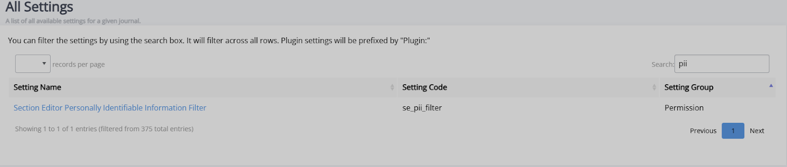
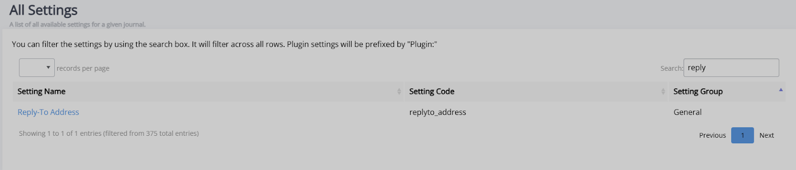

Title: Triple anonymous peer review
# Triple anonymous peer review

In addition to open, single and double anonymous review, Janeway provides the option to use triple anonymous peer review. When this is enabled, authors, reviewers, and editors are all anonymised until the review stage is complete. This review option is, however, slightly more complex than other forms of review.

Using triple anonymous review requires at least one member of the journal team to have non-anonymised access to screen articles at the submission stage. This editor will also need to act as a journal manager. The editors who require anonymised access to the submission need to be given the section editor role. These editors will not have full journal management permissions, as this would provide access to author data.

## Key settings for triple anonymous peer review

Two settings must be configured for triple anonymous peer review to work: the personally identifiable information filter and the reply-to address.

- Section editor personally identifiable information filter (se_pii_filter)
   - Turning on this setting means that all relevant author data will be anonymised for section editors when they are accessing Janeway. This enables them to access the review stage without encountering the author’s personal details.

- Reply-to address (replyto_address)
   - In order to make triple anonymous review possible, author email addresses need to be hidden. Janeway masks these email addresses with your journal’s reply-to address, which you will need to fill in here.

>[!NOTE]
> Be sure to check that this is correctly formatted as a valid email address, as an incorrect one will mean author email addresses will be displayed and the review will no longer be anonymous.

These settings are accessible through the **All settings** page.

## Triple anonymous peer review in practice
To make triple anonymous peer review possible, the main journal editor must first check a manuscript and ensure that the author cannot be identified through any of its contents, including the file information. If there are any identifying elements, it is this editor's responsibility to remove or redact them. 

Once a file has been fully anonymised, the journal editor can assign it to a section editor. The section editor can now manage the peer review process as they normally would. 

On Janeway, where a section editor would usually see the author’s personal details (name, email, or institution), those fields will now show as ‘[Anonymised data]’ for the duration of the review process. After the full process is completed, these fields will return to showing an author’s personal details.

## Areas with anonymisation
Janeway applies anonymisation to the following areas:
- Dashboards – this is applied not only on the main dashboard, but also on the kanban view and active submissions section.

- Unassigned.

- Review – the **Document manager** section will be disabled for section editors so that they cannot view any author details which might be stored there.

- View metadata – section editors can view an anonymised version of the metadata, but are blocked from editing it to ensure that they have no access to author information.

- Article log.

- Email templates – this allows section editors to send decision letters (e.g. revision requests, acceptances or rejections) without seeing author details.

