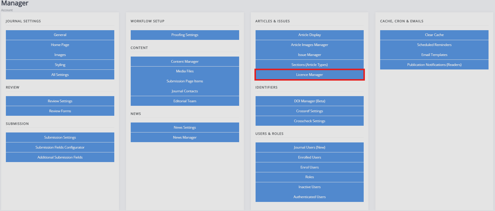
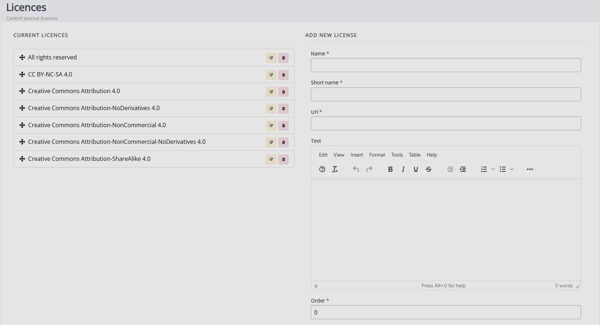

title: Licence manager
# Licence manager

The licence manager allows you to define what licenses are available for submissions to your journal. By default, Janeway provides all  CC 4.0 licences and an All Rights Reserved licence. You can edit the list to fit your journal's needs and licence requirements. 

When people submit to your journal, they have to select a licence from this list. If you want to make more licences available to them, you need to provide the following information to add them: 

- **Name**   
  The full name of the licence type (e.g. Creative Commons Attribution 4.0).

- **Short name**  
  The shortened version of the licence name (e.g. CC BY 4.0).

- **URL**  
  A URL to a description of the licence.

- **Text**  
  The text of the licence, detailing the permissions and the restrictions associated with it.

- **Order**  
  The order in which the licence should appear in the list. This can be set here through numerical ordering (e.g., “1” denotes that it should be first in the list) or changed via drag and dropping the licences on the **Current licences** list view.

- **Available for submission**  
  If this box is checked, this licence can be selected when people submit to your journal.

If the journal uses only one licence type, you can disable the licence selection field using the **Submission configurator**. <!-- missing hyperlink -->
