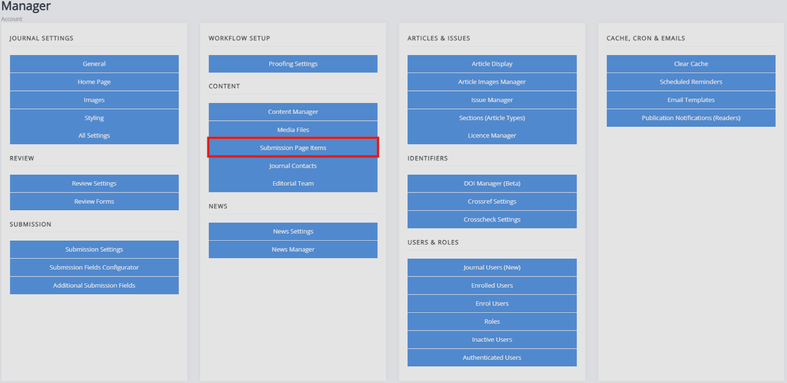
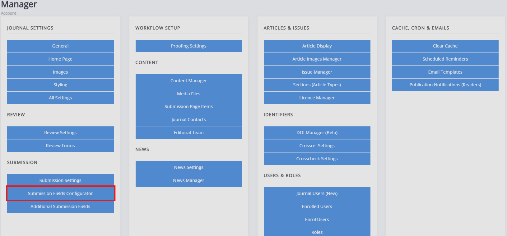

title: Configuring the Submission Process
# Configuring the Submission Process

**WIP**
 intro to submission configuration and customisation in Janeway.

## Submission page items and layout
**WIP**
Configures the submission information page for authors. Found under ‘content’ as it is web content.

## Submission form items

This configures the submission process and form for authors. It is found under ‘Submission’ as it affects the submission process.

The additional submission fields page allows us to add custom fields to the article Info submission page. It works similarly to the Review Forms generator.

To add a new element:
- Name
	- This field provides the name of the submission element
 In case of a short question, you could put a question in this field. If using a longer question, you may wish to use a more generic description and provide further guidance in the help text.

A submission form can have the following types of form elements:
- Text field
	- This is a single-line input area for short text answers such as names, keywords or subjects. It does not allow for formatting.

- Text area
	- This is a larger, multi-line input area for longer texts such as comments and descriptions. It allows for formatting and line breaks.

- Checkbox
	- This element asks users to check a box, which can be used to declare no competing interests / agree to terms, for example.

- Select (dropdown)
	- Shows a predefined list of options, allowing users to select one.

- Email
	- Specific text field for emails. It checks if the input looks like an email address. / follows the format of an email address.
 

- Upload
	- Asks the users to upload a file from their device.
    

- Date
	-Asks the user to provide a date.
 

If you choose the ‘Select’ (dropdown) element, you need create the options. This is done through the ‘Choices’ field. The options should be separated by the bar " | " character, e.g. " choice 1|choice 2|choice 2 ". When using any of the other form elements, you can ignore the ‘Choices’ field.

- Required  
  - Check this setting’s box to make this part of the form obligatory to complete.

- Order  
  - This determines the order of elements on the submission form.

<!--  To be redundant soon
- Width  
  - This setting configures the width of the submission element; a third half or full width. If you put two half-width elements next to each other in order they will both display on the same line.

 -->
- Help text  
  - This text will display under the submission element and can provide further guidance or information for authors.
