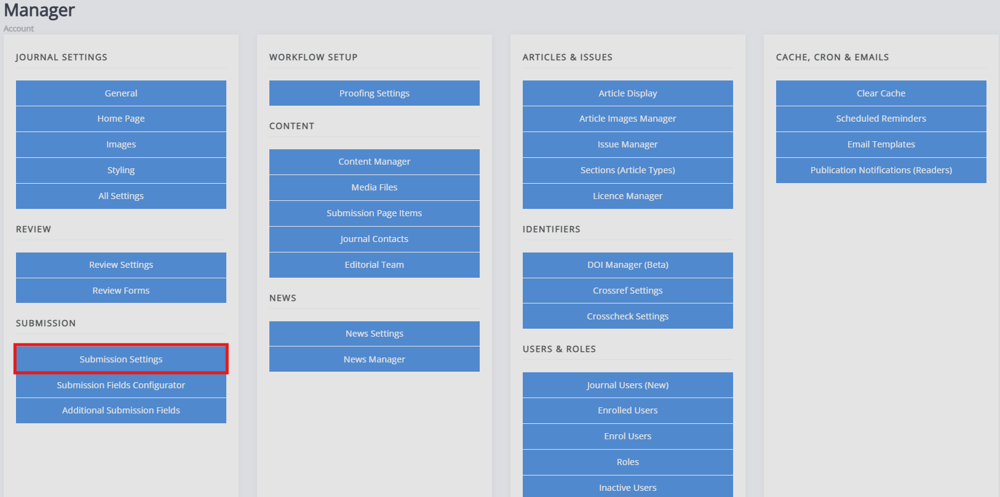

title: Submission settings
# Submission settings

The submission settings are accessed through the manager dashboard under **Submission** and clicking **Submission settings**. From here, you can configure the submission process, text blocks which overlap with the submission page and submission notifications.

**Submission settings** provides access to five blocks of settings:
- **Submission control**   
  This block controls settings relating to whether submission is turned on or off.
  
- **Editors notified on submission**   
  This controls who is notified of new submissions.
  
- **System settings**   
  This controls a small set of settings related to authors and abstracts.

- **Submission page text**   
  This controls the text that makes up the submission page - e.g. focus and scope, copyright notice, acceptance criteria, etc.

- **Submission files**   
   This controls settings around the manuscript files. 

<!-- missing hyperlinks -->

## Submission control

The settings found here are:

- **Disable journal submission** and **Disabled submission message**
   Checking this box closes submission for the journal. Unchecking it reopens submissions. The textbox allows you to display a message to users when submissions are disabled.

You can also limit access to submission by requiring users to create an account before being allowed to submit an article. When a user without an account attempts to submit, they will be directed to a page where they can create a new account.

- **Limit access to submission** and **submission access request text**   
   Checking this box limits access to submission to registered users. The textbox allows you to display a message to users requesting submission access.

- **Submission access request contact**   
   This sets the address to whom submission access requests should be sent.

## Editors notified on submission
- **Editors notified on submission**   
   This allows you to select which – if any – editors are notified of new papers being submitted.

- **Hide assigned editor details**   
   This prevents the assigned editor from being visible to the author. This does not prevent editors from identifying themselves when, for example, rejecting an article if using an account with their name associated or through email signatures.

## System settings

- **Abstracts are required**   
   If this box is checked, all submissions will require an abstract.

- **Enable correspondence authors**   
   If this is checked, an author can be marked as the correspondence author.

- **Non-specialist summary**   
   If enabled, submitters will be asked to provide a brief, non-technical lay summary of their paper.

- **Copyright submission label**   
   This label appears on the **Submission** page and this setting allows you to customise the copyright text. For example: “Author(s) agree to the copyright notice, which will apply to this submission if accepted.”

## Submission page text
These settings make up the **Submission** page as well as the **Submission agreement** that authors accept. The submission text can also be edited through **Submission page items** <!-- Missing hyperlink -->.

- **Submission page text**   
   This sets the introductory text displayed at the head of the **Submission** page.
    
- **Focus and scope**   
   Here you can outline the focus and scope of your journal.
    
- **Submission checklist**   
   This is typically a numerical, step-by-step list of things that an author should check or do before submitting their paper. You can make this list as detailed as you need it to be.
  
- **Copyright notice**   
   This is where you can provide the information on copyright, licenses used for publishing, and rights retained.

- **Publication fees**   
   If there are any fees associated with submitting or publishing the paper, these should be outlined here. If there are no publication fees for an author to pay, you can also use this space to say so.

- **Publication cycle**   
   This is where you describe the journal’s publication schedule, such as whether you publish continuously or at specific points and whether submissions are open only at specific points.

- **Peer review information**   
   This section allows you to provide information on how peer review is conducted and the steps involved.

- **Acceptance criteria**   
   Here is where you outline the criteria which your journal uses to evaluate its papers.

## Submission files
- **File submission guidelines**   
   This describes what files you expect at the time of submission.

- **Manuscript file submission instructions**   
   Here, you can provide specific instructions for uploading and submitting manuscripts, which will appear on the manuscript upload pop-up.

- **Limit manuscript types**   
   If you enable this setting, only DOC, DOCX, RTF and ODT files will be accepted as manuscript files during submission.

- **Data and figure file submission instructions**   
   Here, you can provide specific instructions for uploading and submitting figures and data files, which will appear on the figure and data upload pop-up.
