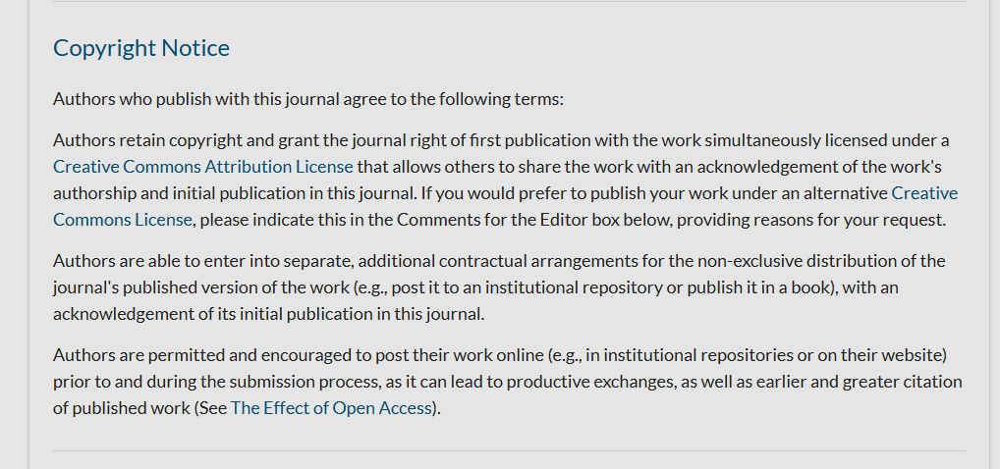
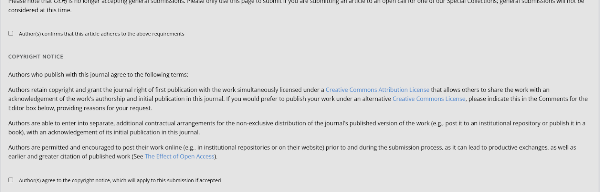
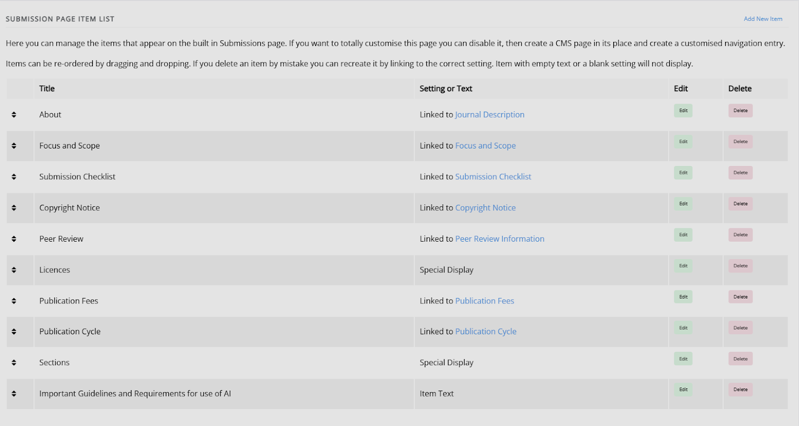
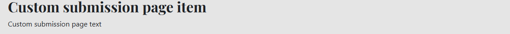
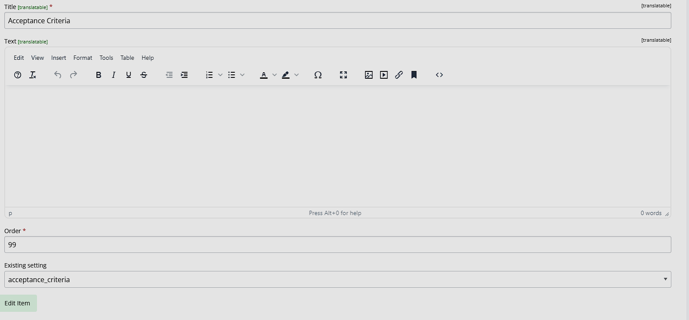
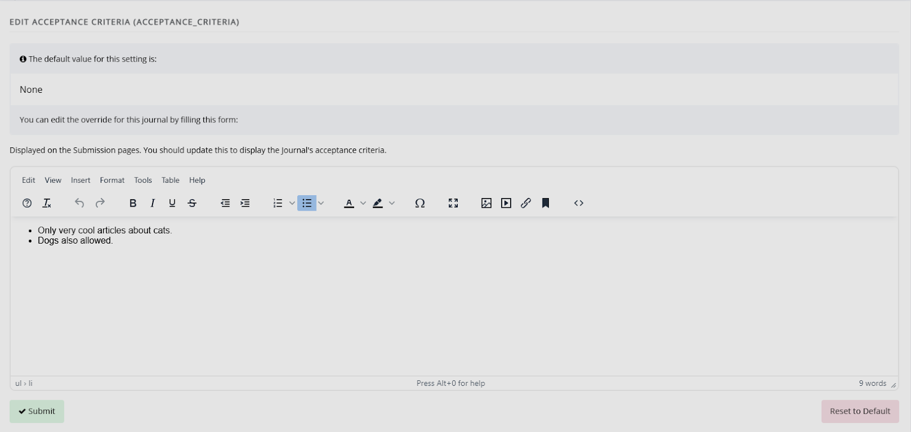
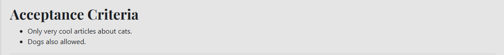

title: Configuring the submission page

# Configuring the submission page

The submission page is where potential authors can find information about submission to your journal before starting the submission process.

The option to configure the submission information page for authors can be found under **Content** by clicking **Submission page items**. 

## Crosslinked submission page items
Some aspects of the submission page can also be edited through **Submission settings** <!-- missing hyperlink -->

The reason these can be accessed and edited from two places is that submission information is displayed in two places: on the submissions webpage and as part of the submission process. Changing the content in one location will automatically change it in the other, so you do not have to update each one individually. 

For example, if you edit your copyright notice through either the **Submission page items** or **Submission settings**, Janeway will automatically update the copyright notice on both the submission page and on the submission process.

In the example below, you can see the copyright notice for the Open Library of Humanities Journal as it appears on https://olh.openlibhums.org/submissions/. 

Here, you can see the same text as it appears in the submission process:

If an edit was made to this copyright notice through the **Submission page items**, it would change on both pages.  

In the **Submission page items list**, you can see all the areas that function like this. All of the options displayed as ‘Linked to’ can be edited through either **Submission page items** or **Submission settings**. 

## Custom submission page items
If there is information you would like to display on the submission page that is not captured by the existing settings, you can create a custom text block by clicking **Add new item**.

There are three types of custom submission page items you can create using this. 

- Custom text
You can add a title and custom text, which will display on the submission information page.

- Special displays
There are two types of special displays, Licences and Sections. These will display the license and article type (section) information for your journal. It will take the information supplied through the License manager and Sections (article types) <!--missing hyperlink-->.

- Setting-based displays
You can also set a title and select a setting to display. This will then display the text  / information set as part of the setting - this will allow consistency and ensures text only needs to be updated in one place. If you wish to check the content of the setting, the best way to do so is:
1. Go to the **Manager dashboard**
2. Go to **All settings**
3. Search for the setting you wish to check.

For example, if you wish to display the acceptance criteria, using the acceptance criteria setting:

The submission page items custom text page, the title and setting name have been provided.

The acceptance criteria setting, with information provided, access through **All settings**:

The acceptance criteria, displayed on the submission page.

>[!NOTE]
> Acceptance criteria is also available through **Submission settings**, so you will be able to edit it through there as well. The information displayed will update, regardless of where it is edited from. This will also work for other settings not found on **Submission settings**.

